# Einführung in die BWL
**Definition**: "Betriebswirtschaftslehre ist die Lehre von den wirtschaftlichen, organisatorischen, technischensowie finanziellen Abläufen in Unternehmen und den unterschiedlichen wirtschaftlichen Institutionen. Neben der Volkswirtschaftslehre (VWL) ist die Betriebswirtschaftslehre (BWL) … zweites Teilgebiet der Wirtschaftswissenschaften…"

**Produktionsfaktoren**: Alle materiellen und immateriellen Mittel und Leistungen, die an der Bereitstellung von Gütern mitwirken. Dabei ist zwischen volkswirtschaftlicher und betriebswirtschaftlicher Betrachtung zu unterscheiden.

**Volkswirtschaftliche Betrachtung**: Betrachtet die Faktoren Arbeit, Boden und Kapital.
Neuerdings werden häufig auch Wissen (Humankapital), Natur (oder Umwelt) oder die Führung eines Unternehmens als VWL Produktionsfaktoren angesehen.

**Betriebswirtschaftliche Betrachtung**
- **Werkstoffe**:
	- *Rohstoffe*: Ein wesentlicher Bestandteil des endgültigen Produktes, wie z.B. das Holz für einen Holzstuhl.
	- *Hilfsstoffe*: Kein wesentlicher Bestandteil des Produktes (z.B.: Schrauben, Nägel, Holzkleber für den Holzstuhl,…)
	- *Betriebsstoffe* werden bei der Fertigung (oder in anderen betrieblichen Bereichen) verbraucht, ohne substanzieller Bestandteil des Produktes zu werden (z.B.: Erdgas, Öle, Fette,..).
- **Betriebsmittel** stehen einem Unternehmen für einen längeren Zeitraum zur Verfügung, z.B.: Maschinen, Geräte, Anlagen, Software
- **Ausführung**: menschliche Arbeit am Objekt ("produktive" Tätigkeit)
- **Dispositive Faktoren**: Planung, Organisation, Information

**Allgemeine BWL**: Befasst sich mit Problemen, die im Wesentlichen für alle Unternehmen von
Bedeutung sind, z.B.:
- Art und Menge der zu beschaffenden Produktionsfaktoren
- Einsatz der Produktionsfaktoren
- Verwertung der erbrachten Leistung am Markt

**Spezielle BWL**
Betrachtet die Abläufe und Besonderheiten bestimmter Branchen (z.B. Bank-, Industrie-, Handels-, Versicherungs-, Verkehrsbetriebslehre, betriebswirtschaftliche Steuerlehre,...), die bei bestimmten Entscheidungen Berücksichtigung finden müssen.

**Klassische Teilfunktionen (Teilbereiche) der BWL**:
- **Beschaffung (Einkauf)**
	Materialwirtschaft einschl. Lagerhaltung, Transport, Logistik
- **Produktion**
	Produktionswirtschaft, Leistungserstellung, Fertigung, Dienstleistungen
- **Absatz (Akquise, Verkauf, Marketing)**
	Absatzwirtschaft, Marketing einschl. Werbung, Vertrieb und
	Marktforschung
- **Finanzen und Administration (F&A)**
	Kapital- und Finanzwirtschaft
	Personal

**Betriebstypologie**: Betriebe lassen sich nach verschiedenen Merkmalen gruppieren. Das soll sinnvolle Systematisierung und bessere Unterscheidung möglich machen. Zudem ist es ein Hilfsmittel für die Bestimmung der geeignetsten Betriebsformen und Verfahren.
- **Betriebszweck**: Produktionsbetriebe, Konsumtionsbetriebe
- **Leistungsart**: Sachleistungsbetriebe, Dienstleistungsbetriebe
- **Wirtschaftszweig**: Handelsbetriebe, Industriebetriebe,..
- **Betriebsgröße**
- **Standortorientierung**
- **Eigentumsverhältnisse**
- **Rechtsform**
- **Fertigungstypen, -verfahren**: Einzel-, Serien-, Massenfertigung

[Notiz] BELFORB (Betriebszweck, Eigentumsverhältnisse, Leistungsart, Fertigungstyp, (Stand-)Ort, Rechtsform, Betriebsgröße)

**Bedürfnisse**: Tatsächlich oder subjektiv empfundene Mangelempfindungen nach Sachgütern oder Dienstleistungen.

**Maslowsche Bedürfnispyramide**: Der Mensch versucht, zuerst die Bedürfnisse der niedrigsten Stufe zu befriedigen, bevor die nächste Stufe zum neuen Bedürfnis in Angriff genommen wird.
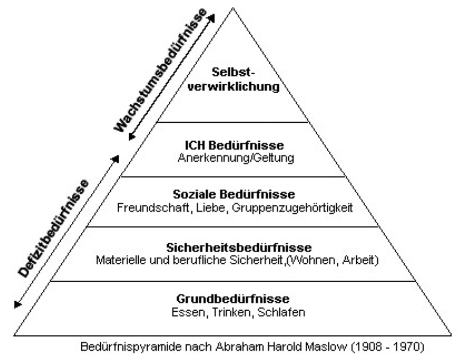

**Defizitbedürfnisse**: Die unteren drei Stufen in der Pyramide müssen befriedigt sein, damit man zufrieden ist, aber wenn sie erfüllt sind, hat man (nach Maslow) keine weitere Motivation diese
zu befriedigen.

**Unstillbare Bedürfnisse (Wachstumsbedürfnisse)**: Können demgegenüber nie wirklich befriedigt werden (ab vierter oder fünfter Stufe).

**Bedarf**: Ein mit Kaufkraft ausgestattetes Bedürfnis, dass voraussetzt, dass jemand zur Bedürfnisbefriedigung diese einsetzen will und kann (Nachfrage), z.B.:
- Personalbedarf
- Materialbedarf
- Kapitalbedarf

**Wirtschaftsgüter**: Gegenstände, Tätigkeiten und Rechte, die der Bedürfnisbefriedigung dienen. Diese werden unterschieden in:
- **Freie Güter**
	- stehen unbegrenzt zur Verfügung
	- keinerlei Anstrengung für Gewinnung notwendig
	- wirtschaftliches Handeln nicht notwendig
- **Knappe Güter**
	- sind nur in begrenzter Menge vorhanden
	- werden erst durch wirtschaftliche Tätigkeit verfügbar (Güterproduktion, Erbringen von Dienstleistungen) und zwingen zu wirtschaftlichem Handeln, wie z.B. Vermeidung von Verschwendung.
	- *Materielle Güter*
		- Konsumgüter (privat): Kleidung, Lebensmittel,…
		- Produktivgüter: Maschinen, Roh-, Hilfs-, Betriebsstoffe
	- *Immaterielle Güter*
		- Transportdienstleitungen
		- Beratung
		- Patente, Rechte, Lizenzen

**Konsumgüter – Produktiv-/Investitionsgüter**: Produktionsgüter werden zur Herstellung von Gütern und Dienstleistungen benötigt, während Konsumgüter zum Verbrauch beim Endverbraucher bestimmt sind.

**Wirtschaften**: Dient dem Ausgleich von Bedürfnissen und erfordert den planmäßigen
Einsatz knapper Wirtschaftsgüter. Sie ist ein allgemeines Maß für die Effizienz im Sinne der Kosten-Nutzen-Relation. Sie wird allgemein als das Verhältnis zwischen erreichtem Erfolg und dafür benötigtem Mitteleinsatz definiert. Häufige Arten sind:
- *Wertmäßige* Wirtschaftlichkeit: Ertrag / Aufwand
- *Monetäre* Wirtschaftlichkeit: Umsatz / Ausgaben
- *Mengenmäßige* Wirtschaftlichkeit: Output / Input

**Ökonomisches Prinzip**: Geht davon aus, dass Menschen rational handeln, indem sie eingesetzte Mittel und Ertrag in ein Verhältnis setzen und versuchen, ihren Nutzen oder ihren Gewinn zu maximieren (sog. *Homo Oeconomicus*).
- **Minimumprinzip**: Mit minimalen Mitteleinsatz (Input) soll ein vorgegebener Ertrag (Output) erwirtschaftet werden.
- **Maximumprinzip**: Mit einem gegebenen Aufwand (Input) soll ein möglichst hoher Ertrag (Output) erzielt werden.
- **Optimumprinzip**: mit minimalen Mitteleinsatz (Input) soll ein möglichst hoher Ertrag (Output) erwirtschaftet werden.

**Träger der Wirtschaft**: Alles Wirtschaften (wie Güterproduktion, Erbringen von Dienstleistungen, Verbrauch von Gütern und Leistungen…) vollzieht sich in organisierten sog. Wirtschaftseinheiten. Diese werden unterschieden in Produktions- (öffentliche und private **Betriebe**) und Konsumtionswirtschaften (öffentliche und private **Haushalte**).

**Kennzahl**: Eine Maßzahl, die zur Quantifizierung (Angabe als Zahlenwert) dient, z.B.:
- **Umsatz**: Gegenwert, der einem Unternehmen in Form von Zahlungsmitteln oder Forderungen durch den Verkauf von Produkten, Dienstleistungen usw. zufließt.
- **Gewinn**: Überschuss der Erträge über die Aufwendungen eines Unternehmens. Ein negativer Gewinn heißt Verlust.
- **EBIT (earnings before interest and taxes)**: Messung der Profitabilität ohne Zinsen und Steuern zu berücksichtigen und dient v.a. dem internationalen Vergleich der Ertragskraft.
- **Produktivität**: Maß für die **quantitative** Ergiebigkeit (Effizienz) der im Betrieb wirkenden **produktiven Faktoren**. **Produktivität = Output / Input** (Ausbringungsmenge / Einsatzmenge). Sagt ohne Vergleich mit ähnlichen Betrieben nichts über die Rationalität des betrieblichen Geschehens aus.
- **Rentabilität**: Das Verhältnis einer Erfolgsgröße zum eingesetzten Kapital einer Rechnungsperiode:
	- *Eigenkapitalrentabilität*
	- *Gesamtkapitalrentabilität*
	- *Return on Investment (ROI)*
	- *Fremdkapitalrentabilität*
	- *Umsatzrentabilität*
- **Liquidität**: Fähigkeit eines Wirtschaftssubjekts, seine fälligen Verbindlichkeiten jederzeit (fristgerecht) und uneingeschränkt begleichen zu können. Setzt voraus, dass die Zahlungsmitteldeckung immer größer/gleich des Zahlungsmittelbedarf ist. Fristen werden oft so definiert:
	- *kurzfristige* (unter 1 Jahr)
	- *mittelfristige* (1 - 5 Jahre)
	- *langfristige* (über 5 Jahre)

[Notiz] Rentabilität = Rendite. Ertrag is Umsatz - Kosten

# Unternehmensorganisation (Aufbau- und Ablauforganisation)
**Betrieb**: Eine wirtschaftliche Einheit, deren Aufgabe in der Erstellung und Verwertung von Gütern und Dienstleistungen zur Bedürfnisbefriedigung Dritter liegt. Betrieb und Unternehmen werden häufig synonym verwendet.

**Unternehmen (Unternehmung)**: Marktwirtschaftliche, am Gewinn ausgerichtete Wirtschaftseinheit.

**Non-Profit-Organisation (NPO)**: Nicht primär am Gewinn ausgerichtete wirtschaftliche Einheit (Gewerkschaften,..).

**Unternehmensorganisation**: Oberbegriff für Strukturen und Abläufe in Unternehmen (Aufbau- und Ablauforganisation).

**Aufbauorganisation**: Bildet das hierarchische Gerüst eines Unternehmens (oder Organisation), die sog. "Unternehmenshierarchie". Legt die Rahmenbedingungen fest, welche Aufgaben von welchen Personen oder Abteilungen übernommen werden.
Die wichtigsten "Formen der Aufbauorganisation" (sog. Strukturmodelle) sind:
- Funktionale Organisation *"Einlinienorganisation"* (Differenzierung: Verrichtung)
- Spartenorganisation (Divisionale Organisation) *"Einlinienorganisation"* (Differenzierung: Objekt)
- Projektorganisation (Matrixorganisation) *"Mehrlinienorganisation"* (Differenzierung: Objekt und Verrichtung)
[Was sind Einlinienorganisation und Differenzierung?]
[Fehlen 50-54]

**Funktionale Organisation**:
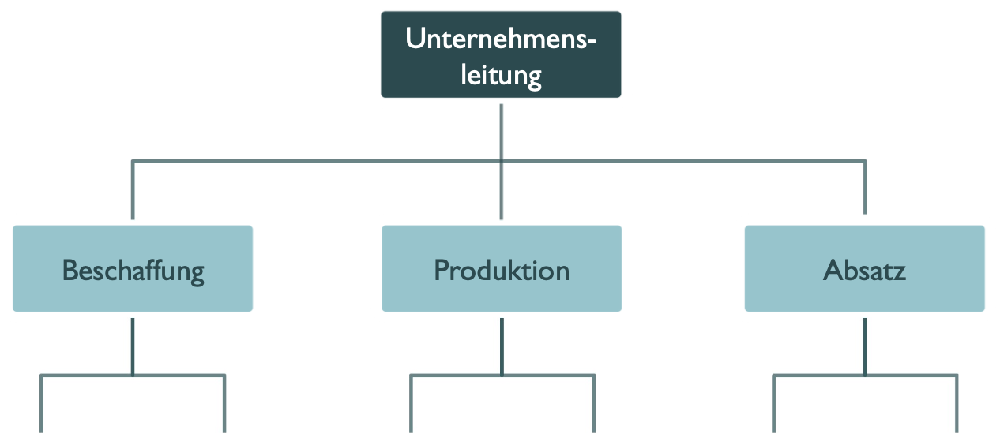

**Spartenorganisation (Divisionale Organisation)**:

**Projektorganisation (Matrixorganisation)**:
- Gesamtheit der Organisationseinheiten und der aufbau- und ablauforganisatorischen Regelungen zur Abwicklung eines bestimmten Projektes
- Organisationseinheiten: Gremien (Lenkungsausschuss, Teambesprechungen...), organisatorische Regelungen (Projekthandbuch, Betriebsvereinbarungen...) sowie die Führungs- und Entscheidungsstrukturen (Organigramm des Projekts)
- Projektleiter werden für die Planung und Durchführung komplexer Vorhaben Projektteams zugeordnet
- Mitglieder des Projektteams kommen aus verschiedenen Organisationseinheiten

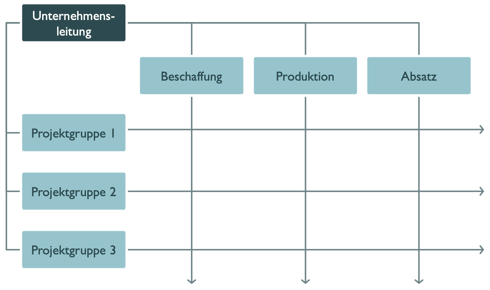

**Aufgabenanalyse**: Gesamtaufgaben eines Unternehmens
analysiert, in Teilaufgaben zerlegt und gegliedert. Die Gliederung kann
verschiedenen Gliederungskriterien erfolgen:
- *Verrichtung*: z.B.: Einkauf, Verkauf, Produktion,..
- *Produkten/Objekte*
- *Rang*: Ausführungsaufgaben und Entscheidungsaufgaben. Entscheidungsaufgaben haben dabei jedoch einen höheren Rang.
- *Phasen*: z.B.: Planung, Durchführung und Kontrolle.
- *Zweck*: Primäre Aufgaben (Zweckaufgaben) sind Beschaffung, Lagerung und Verkauf. Finanzen, Personal und Werkstatt bilden die sekundären (unterstützende) Aufgaben.

**Aufgabensynthese**: Nachdem die Gesamtaufgabe in der Aufgabenanalyse in Teilaufgaben zergliedert wurde, werden diese Einzelaufgaben wieder zusammengefasst. Es gibt keine allgemeine Regel, wie viele Teilaufgaben und welche Arten von Aufgaben zu einer Stelle zusammengefasst werden sollen.

**Stellen**: Kleinsten Einheiten und Grundelemente der organisatorischen
Struktur. Werden die, auf verschiedene Stellen beziehenden, Leitungsaufgaben zu einer ranghöheren Stelle zusammengefasst, so entsteht eine Instanz (Stelle mit Leitungsbefugnis).
[S. 50]

# Das Unternehmen und sein Umfeld
**Unternehmensumfeld**: Besteht aus "Gruppen" (innerhalb und außerhalb des UN), mit deren Ansprüchen und Erwartungen sich das Unternehmen auseinandersetzen muss (Stakeholder bzw. Interessengruppen).
- Anteilseigner (= Shareholder)
- Management
- Arbeitnehmer (Mitarbeiter)
- Interessenten / Kunden
- Banken
- Lieferanten
- Staat und Öffentlichkeit (Gesellschaft)
- (Wettbewerber)

**Markt (Mikroumfeld) und marktliches Umfeld (Makroumfeld)**:
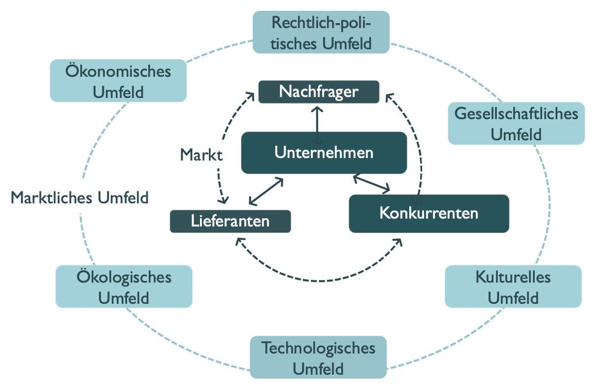

**Die Verflechtungen des Unternehmens mit seiner Umwelt**:
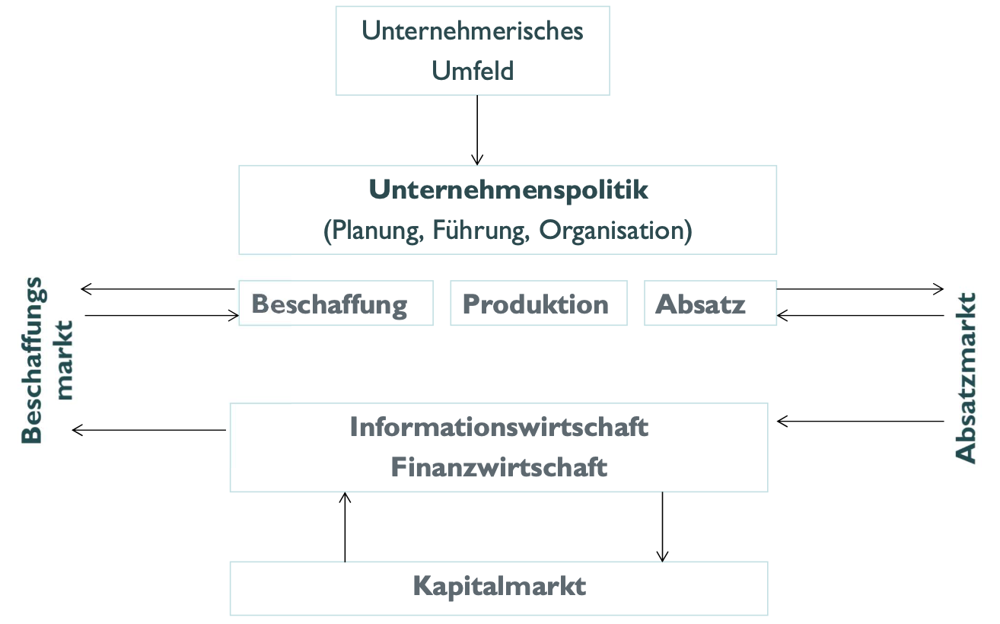

# Unternehmensführung
Unternehmensführung: Beschäftigt sich mit Steuerungsfragen
und -funktionen (Management). Es gibt keine allgemeingültigen Regeln, es
sollte jedoch berücksichtigt werden:
- Marktorientierung (Absatzorientierung)
- Produktions- und Kostenorientierung
- Finanzorientierung
- Mitarbeiterorientierung
- Technologie- und Innovationsorientierung
- Umwelt- und Gesellschaftsorientierung

[Skip 66 - 76]

**Zielsystem des Unternehmens (Zielhierarchie)**:
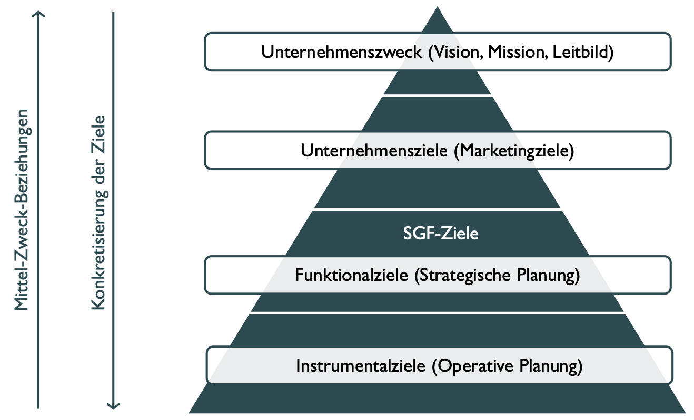

**Zielbeziehungen**:
- **konkurrierend**: Ziele lassen sich nicht gleichzeitig mit Erfolg erreichen
	- Produktqualität erhöhen und Produktionskosten senken
- **antinom**: Durch das eine Ziel wird das andere (völlig) ausgeschlossen
	- Entlassung eines Mitarbeiters und Mitarbeitermotivation
- **Indifferent**: Ziele beeinflussen einander überhaupt nicht (unabhängig)
	- Marketingkosten senken und effizientere Produktion
- **Komplementär**: Ziele ergänzen einander
	- "Je höher die Zufriedenheit der Mitarbeiter desto höher deren Produktivität"

[Skip 78]

**Prozess der Festlegung strateg. Unternehmensziele**:
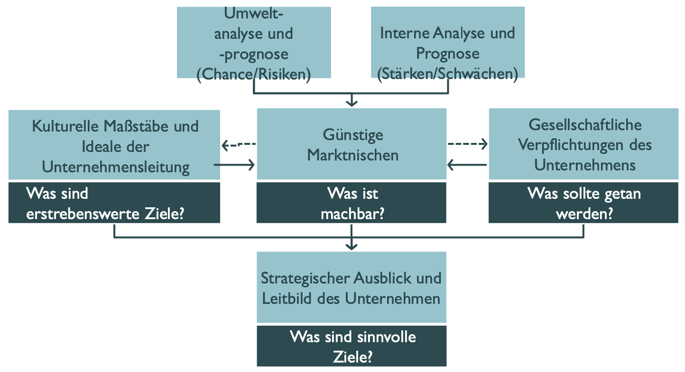

**Prozess bei der Festlegung von Unternehmenszielen**:
1. Situationsanalyse
2. Zielbestimmung (Definieren neuer Unternehmensziele)
3. Analysieren von Zielbeziehungen
4. Operationalisieren von Zielen
5. Kommunikation der Ziele nach innen und nach außen

[Notiz] SMART: Specific, Measurable, Achievable, Relevant, and Time-bound (Spezifisch, messbar, erreichbar, relevant und zeitgebunden)

[Skip 81 - 83]

**Unternehmensstrategie**: Beschreibt, wie Unternehmensziele langfristig erreicht
werden sollen:
1. Absatz bzw. Vertrieb und Marketing (Absatz-/Vertriebsstrategien)
2. Forschung und Entwicklung (F&E-Strategien, Innovationsstrategien)
3. Leistungserstellung (Produktions- und Kooperationsstrategien)
4. Material, Beschaffung, Einkauf (Beschaffungs-, Logistik- und Lagerhaltungsstrategien)
5. Personal (Personalstrategien)
6. Informations- und Wissensmanagement (Strategien zur Entwicklung und Nutzung der Wissens- und Informationsbasis)
7. Kosten: FiBu, KLR (Strategien zur Beherrschung der Kosten)
8. Investitionen (Ableitung aus 1-7)
9. Finanzierung

[Skip 85]

# Einzelunternehmen

**Einzelunternehmen (EU)**: Werden von Personen (Inhaber alleiniger Geschäftsführer) geführt, die das notwendige Eigenkapital aufbringen und unbeschränkt haften (keine Personen- oder Kapitalgesellschaft). Es muss kein Mindestkapital eingebracht werden und weitere Mitarbeiter dürfen eingestellt werden. Maximal jährlicher Umsatz 600.000€ oder Gewinn 60.000€.
- Formen der EU sind Einzelkaufleute (Gewerbetreibende; Handelsregistereintrag)
- Kleingewerbetreibende (Handelsregistereintrag freiwillig)
- Freiberufler (keine Gewerbetreibende und kein Handelsregistereintrag)

*Wenn man im Handelsregister eingetragen ist heißt man eingetragener Kaufmann/-frau.*

**Vorteile**
- Alleinige Verfügungsgewalt über das Betriebsvermögen und Entscheidungsfreiheit
- Gewinn fließt alleine dem Unternehmer zu
- Kann schnell und unbürokratisch handeln (ohne Rücksprache anderer Gesellschafter)
- Keine Eintragungspflicht ins Handelsregister
**Nachteile**
- Aufbringung von Eigenkapital schränkt meist finanziellen Möglichkeiten stark ein
- Alleinige Haftung gegenüber Gläubigern auch mit dem Privatvermögen (hohes Risiko)

**Handelsregister**:
- Name der Firma
- Firmensitz und Zweigniederlassungen mit Anschriften
- Gegenstand des Unternehmens (Betätigungsfeld)
- vertretungsberechtigte Personen (Vorstand, Leitungsorgan / geschäftsführende Direktoren, Geschäftsführer, Prokuristen, Inhaber)
- persönlich haftende Gesellschafter und die besondere Vertretungsbefugnis von Personen
- Rechtsform des Unternehmens
- Grund- oder Stammkapital
- Kommanditisten, Mitglieder
- Eröffnung der Insolvenz
- Löschung der Firma.

*Das Handelsregister wird von den Amtsgerichten (elektronisch) geführt.*

# Personengesellschaften (GbR / OHG / KG)
**Personengesellschaften**: Entstehen durch einen Vertrag zwischen min. zwei Personen, die zur Erfüllung eines gemeinsamen Zweckes, sich zu einer Gesellschaft zusammenschließen. Die Gesellschaft selbst zahlt keine Umsatzsteuer, stattdessen wird der Gewinn direkt den Gesellschaftern zugerechnet und versteuert.

**Gesellschaft bürgerlichen Rechts (GbR)**:
Personengesellschaft, die zu jedem gesetzlich zulässigen Zweck gegründet werden kann. Ein schriftlicher Vertrag oder Geschäftsbezeichnung (muss "GbR" enthalten) sind nicht zwingend.
Eintragungspflicht ins Handelsregister erst ab bestimmten Umständen erforderlich, wodurch sie entweder zur OHG oder KG.
- Kein Mindestkapital
- Gesellschafter sind Träger von Rechten und Pflichten
- Die im Vertrag festgesetzte Kapitaleinlage ist von jedem Gesellschafter zu leisten
- Das Vermögen ist gemeinschaftlich unter den Gesellschaftern
- Haften mit ihrem Privat- sowie Geschäftsvermögen unbeschränkt
- Gläubiger können sich direkt an Gesellschafter wenden und Forderungen geltend machen (unmittelbar)
- Geschäftsführung richtet sich nach dem Gesellschaftsvertrag (Bei fehlender Vereinbarung Zustimmung aller erforderlich)

**Vorteile**:
- Geringe formale Anforderungen und Flexibilität
- Kein Mindestkapital, keine Eintragung ins Handelsregister
- Gering Gründungskosten

**Nachteile**:
- Unbeschränkte Haftung der Gesellschafter gegenüber Gläubigern
- Streitigkeiten GbR gefährden
- Übertragung von Geschäftsanteilen nur dann möglich, wenn alle einverstanden sind
- GbR erlischt, wenn ein Gesellschafter stirbt oder kündigt

**Offene Handelsgesellschaft (OHG)**:
Meist für klein- und mittelständische Unternehmen (KMU) im Einzelhandel, im Großhandel aber auch in der Industrie und im Handwerksbereich. Haftung unbeschränkt, kein Mindestkapital, Gesellschaftsvertrag frei gestalten (wie GbR). Gewinn/Verlust jedes Gesellschafters nach Gesellschaftervertrags berechnet.

**Vorteile**:
- Gesellschaftsvertrag frei gestaltetbar
- Arbeitsteilung und Spezialisierung
- Bessere Möglichkeiten für Eigenkapitalbeschaffung
- Die Haftung verteilt sich auf mehrere Personen

**Nachteile**:
- Gewinn muss nach Gesellschaftsvertrag geteilt werden
- Haften mit Privatvermögen, für die Verbindlichkeiten des Unternehmens
- Kompetenzen und Zuständigkeiten müssen selbst geregelt werden

**Kommanditgesellschaft (KG)**:
Wie bei OHG mit Zweck auf den Betrieb eines kaufmännischen Unternehmens unter einer gemeinschaftlichen Firma gerichtet ist. Handelsregister is Pflicht. Haftung gegenüber Gläubigern bei Komplementären (Vollhaftern) ist unbeschränkt, während es bei Kommanditisten (Teilhaftern) auf den Betrag der Einlage beschränkt bleibt. Gewinn wird wie bei OHG berechnet. Geschäftsführung und Vertretung nach außen liegen alleine beim Komplementär. Kommanditist hat lediglich ein Recht auf Gewinn, ein Kontroll- sowie ein Widerspruchsrecht [Was will man mehr?].

**Vorteile**:
- Zahl der Kommanditisten ist nicht begrenzt → bessere Möglichkeiten der Kapitalausstattung
- Privatvermögen des Kommanditisten ist geschützt
- Teilrechtsfähigkeit
- Komplementäre haben alleinige Geschäftsführung

**Nachteile**:
- Der Komplementär haftet unbeschränkt
- Kommanditist hat lediglich Kontroll- und Widerspruchsrecht

**GmbH & Compagnie Kommanditgesellschaft (GmbH & Co. KG)**:
- Sonderform der KG bei der der Komplementär (Vollhafter) eine GmbH ist
- GmbH haftet voll, aber die Gesellschafter der GmbH (Kapitalgesellschaft) nur mit ihrer Einlage (niemand haftet persönlich und unbeschränkt)
- Die Geschäftsführung und Vertretung erfolgt durch den Komplementär bzw. deren gesetzliche Vertreter
- Für die Buchführung und den Jahresabschluss der GmbH & Co. KG gelten nach HGB die verschärften Regelungen, wie sie auch für KGs
- Sie kann auch von einer Person gegründet werden (einziger Komplementär und Kommanditist)

# Kapitalgesellschaften (GmbH, UG, AG)
- Im Gegensatz zu Personengesellschaften beschränkt sich die Haftung auf das Gesellschaftsvermögen (Betriebsvermögen – Schulden)
- Die Gläubiger können sich nicht aus dem Privatvermögen der Gesellschafter bedienen
- Eine Person reicht zur Gründung einer Kapitalgesellschaft aus

[Skip 127 - 133]

# Zusammenfassung von Rechtsformen
*Mit GPT 4o generiert, aber es fehlen kleine Details weil diese KI Lack gesoffen hat.*

## Personengesellschaften - Überblick
- **Allgemeines:**
  - Vertrag zwischen mindestens zwei Personen zur Erfüllung eines gemeinsamen Zwecks.
  - Umsatzsteuerlich als eigenständiger Unternehmer betrachtet (nach §2 UStG).
  
- **Gesellschaft bürgerlichen Rechts (GbR):**
  - Kein Mindestkapital erforderlich.
  - Keine eigene Rechtsfähigkeit; Rechte und Pflichten bei Gesellschaftern.
  - Haftung: unbeschränkt, unmittelbar, solidarisch.
  - Gewinn-/Verlustverteilung nach Gesellschaftsvertrag.
  - Gesamtgeschäftsführungsbefugnis bei fehlender Vereinbarung.
  - Vorteile: geringe formale Anforderungen, Flexibilität, kostengünstige Gründung.
  - Nachteile: solidarische, unbeschränkte Haftung, schwierige Anteilsübertragung, Auflösung bei Tod/Kündigung eines Gesellschafters.
  
- **Offene Handelsgesellschaft (OHG):**
  - Für KMU im Einzelhandel, Großhandel, Industrie und Handwerk.
  - Eintragung ins Handelsregister erforderlich.
  - Teilrechtsfähigkeit: kann Verbindlichkeiten eingehen und Eigentum erwerben.
  - Haftung: unbeschränkt, unmittelbar, solidarisch.
  - Jeder Gesellschafter zur Vertretung und Geschäftsführung befugt.
  - Vorteile: frei gestaltbarer Gesellschaftsvertrag, Spezialisierung möglich, bessere Kapitalaufbringung.
  - Nachteile: persönliche Haftung, interne Kompetenzregelung erforderlich.
  
- **Kommanditgesellschaft (KG):**
  - Mischform: Komplementäre haften unbeschränkt, Kommanditisten haften beschränkt.
  - Eintragung ins Handelsregister erforderlich.
  - Teilrechtsfähigkeit.
  - Komplementär führt Geschäfte und vertritt die KG nach außen.
  - Vorteile: unbegrenzte Kommanditistenanzahl für bessere Kapitalausstattung, beschränkte Haftung für Kommanditisten.
  - Nachteile: unbeschränkte Haftung für Komplementäre, eingeschränkte Rechte für Kommanditisten.
  
- **Sonderform: GmbH & Co. KG:**
  - Komplementär ist eine GmbH; Gesellschafter haften nur mit Einlage.
  - Geschäftsführung und Vertretung durch GmbH.
  - Verschärfte Buchführungs- und Abschlussregelungen.
  - Kann von einer Person gegründet werden (Ein-Personen-GmbH als Komplementär).

## Kapitalgesellschaften - Überblick

- **Allgemeines:**
  - Haftung beschränkt sich auf das Gesellschaftsvermögen, keine Haftung mit Privatvermögen der Gesellschafter.
  - Gründung durch eine Person möglich.

- **Gesellschaft mit beschränkter Haftung (GmbH):**
  - Juristische Person mit eigener Rechtspersönlichkeit.
  - Name muss „GmbH“ oder „Gesellschaft ... mbH“ enthalten.
  - Mindeststammkapital: 25.000 Euro.
  - Erfordert Satzung/Gesellschaftsvertrag.
  - Organe:
    - **Geschäftsführer (GF)**: Leitung der Gesellschaft.
    - **Aufsichtsrat (AR)**: Überwachung der GF (ab 500 Mitarbeitern vorgeschrieben).
    - **Gesellschafterversammlung**: Oberstes Organ mit Weisungsbefugnis, wählt GF.
  - Vorteile:
    - Geringerer Kapitaleinsatz als AG.
    - Risiko auf Stammeinlage beschränkt.
    - Mitgestaltungsrecht der Gesellschafter.
    - Möglichkeit, externe Geschäftsführer einzusetzen.
    - Unternehmensfortführung bei Tod eines Gesellschafters.
    - Weniger Auflagen im Vergleich zur AG.
  - Nachteile:
    - Keine Pflicht für Rücklagenbildung.
    - Offenlegungspflicht der Jahresabschlussdokumente.
    - Mögliche Konflikte durch Mitgestaltungsrecht der Gesellschafter.
    - Insolvenzpflicht bei Zahlungsunfähigkeit.
    - Gewinnversteuerung durch Körperschafts- und Gewerbesteuer sowie Einkommensteuer für ausgeschüttete Gewinne.

- **Unternehmergesellschaft (UG):**
  - Sonderform der GmbH („Mini-GmbH“).
  - Mindestkapital: 1 Euro.
  - Pflicht zur Bildung einer Rücklage von 25% des Jahresgewinns bis 25.000 Euro erreicht sind.
  - Erfordert Firmierung als „UG (haftungsbeschränkt)“.

- **Aktiengesellschaft (AG):**
  - Juristische Person mit eigener Rechtspersönlichkeit.
  - Kapital durch Aktien zerlegt; Anteilseigner werden Aktionäre genannt.
  - Mindestgrundkapital: 50.000 Euro.
  - Organe:
    - **Vorstand**: Gesamtgeschäftsführungs- und Gesamtvertretungsbefugnis, ggf. Einzelgeschäfte in Satzung vorgesehen.
    - **Aufsichtsrat** und **Hauptversammlung** als Kontroll- und Entscheidungsorgane.
  - Pflicht zur Rücklagenbildung.
  - Aktienarten:
    - Nennwertaktien (Mindestnennwert: 1 Euro).
    - Stückaktien (ausgewiesener Anteil am Grundkapital, nicht unter 1 Euro).

[Was Nennwert vs. Kurswert?]

[Skip 134 - 140]

**Holding (Kurzform für Holding-Gesellschaft, Holding-Organisation oder Dachgesellschaft)**: Ein Unternehmen, dessen ausschließlicher Betriebszweck darin besteht, sich an anderen Unternehmen zu beteiligen. Sie ist an keine Rechtsform gebunden (bevorzugt AG und GmbH). Die Festlegung des Betriebszwecks bleibt den Unternehmensgründern vorbehalten. Handelsrechtlich dürfen auch diese Unternehmen alle Maßnahmen ergreifen, die den Betriebszweck fördern.
- **Reinen Beteiligungsholdings**: Schwerpunkt Erwerb von Beteiligungen
- **Mischholdings**: Der Beteiligungserwerb ist nur dann ein Schwerpunkt, wenn er einen wesentlichen Teil des Geschäftsbetriebs ausmacht

# Rechnungswesen - Grundlagen

**Handelsgesetzbuch (HGB)**: Regelt das Handelsrecht in Deutschland. Das HGB
ergänzt das BGB (regelt Beziehungen von Privatpersonen untereinander).

**Handelsregister**: Ein öffentliches Verzeichnis, das Eintragungen über Unternehmen in einem
bestimmten geografischen Raum führt. Einzelunternehmer und GbR sind zur Eintragung nicht verpflichtet.

**Geschäftsfall (Geschäftsvorfall)**: Ein Vorgang, der die Vermögenszusammensetzung eines Unternehmens beeinflusst bzw. verändert. 

**Buchführung**: In Zahlenwerten vorgenommene, lückenlose, zeitliche und sachlich geordnete Aufzeichnung aller Geschäftsvorfälle in einem Unternehmen aufgrund von Belegen. Die meisten Unternehmer sind zur Buchführung verpflichtet. Die Buchführungspflicht ergibt sich aus dem Handelsgesetzbuch (HGB) und aus der Steuergesetzgebung.

**Buchhaltung**: Organisationseinheit eines Unternehmens, die sich mit der Buchführung befasst.

**Zahlungsmittelbestand** = Kassenbestand + jederzeit verfügbares Bankvermögen (liquide Mittel).

**Einzahlungen und Auszahlungen**: Verändern den Zahlungsmittelbestand (Mehrung oder
Minderung).

**Geldvermögen** = Zahlungsmittelbestand + kurzfristige Forderungen – kurzfristige
Verbindlichkeiten.

**Einnahmen und Ausgaben**: Verändern das Geldvermögen (Mehrung oder Minderung).

**Forderungen**: Ansprüche, die ein Unternehmen gegenüber externen Schuldnern hat, bspw. Kunden.

**Verbindlichkeiten**: Zahlungsverpflichtung gegenüber einem Gläubiger.

**Rechnungswesen**: Hat die Aufgabe, das gesamte Unternehmensgeschehen zahlenmäßig zu erfassen, zu überwachen und auszuwerten. Dazu gehören:
- **Dokumentationsaufgabe**: Aufzeichnung sämtlicher Geschäftsfälle anhand von Belegen: zeitnah, zeitrichtig, geordnet, lückenlos, wahr und fortlaufend.
- **Rechenschaftslegungs- und Informationsaufgabe**: Periodenweise (jährliche) Berichterstattung an Unternehmenseigner, Behörden, Gläubiger (Kreditgeber) usw. über Vermögens- und Ertragslage (Jahresabschluss).
- **Kontrollaufgabe**: Aussagen über Produktivität, Wirtschaftlichkeit und Rentabilität des Unternehmens, seiner Betriebe und anderen Teilsysteme (z.B. Kostenstellen, siehe KLR).
- **Dispositionsaufgabe**: Bereitstellung von Zahlenmaterial als Grundlage für unternehmerische Entscheidungen, z.B. über Investitionen, Märkte, Produktsortimente oder Absatzpolitiken.

**Teilbereiche des Rechnungswesens**: Traditionell besteht das Rechnungswesen aus folgenden vier Teilbereichen:
- **Finanzbuchhaltung (Fibu)**: Eine unternehmensbezogene Zeitraum- und Zeitpunktrechnung. Die zeitraumbezogene Rechnungslegung gipfelt in der Gewinn und Verlustrechnung (GuV), und die zeitpunktbezogene Rechnungslegung kulminiert in der Bilanz.
- **Kosten- und Leistungsrechnung (KLR)**: Diese ist eine betriebsbezogene Stück- und Gesamtrechnung.
- **Statistik**: Im Rechnungswesen versteht man hierunter eine Vergleichs- und Analyserechnung, die etwa für Zeit-, Unternehmens- oder Betriebsvergleiche eingesetzt werden kann.
- **Planrechnung**: Vorschaurechnung für Investition, Einkauf, Produktion, Absatz,...

**Externes Rechnungswesen (Financial Accounting)**: Bildet die finanzielle Situation des Unternehmens nach außen ab (sog. Finanzbuchhaltung). Dargestellt wird die Vermögens-, Finanz- und Ertragslage des Unternehmens. Rechtliche Grundlage ist in Deutschland das
Handelsgesetzbuch (HGB).
- Buchführung
- Inventar
- Jahresabschluss (Jahresbilanz, Gewinn-und Verlustrechnung, Anhang und ggf. Lagebericht)
- Sonderbilanzen, Zwischenbilanzen, Konzernabschluss

**Internes Rechnungswesen (Management Accounting)**: Beschäftigt sich mit der Planung, Kontrolle und Koordination bewerteter Unternehmensprozesse im Hinblick auf die Maximierung des Unternehmenserfolgs. Die so ermittelten Informationen sollen der objektiven
Fundierung von Entscheidungen des Managements dienen. Dazu werden die Quellen des Erfolgs eines Unternehmens mit Hilfe der Kosten- und Leistungsrechnung und der Investitionsrechnung, analysiert und oftmals zu einem umfassenden Controllingkonzept ausgebaut.

# Rechnungswesen – Fibu (Inventar, Bilanz, GuV, JA)
Buchhaltung muss in der Lage sein, folgende Aufgaben zu erfüllen:
- Erfassung aller Geschäftsvorfälle zwischen den Unternehmen und der Außenwelt.
- Systematische Verarbeitung (Verbuchung) aller sich aus den Geschäftsvorfällen ergebenden Daten.
- Erstellung des handels- und steuerrechtlich vorgeschriebenen Jahresabschlusses (JA) durch periodische Ermittlung des Vermögens und der Schulden (= Bilanz) sowie des während des Jahres erwirtschafteten Periodenerfolgs (= Gewinn / Verlust), der sich im neuen Eigenkapital der Folgeperiode niederschlägt.
- Ermittlung der Steuerbemessungsgrundlagen.

Je nach Größe und Art der Organisation kann es sinnvoll sein, die Buchhaltung in
Teilbereiche zu untergliedern:
- Finanzbuchhaltung (Fibu): bucht Vorgänge, die zur Bilanzierung und Gewinn- und Verlustrechnung nötig sind.
- Debitorenbuchhaltung: verarbeitet die Forderungen an Kunden.
- Kreditorenbuchhaltung: verarbeitet die Verbindlichkeiten gegenüber Lieferanten.
- Lohnbuchhaltung: wickelt die Lohn-und Gehaltsabrechnungen ab.
- Kosten- und Leistungsrechnung (KLR): ordnet zu, welche Kosten die einzelnen Unternehmensteile und/oder die Projekte verursachen.
- Lager- oder Mengenbuchhaltung: Verbuchung von Geschäftsvorfällen in der Materialwirtschaft.
- Energiebuchhaltung: wird im kommunalen Facility Managements angewendet.

**Inventur**: Die mengen- und wertmäßige Bestandsaufnahme aller Vermögensgegenstände und Schulden zu einem bestimmten Stichtag. Das Ergebnis einer Inventur ist das Inventar.
Jeder Kaufmann ist zur Inventur verpflichtet, und zwar bei Gründung, Übernahme und
Abwicklung eines Unternehmens, sowie zum Schluss eines jeden Geschäftsjahres.
- **Körperlichen Inventur**: Alle körperlichen Vermögensgegenstände durch Zählen, Messen oder Wiegen.
- **Buchinventur**: Alle nicht körperlichen Vermögensgegenstände und Schulden auf der Basis von Belegen oder anderen Aufzeichnungen.

**Inventar**: Ein genaues und ausführliches Bestandsverzeichnis aller Vermögensgegenstände und Schulden eines Unternehmens. Es bildet die Grundlage eines ordnungsgemäßen Jahresabschlusses. Die Aufbewahrungsfrist beträgt 10 Jahre. Das Inventar sichert gegenüber dem Unternehmen, eventuellen Geldgebern und Finanzbehörden, dass die in der Bilanz enthaltenen Informationen der Wahrheit entsprechen. Es ist gem. HGB zu Beginn eines Handelsgewerbes und zum Schluss eines jeden Geschäftsjahres sowie bei Geschäftsaufgabe aufzustellen. Gliederungsvorschriften für das Inventar existieren nicht. In der Praxis ist es üblich:
- Die Positionen zu nummerieren,
- das Vermögen nach der Liquidität in Anlage- und Umlaufvermögen und
- die Schulden in langfristige und kurzfristige zu untergliedern sowie
- das Reinvermögen (Eigenkapital) zu berechnen.

**Anlagevermögen**: Alle Vermögensgegenstände zu verstehen, die dauerhaft dazu bestimmt sind, dem Geschäftsbetrieb zu dienen, z.B. Grundstücke, Gebäude, Maschinen, Beteiligungen.

**Umlaufvermögen**: Alle Vermögenswerte, die nur vorübergehend im Unternehmen verbleiben. Für die Zuordnung ist folglich nicht die Art des Gegenstands sondern dessen Verwendung entscheidend.

**Eigenkapital (EK)**: Der Kapitalteil eines Unternehmens, der sich aus den eigenen finanziellen Mitteln zusammensetzt. Also Geld, das vom Unternehmer oder den Anteilseignern eingebracht wurde. Dieses Kapital steht dem Unternehmen unbefristet zur Verfügung und unterliegt keiner Rückzahlungspflicht.
- **Gezeichnetes Kapital**: Kapitalgesellschaften sind dazu verpflichtet, bei ihrer Gründung eine Kapitaleinlage zu hinterlegen, welche auch als Stammeinlage oder Grundkapital benannt wird. Das gezeichnete Kapital setzt sich aus dieser Einlage sowie etwaigen späteren Kapitalerhöhungen zusammen.
- **Kapitalrücklagen**: Müssen gesetzlich verpflichtend von Kapitalgesellschaften gebildet werden, um finanzielle Reserven gewährleisten zu können.
- **Gewinnrücklagen**: Zu Gewinnrücklagen zählen finanzielle Reserven, die aus dem erwirtschafteten Gewinn einbehalten werden.
- **Gewinnvortrag/Verlustvortag**: Der Gewinnvortrag wird aus dem Rest des Vorjahres- Gewinnes gebildet, der nach der Gewinnverwendung noch vorhanden ist. Der Verlustvortrag wird dementsprechend aus dem Vorjahres-Verlust gebildet.
- **Jahresüberschuss/Jahresfehlbetrag**: Als Jahresüberschuss wird der Gewinn nach Abzug aller Steuern bezeichnet. Das Pendant dazu ist der Jahresfehlbetrag.

**Fremdkapital (FK)**: Der Teil des Kapitals bezeichnet, der von anderen Kapitalgebern (Gläubigern) stammt. Es bezeichnet die Schulden – Verbindlichkeiten (Hypotheken, Darlehen, Lieferantenschulden,...) und Rückstellungen – eines Unternehmens. Bzgl. der Bewertung gilt beim Fremdkapital das Höchstwertprinzip. Eigenkapital und Fremdkapital bilden zusammen das **Gesamtkapital**.

**Rücklagen**: Werden aus den Gewinnen eines Unternehmens einbehalten und gelten als
Eigenkapital. Sie dienen dem Unternehmen als finanzielle Reserve. Rücklagen machen es dem
Unternehmen möglich, evtl. Verluste auszugleichen und sie stärken das Eigenkapital der Firma.

**Rückstellungen**: Gegensatz zu Fremdkapital. Dabei handelt es sich um Verbindlichkeiten, die ein Unternehmen mit großer Wahrscheinlichkeit erwartet, deren Zeitpunkt und Höhe ungewiss sind. Weisen konkrete Tatsachen darauf hin, dass mit einer Inanspruchnahme zu rechnen ist, werden Rückstellungen aus kaufmännischer Vorsicht gebildet.
- Rückstellungen für ungewisse Verbindlichkeiten (z.B. Pensionsrückstellungen, Steuernachzahlungen, Prozessrisiken)
- Rückstellungen für drohende Verluste aus schwebenden Geschäften (Verkaufserlöse werden den Aufwand wahrscheinlich nicht decken)
- Gewährleistungsrückstellungen (für nicht vorhersehbare Ansprüche von Kunden)
- Instandhaltungsrückstellung (Aufwand für unterlassene Instandhaltungsmaßnahmen)
- Rückstellungen für die Erstellung des Jahresabschlusses

**Bilanz**: Eine stichtagsbezogene Gegenüberstellung der Vermögensgegenstände (Mittelverwendung) und der Kapitalgegenstände (Mittelherkunft) eines Unternehmens. Jeder Kaufmann hat zu Beginn seines Handelsgewerbes und für den Schluss eines jeden Geschäftsjahrs einen das Verhältnis seines Vermögens und seiner Schulden darstellenden Abschluss (Eröffnungsbilanz, Bilanz) aufzustellen. Die Basis für die Bilanz bildet das Inventar. Sie ist eine Kurzfassung des Inventars in Kontenform (Aktiva oder Aktivkonten und Passiva oder Passivkonten).
- Weglassen der Mengenangaben
- Zusammenfassung der einzelnen Positionen zu Gruppen
- Vermögens- und Schuldteile (Fremdkapital) werden gegenübergestellt
- Ausweis des Eigenkapitals

**Aufbau der Bilanz**: Links Aktivseite: Mittelherkunft (EK=Saldo, FK = Schulden). Rechts Passivseite: Mittelverwendung (AV, UV) Es gelten immer die Bilanzgleichungen: Aktiva = Passiva und Vermögen (AV, UV) = Kapital (EK, FK). Die Aktiva werden nach ihrer Liquidität und die Passiva nach ihrer Fristigkeit geordnet werden.

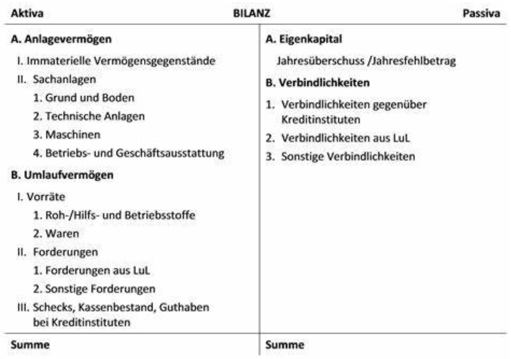

[Beispiel] Ich habe 35.000€ in EK und kaufe eine Maschine für 10.000€.

**Bilanz vor dem Kauf:**
| **Aktiva (Vermögen)**   | **€**  | **Passiva (Kapital)**  | **€**  |  
|-------------------------|--------|-------------------------|--------|
| Bankguthaben            | 35.000 | Eigenkapital            | 35.000 |  
| **Summe Aktiva**        | 35.000 | **Summe Passiva**       | 35.000 |  

**Bilanz nach dem Kauf:**
| **Aktiva (Vermögen)**   | **€**  | **Passiva (Kapital)**  | **€**  |  
| ------------------------- | -------- | ------------------------- | -------- |
| Maschine               | 10.000 | Eigenkapital            | 35.000 |  
| Bankguthaben           | 25.000 |                         |        |  
| **Summe Aktiva**        | 35.000 | **Summe Passiva**       | 35.000 |  

### **Erklärung:**  
- Du hast 10.000 € von deinem Bankguthaben verwendet, um eine Maschine zu kaufen.  
- Das Bankguthaben sinkt von 35.000 € auf 25.000 €.  
- Die Maschine wird als Anlagevermögen mit 10.000 € in der Bilanz aktiviert.  
- Das Eigenkapital bleibt unverändert bei 35.000 €, weil kein Gewinn oder Verlust entstanden ist – es wurde nur eine **Umschichtung der Vermögenswerte** vorgenommen.

**Doppelte Buchführung (Doppik)**: In der privaten Wirtschaft die vorherrschende Art der Finanzbuchhaltung. Man spricht von "doppelter" Buchführung, weil jeder Geschäftsvorgang in zweifacher Weise erfasst wird. In einem Buchungssatz wird grundsätzlich "Soll an Haben" gebucht und damit jeder Geschäftsvorfall doppelt erfasst, jedoch auf verschiedenen Konten. Es wird zeitgleich jeweils genau der gleiche Wert im Soll und im Haben gebucht. Der Periodenerfolg wird auf zwei Wegen ermittelt: Einmal durch die Bilanz und zum anderen mit Hilfe der Gewinn- und Verlustrechnung durch Zusammenfassen und Saldieren von Aufwendungen und Erträgen.

[Notiz] **Grundprinzipien der doppelten Buchführung:**
1. **Jede Transaktion wird doppelt erfasst:** Eine Buchung wird sowohl auf der **Soll-Seite** als auch auf der **Haben-Seite** erfasst.
   * **Soll-Seite (links)**: Hier werden die **Empfänger** einer Transaktion erfasst (z. B. das Konto, das im Wert steigt).
   * **Haben-Seite (rechts)**: Hier wird das **Gegengeschäft** erfasst (z. B. das Konto, das im Wert sinkt).

2. **Bilanzielle Ausgeglichenheit:** Die doppelte Buchführung stellt sicher, dass jede Transaktion die **Bilanzgleichung** nicht verletzt. Das bedeutet, dass **jede Soll-Buchung eine Haben-Buchung in gleichem Betrag erfordert**. Dadurch bleibt die Bilanz immer **ausgeglichen**.

3. **Kontenrahmen und -plan:** Die Unternehmen verwenden ein **Kontenrahmen** oder **Kontenplan**, der festlegt, wie die verschiedenen Transaktionen auf den Konten verbucht werden. Es gibt standardisierte Konten wie **Bank**, **Kasse**, **Forderungen**, **Verbindlichkeiten** und viele andere.

**Beispiel:** Angenommen, ein Unternehmen kauft Waren im Wert von 1.000 Euro auf **Rechnung**.
* **Soll-Buchung**: Das **Warenlager-Konto** (Aktivkonto) wird im Wert von 1.000 Euro erhöht. (Warenlager wächst)
* **Haben-Buchung**: Das **Verbindlichkeiten-Konto** (Passivkonto) wird im Wert von 1.000 Euro erhöht. (Unternehmen schuldet den Betrag)

**Werkzeuge (Hilfsmittel) der doppelten Buchhaltung**:
- Grundbuch (Journal): Aufzeichnungen aller Geschäftsvorfälle in chronologischer Reihenfolge. Untergeordnet sind:
- Kassenbuch für Barvorgänge
- Tagebuch für bargeldlose Vorgänge
- Hauptbuch: Aufzeichnungen aller GV nach Gebieten geordnet
- Inventar

**Bestandskonten (z.B. die Kasse)**: Teil der Bilanz und erfassen die Vermögenswerte (Aktiva) sowie die Kapital- und Schuldenstände (Passiva) eines Unternehmens. Sie dienen dazu, die Bestände an Vermögensgegenständen und Schulden zu einem bestimmten Zeitpunkt abzubilden.

**Erfolgskonten (z.B. die Umsatzerlöse)**: Teil der Gewinn- und Verlustrechnung. Sie erfassen die Geschäftsvorfälle, die den Erfolg eines Unternehmens betreffen, also die Erträge und Aufwendungen.

**Buchungssatz**: Jeder Geschäftsvorfall wird in einem Buchungssatz mit folgenden Informationen beschrieben:
- Belegdatum
- Belegnummer
- Betrag
- das Soll-Konto und das Haben-Konto
- Notiz (optional)

**Buchungssatz bilden**:
1. Betroffene Konten bestimmen (laut Kontenplan)
2. Kontenarten bestimmen (Aktiv-/Passivkonto, Aufwands-/Ertragskonto)
3. Bewegungen auf den Konten bestimmen (Zugang oder Abgang?)
4. Konto-Seite festlegen (Soll oder Haben?)
5. Buchungssatz formulieren: "Soll an Haben"

**Aufwand**: Werteverbrauch (Löhne, Miete,..) einer bestimmten Abrechnungsperiode, der in der
Finanz- oder Geschäftsbuchhaltung erfasst und am Jahresende in der GuV ausgewiesen wird.

**Ertrag**: Wertezuwachs (Umsatzerlöse, Zinserträge, ...) einer bestimmten Abrechnungsperiode, der in der Finanz- oder Geschäftsbuchhaltung erfasst und am Jahresende in der GuV ausgewiesen wird.

**Ertragskonten**:
- Umsatzerlöse
- Zinserträge

**Aufwandskonten**:
- Löhne
- Miete
- Provisionsaufwendungen

[Skip 182 - 188]

**Gewinn- und Verlustrechnung (GuV)**: Ein Bestandteil des Jahresabschlusses eines Unternehmens. In der GuV werden alle Aufwendungen und Erträge der abgelaufenen Periode einander gegenübergestellt. Sie ist demnach eine Zeitraumrechnung (die Bilanz ist eine Zeitpunktrechnung). Die GuV weist die Art, die Höhe und die Quellen des unternehmerischen Erfolgs aus finanztechnischer Perspektive aus. Überwiegen die Erträge, ist der Erfolg ein Gewinn andernfalls ein Verlust.

[Nicht aus den Unterlagen, nur zum Merken] 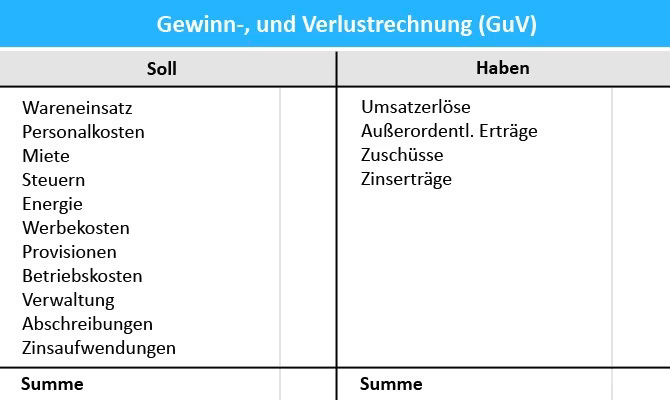
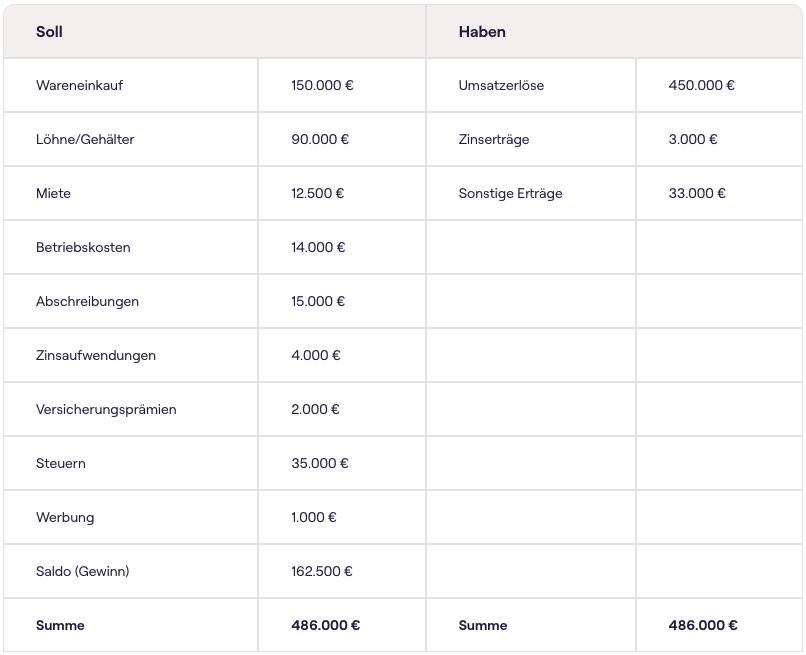

[Notiz] Bilanz ist Aktiva (Vermögenswerte, wie Sachanlagen, Umlaufvermögen und immaterielle Vermögenswerte) und Passiva (Kapital und die Schulden, einschließlich Eigenkapital und Fremdkapital). GuV ist Soll (Aufwand, wie Miete, Steuern, Vertriebskosten) und Haben (Erträge, wie Umsatzerlös, Zuschüsse)

**Jahresabschluss (JA)**: Die periodische Erstellung des Jahresabschlusses ist für alle Kaufleute handelsrechtlich vorgeschrieben. Bestandteile sind die Bilanz sowie die GuV-Rechnung. Mittelgroße und große Kapitalgesellschaften müssen zusätzlich den Jahresabschluss durch Anhang und Lagebericht ergänzen. Der Lagebericht wird von der Geschäftsführung erstellt und soll ein vorausschauendes Element des Jahresabschlusses darstellen. Es sollen Informationen über Forschungs- und Entwicklungsinvestitionen sowie über neue Betriebsstätten und über neue technische Errungenschaften gemacht werden. Generell soll eine Prognose für die nächsten 1-5 Jahre enthalten sein.

# Rechnungswesen - Kosten- und Leistungsrechnung (KLR)
Die Kosten- und Leistungsrechnung (oder Kosten- und Erlösrechnung) ist Bestandteil des internen Rechnungswesens, denn sie berichtet über den innerbetrieblichen Kombinationsprozess der eingesetzten Produktionsfaktoren:
- Eine Erfolgsrechnung bei der durch Gegenüberstellung des bewerteten Güterverzehrs und des Wertes der erstellten Leistungen ein kalkulatorischer Erfolg ermittelt wird.
- Vorwiegend eine laufende (regelmäßig) erstellte Berechnung, durch die das Zahlenmaterial kontinuierlich erfasst und aufbereitet werden soll. Daneben werden aber auch fallweise Sonderrechnungen durchgeführt.
- Sie stellt Informationen für Entscheidungen über den Einsatz von Produktionsfaktoren zur Leistungserstellung und –verwertung zur Verfügung.
- Nicht gesetzlich vorgeschrieben.

**Kosten**: Wert aller Güter und Dienstleistungen, die innerhalb einer Periode für die Erstellung der eigentlichen betrieblichen Leistung (v.a. die Produkte oder Dienstleistungen des Unternehmens) verbraucht bzw. in Anspruch genommen worden sind.

**Erlös**: Wert der in einer Periode erstellten betrieblichen Güter und Dienstleistungen
(betrieblicher, periodenbezogener, ordentlicher Ertrag).

**Kostenträger**: Alle Leistungen, die ein Unternehmen anbietet (Produkte, Dienstleistungen,
Projekte,…). Kostenträger können auch innerbetrieblich angeboten werden.

**Kostenstellen**: Dabei handelt es sich um einen Ort im Unternehmen, an dem Kosten
entstehen und Leistungen erbracht werden. Kostenstellen können Abteilungen oder
Verantwortungsbereiche sein und nach funktionalen, räumlichen oder anderen Aspekten
gebildet werden.

**Einzelkosten**: Sie können direkt (einzeln) dem entsprechenden Kostenträger (Kostenträgereinzelkosten) oder einer Kostenstelle (Kostenstelleneinzelkosten) zugeordnet
werden.

**Gemeinkosten**: Sie entstehen gemeinsam für mehrere Kostenträger (Kostenträgergemeinkosten) oder gemeinsam für mehrere Kostenstellen
(Kostenstellengemeinkosten) und können daher nicht direkt verrechnet werden.

**Fixe und variable Kosten**: Fixe Kosten sind unabhängig von der Menge an Produkten oder
Dienstleistungen, die ausgebracht werden. Sie bleiben über einen bestimmten Zeitraum
konstant. Variable Kosten sind abhängig von der Menge an Produkten oder Dienstleistungen, die ein Unternehmen ausbringt. Gemeinkosten können fix und variabel sein. Einzelkosten sind immer variable Kosten.

**Deckungsbeitrag**: Differenz zwischen den erzielten Erlösen und den variablen Kosten. Es
handelt sich also um den Betrag, der zur Deckung der Fixkosten zur Verfügung steht. Er kann
sich sowohl auf die Gesamtmenge eines Produktes als auch auf eine Mengeneinheit
(Stückgröße) beziehen.

# Dieser Teil kommt wahrscheinlich nicht in der Prüfung

**Vollkostenrechnung**: Bei der Vollkostenrechnung erfolgt eine Aufteilung in Einzel- und
Gemeinkosten. Alle Kosten werden auf die Kostenträger verrechnet. Die Summe aus Einzel-
und Gemeinkosten wird als Selbstkosten bezeichnet.

**Teilkostenrechnung**: Die Kosten werden in fixe und variable Kosten eingeteilt. Nur die
variablen Kosten werden auf die Kostenträger verteilt. Die Summe aus fixen und variablen
Kosten wird als Gesamtkosten bezeichnet.

**Die KLR wird unterteilt in**:
- Kostenartenrechnung (KAR)
- Kostenstellenrechnung (KStR)
- Kostenträgerrechnung (KTR)
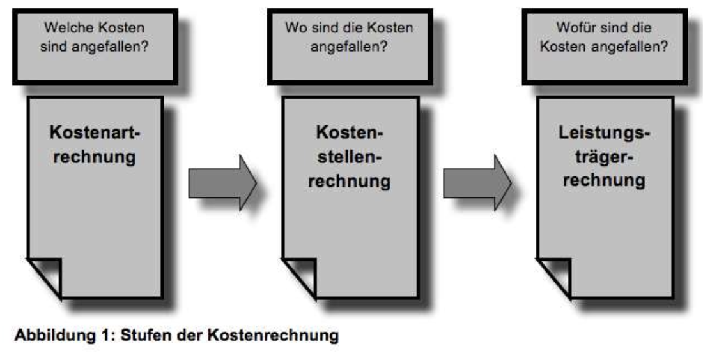

**Gliederung der Kostenarten**
- Verursachungsgerechte Zurechenbarkeit (VKR)
	- Einzelkosten: Sie können direkt (einzeln) dem entsprechenden Kostenträger (Kostenträgereinzelkosten) oder der einer Kostenstelle (Kostenstellengemeinkosten zugeordnet werden.
	- Gemeinkosten: Sie entstehen gemeinsam für mehrere Kostenträger (Kostenträgergemeinkosten) oder gemeinsam für mehrere Kostenstellen (Kostenstellengemeinkosten) und können daher nicht direkt verrechnet werden.
- Nach Veränderung bei Beschäftigung/Produktion (TKR)
	- Fixe Kosten: Entstehen immer, unabhängig davon wieviel „produziert“ wird.
	- Variable Kosten: Produktionsabhängige Kosten.
- Nach Bezugsgrößen
	- Stückkosten
	- Kosten je Leistungseinheit
	- Gesamtkosten
	- Kosten je Periode
- Nach der Art der verbrauchten Güter und Dienstleistungen
	- Personalkosten
	- Materialkosten
	- Energiekosten
	- Kapitalkosten
	- Fremdleistungskosten
	- Kalkulierter Unternehmerlohn
- Nach betrieblichen Funktionen (Entscheidungsbereiche)
	- Beschaffungskosten
	- Produktionskosten
	- Forschungs-und Entwicklungskosten
	- Vertriebskosten
	- Transportkosten
	- Verwaltungskosten
- Kostenverrechnungssysteme
	- Plan-Kosten
	- Ist-Kosten
	- Normal-Kosten

**Kostenstellenrechnung (KStR)**: Untersucht, an welchen Stellen (z.B.: Unternehmensbereich) die Kosten entstanden sind, dazu wird ein Unternehmen in sog. "Kostenstellen" unterteilt. Anschließend werden die in der Kostenartenrechnung erfassten und gegliederten Kosten auf die Kostenstellen (Kostenstelleneinzelkosten und Kostenstellengemeinkosten) verteilt, durch die sie verursacht worden sind. Die zugrunde liegende Frage lautet: "Wo sind welche Kostenarten in welchem Umfang angefallen?" Ziele:
1. Verursachungsgerechte Verteilung der Gemeinkosten auf die Kostenstellen
2. Kontrolle der Wirtschaftlichkeit, der Leistungserstellung in den Kostenstellen.
3. Planung der der Gemeinkosten für jede Kostenstelle (Budgetermittlung)

Kostenstellen können nach unterschiedlichen Kriterien gebildet werden, z.B. nach:
- **Funktionen**: Fertigung, Vertrieb, Verwaltung
- **Verantwortungsbereichen**: Abteilungen, Teams, Werkstätten, Prozesse
- **Räumlichen Gegebenheiten**: Standorte, Maschinenarbeitsplätze, Büros
- **Verrechnungsaspekten**: Hauptkostenstellen, Hilfskostenstellen

**Kostenträgerrechnung (KTR)**: Der letzte Schritt besteht in der Verteilung der Kosten auf die Kostenträger (z.B.: Produkte oder Dienstleistungen), deren Erstellung (Erbringung) letztlich die Kosten verursacht hat. In der KTR werden zum einen die für eine erstellte Leistungseinheit angefallenen Kosten ermittelt (Kostenträgerstückrechnung), und zum anderen wird durch die Einbeziehung der Erlöse der Betriebserfolg einer Abrechnungsperiode bestimmt (Kostenträgerzeitrechnung). Die zugrunde liegende Frage lautet:
"Wofür sind die Kosten angefallen?"
("Wer hat die Kosten zu tragen?")

**Hauptaufgaben der Kostenträgerrechnung**:
- Ermittlung von Angebotspreisen im Sinne von Selbstkosten plus Gewinnzuschlag für zum Verkauf bestimmte Produkte.
- Ermittlung kostenmäßiger kurz- und langfristiger Preisuntergrenzen.
- Bestimmung interner Verrechnungspreise.
- Bereitstellung von Kosteninformation für die Bewertung von Lagerbeständen und selbsterstellten Anlagen, Eigenleistungen (Ermittlung der Herstellkosten).

