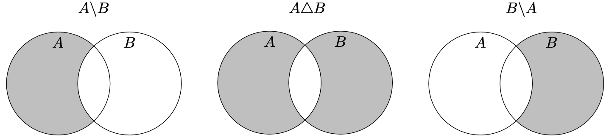
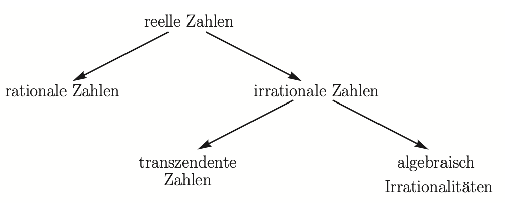
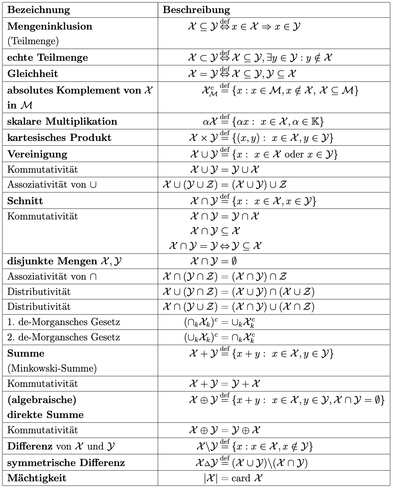
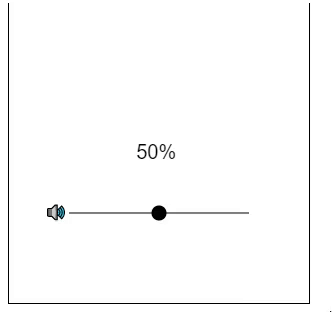
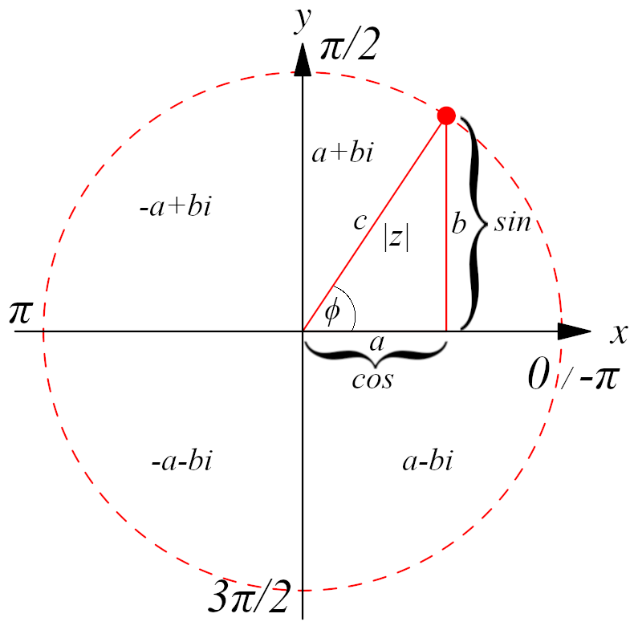
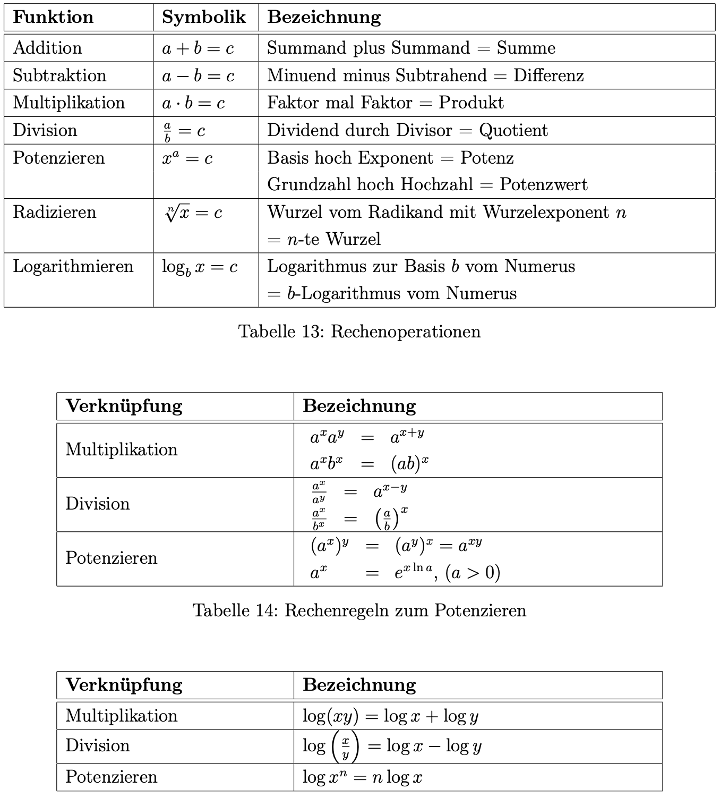
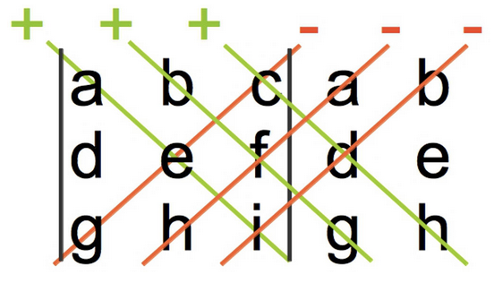
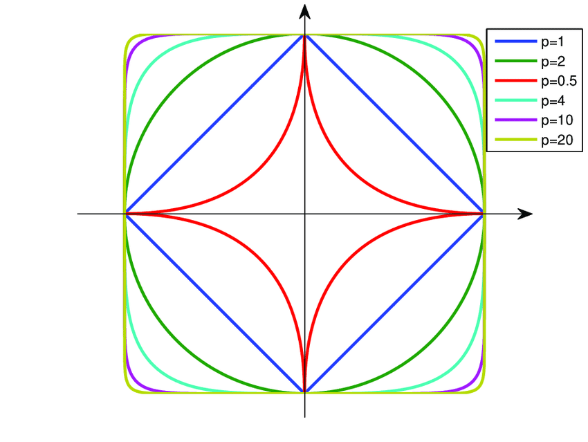

# Definitionen

**Einheitsvektor**: Ein Vektor, dessen Länge (Betrag, euklidische Norm) eins ist, heißt Einheitsvektor[Bsp]
**Basisvektor**: Einheitsvektoren, die genau eine Eins und sonst Nullen besitzen, heißen kanonische Basisvektoren[Bsp]
**Untermatrix**: Eine Matrix, die durch Streichen von Zeilen und/oder Spalten aus einer Matrix $A$ hervorgeht[Bsp]

(In)Konsistens [LGS]

Skalarpr. ⟨x,x⟩

# Verknüpfungen und Aussagen 1

[[TI 1 Zusammenfassung#Logik und Beweistechniken 1]]

# Übliche mathematische Beweisverfahren 2
- **Sätze (Theoreme):** Bewiesene mathematische Aussagen
- **Hilfssätze (Lemmata):** Unterstützende Teilergebnisse für größere Beweise
- **Schlussfolgerungen (Korollare):** Direkte Folgerungen aus bewiesenen Sätzen
- **Formeln:** Kompakte Darstellungen mathematischer Zusammenhänge, oft als Grundlage für Beweise
- **Vermutungen:** Noch unbewiesene, aber meist nicht widerlegte Aussagen
- **Gegenbeispiele:** Konkrete Beispiele, die eine allgemeine Aussage widerlegen

## Beweis durch vollständige Induktion (Remastered)
1. **Induktionsanfang (Induktionsanker)**: Induktionsanker finden, indem man $n= n_0$ in den Term einsetzt (meist $n_0 = 1$) und die Wahrheit der Aussage überprüft. **Wichtig**: Wenn die Aufgabenstellung Ungleichheit, Teilbarkeit oder einen anderen Operator verlangt, diesen anstatt Gleichheit überprüfen.
2. **Induktionsvoraussetzung (Induktionsannahme)**: Nun kann man annehmen, dass die Aussage für $n$ gilt (Voraussetzung $p$). Dazu den Term aufschreiben oder, wenn dieser in der Aufgabenstellung steht, einfach "s.o." (siehe oben) schreiben.
3. **Induktionsschritt**: Danach überprüft man den nächsten Schritt bzw. Iteration des Terms, indem man jedes $n$ mit $n+1$ ersetzt (Behauptung $q$).
4. **Beweis der Implikation**: Zuletzt beweist man anhand der Voraussetzung $p$, dass die Behauptung $q$ wahr ist ($p ⇒ q$). Je nach Operator kann dies unterschiedlich aussehen:
	- Gleichheit: Beweise, dass $p = q + s$ ist. $s$ ist der nächste Schritt. Z.B. bei einer Summe $\sum_{i=1}^{n} \sqrt{i}$ wäre diese $s=\sqrt{n+1}$. $n+1$ ersetzt also praktisch $i$.
	- Teilbarkeit: Die Summe und Differenz zweier Zahlen, die beide durch eine Zahl teilbar sind, ist durch die gleiche Zahl teilbar. D.h. man muss nur $q-p$ rechnen und überprüfen, ob alle Terme durch diese Zahl teilbar sind.
	- Ungleichung: Ähnlich wie bei der Gleichung stellt man $p \geq q + s$ auf, nur mit einem anderen Operator. Allerdings formt man die Gleichung solange um, bis eindeutig wird, dass diese immer wahr ist. Im Gegensatz zur Gleichung müssen beide Seiten nicht gleich sein, weshalb häufig abgeschätzt wird, ob das Ergebnis stimmt. 

[Ab hier Kapitel neu schreiben]

## Direkter Beweis 2.2
Mit dieser Beweismethode werden Gleichungen und Ungleichungen bewiesen. Zwei Möglichkeiten:

1. Stelle eine Kette richtiger Schlüsse ausgehend von einer wahren (trivialen) Aussage auf, deren letztes Glied die Behauptung ist.
2. Gehe von der Behauptung aus und nutze **nur äquivalente** Umformungen, um eine bekannte wahre Aussage abzuleiten.

**Anmerkung**: Gegebenenfalls sind Fallunterscheidungen notwendig.

### Beispiel

## Indirekter Beweis (Widerspruchsbeweis) 2.3
- Richtigkeit von Aussagen wird durch die Falschheit der negierten Aussage bewiesen
- Eine $a$ ist genau dann wahr, wenn $¬a$ falsch ist
- Eine Aussage $a ⇒ b$ ist wahr, wenn die Aussage $¬(¬a ∨ b) = a ∧ ¬b$ falsch ist ($¬(a ⇒ b) = ¬(¬a ∨ b) = a ∧ ¬b$)

### Beispiel

## Beweis durch vollständige Induktion 2.4
- Sätze und Formeln, die von natürlichen Zahlen $n$ abhängen, werden bewiesen
- Ist eine Aussage für eine natürliche Zahl $n_0$ wahr, und folgt aus der waren Aussage für eine natürliche Zahl $n ≥ n_0$ die Wahrheit der Aussage für $n + 1$, dann ist $n ≥ n_0$ gültig

**Danach erfolgt der Beweis**:
1. Induktionsanfang (Induktionsanker): Die Wahrheit der Aussage wird für $n = n_0$ gezeigt. Meist kann man $n_0 = 1$ wählen.
2. Induktionsvoraussetzung (Induktionsannahme): Die Aussage sei für $n$ wahr (Voraussetzung $p$)
3. Induktionsschritt Die Aussage sei für $n + 1$ wahr (Behauptung $q$)
4. Beweis der Implikation: $p ⇒ q$

### Beispiel

## Beweis von Äquivalenzen 2.5

- $a = b$ stellt eine Äquivalenz dar
- Kann durch zwei Ungleichungen bewiesen werden, da $a = b ⇔ a ≤ b ∧ b ≤ a$
- Gleiche gilt für Mengen: $A = B ⇔ A ⊆ B$ und $B ⊆ A$
- $a ⇔ b$ wird zu $a ⇒ b$ und $b ⇒ a$
  • $a, b, c, d$ sind äquivalent
- Zeige $a ⇒ b, b ⇒ c, c ⇒ d$ und $d ⇒ a$
  $a ⇒ b ⇒ d ⇒ c ⇒ a$
  $b ⇒ a ⇒ d ⇒ c ⇒ b$
  (Reihenfolge kann getauscht werden)

## Gegenbeispiele 2.6

- Gelingt für eine Aussage kein Beweis, kann die Aussage falsch (Gegenbeispiel anwenden) sein oder der Beweis ist zu schwer
- Gelingt für eine Vermutung ein Gegenbeispiel, hat man die Vermutung widerlegt
- Es ist auch nützlich, wenn man von $a$ auf $b$ schließt, aber darauf verweisen will, dass von $b$ nicht auf $a$ geschlossen werden kann

### Beispiel

Wenn eine Funktion auf einem Intervall $(a, b)$ ein Minimum hat, ist ihre Ableitung null. $f(x) = |x|$ zeigt, dass dies nicht so sein muss.

# Mengen und Mengenoperationen 3
- Objekte einer Menge heißen Elemente
- Eine Menge ist eine Ansammlung von Objekten aus einer Grundgesamtheit
- Es wird verlangt, dass von jedem Objekt feststeht, ob es in der Menge vorkommt oder nicht
  - Gehört das Element a in eine Menge $M$, schreibt man $a ∈ M$
  - Wenn nicht, dann $a ∉ M$
- Jedes Objekt kommt in einer Menge höchstens einmal vor
- Die Menge hat keine Ordnung, d.h. zwei Mengen sind gleich unabhängig davon, an welcher Stelle ihre Elemente stehen

**Beschreibung von Mengen**:
- Aufzählen der Elemente: $A = \{ \text{Merkur, Mars, Venus, Erde} \}$
- Angabe von Eigenschaften: $B = \{ x^2\ |\ x \text{ ist eine positive ungerade Zahl} \} = \{1, 9, 25, 49, ...\}$

**Bezeichnung einer Menge nach Anzahl der Elemente**:
| Anzahl der Elemente | Bezeichnung      |
| --------------------- | ------------------ |
| null (keins)        | leere Menge      |
| endlich viele       | endliche Menge   |
| unendlich viele     | unendliche Menge |
| keine Angabe        | Menge            |

**Bezeichnung von Teilmengen**:
| Anzahl der Elemente | Bezeichnung |
| --------------------- | ------------- |
| eins                | Singleton   |
| zwei                | Paar        |
| drei                | Tripel      |
| vier                | Quadrupel   |
| n                   | n-Tupel     |

**Venn-Diagramme von Vereinigung und Schnitt von $A$ und $B$**:

$A \cup B= \{ x\ |\ x\text{ ist Element von }A\text{ oder Element von }B \} = \{ x\ |\ x \in A \lor x \in B \}$
$A \cap B= \{ x\ |\ x\text{ ist Element von }A\text{ und Element von }B \} = \{ x\ |\ x \in A \land x \in B \}$

**Venn-Diagramme der Di!erenzen von $A$ und $B$**:

$A\setminus B= \{ x\ |\ x \in A \land x \notin B \}$
$A \triangle B= A \backslash B \cup B \backslash A$

**Axiome der Aussagenlogik nach Peano gelten auch für Mengen**:

**Partition**: Teilt bzw. zerlegt eine Menge $M$ in nicht-leere, nicht-überschneidene Stücke (Teilmengen $M_i$), welche die gesamte Menge $M$ abdecken.

$$
\bigcup_{k=1}^n M_k = M_1 \cup ... \cup M_n = M
$$

**Bsp.**: $M = \{1, 2, 3, 4, 5, 6\}$
Eine mögliche Partition: $Z=\{M1​=\{1,2\},M2​=\{3,4\},M3​=\{5,6\}\}$

**Kartesisches Produkt**: Eine Menge aus geordneten Paaren entsteht aus der Kombination von jedem Element einer Menge $A$ mit jedem Element einer Menge $B$.

$$
A×B=\{(a,b)∣a∈A,b∈B\} \\
\text{Mit mehr als zwei Mengen:} \\
A×B×C=\{(a,b,c)∣a∈A,b∈B,c∈C\}
$$

**Bsp.**: $A = \{1, 2\},\ B = \{x, y\}$
$A×B=\{(1,x),(1,y),(2,x),(2,y)\}$

## Spezielle Mengen 3.1

[Werden auch teilweise in den Definitionen erklärt]

## Erweiterung des Mengenbegriffs 3.2

### Fuzzy-Menge
Eine Menge geordneter Paare $(x,µ_x (x))$, bei der $x$ aus der gewöhnlichen Menge $X$ stammt und $µ_x (x)$ den Grad der Zugehörigkeit durch einen Wert $µ_x (x)$ mit $0 ≤ µ_x (x) ≤ 1$ darstellt.

### Multimenge
Eine Menge, in der gleiche Elemente mehrfach vorkommen können.
**Anmerkung**: Eine Multimenge kann auch als Menge geordneter Paare $(x, n_x)$ und damit als eine Abbildung aufgebaut werden, wobei $x$ aus einer gewöhnlichen Menge $X$ stammt und $n_x$ die Anzahl des Auftretens von $x$ in der Multimenge ergibt.

## Mengenoperationen 3.3

[Begriffe und Symbole erklären!]

- Sei $A ≠ ∅$ eine Menge und $R$ eine Äquivalenzrelation auf $A$ und $c∈A$. $[c] := \{x∈A: xRc\}$ heißt die zu $c$ gehörende Äquivalenzklasse
- Die Menge verschiedener Äquivalenzklassen $[a], a ∈A$ heißt Faktormenge von $A$ unter $R$, Bezeichnung: $A_R = \{[a] : a∈A\}$
- Für die Äquivalenzklassen einer Äquivalenzrelation $R$ auf $A$ gilt:¡

1. $aRb⇔[a] = [b]$
2. Für beliebige $a,b∈A$ gilt stets entweder leere Menge, $[a] = [b]$ oder $[a] ∩[b] = ∅$
3. $A = \underset{a∈A} \cup [a]$

## Relationen 3.4

[[TI 1 Zusammenfassung#Relationen 2.2]]

### Beispiel
| Relation         | Reflexiv | Symmetrisch | Transitiv |
|------------------|----------|-------------|-----------|
| mRn ⇔ m·n ≥ n²   | Ja       | Nein        | Ja        |
| mRn ⇔ max(m,n)=m | Ja       | Nein        | Ja        |
| mRn ⇔ m-n=0      | Ja       | Ja          | Ja        |
| mRn ⇔ mⁿ > 1     | Nein     | Nein        | Ja        |

#### Begründungen
**Relation 1**:
- Reflexivität: $m \times m = m^2$
- Symmetrie: $3 \times 2 \geq 2^2$, aber $2 \times 3 \geq 3^2$
- Transitivität: $m \times n \geq n^2 ⇔ m \geq n$ und $n \geq p$, dann $m \geq p$

**Relation 2**:
- Reflexivität: $\max(m,m)=m$
- Symmetrie: $\max(3,2)=3$, aber $\max(2,3) \neq 2$
- Transitivität: $\max(m,n)=m ⇔ m \geq n$ und $n \geq p$, dann $m \geq p$

**Relation 3**:
- Reflexivität: $m-m=0$
- Symmetrie: $m-n=0$, dann $n-m=0$
- Transitivität: $m-n=0 ⇔ m=n$ und $n=p$, dann $m=p$

**Relation 4**:
- Reflexivität: $1^1 \ngtr 1$
- Symmetrie: $2^1>1$, aber $1^2 \ngtr 1$
- Transitivität: $m^n>1 ⇔ m>1, n>0$ und $n^p>1 ⇔ n>1, p>0$, dann $m^p>1$, weil $m \geq 2,p \geq 1$

## Abbildung 3.5

[[TI 1 Zusammenfassung#Abbildungen 2.3]]

# Komplexe Zahlen 4

- Während reelle Zahlen an einen 1-dimensionalem Zahlstrahl gebunden sind, können komplexe Zahlen sich in mehreren Dimensionen bewegen
- Die imaginäre Einheit $i$ ist definiert durch die Eigenschaft $i^2 = -1$ bzw. $i=\sqrt{-1}$
- Eine komplexe Zahl $z$ hat die Form $z = a + bi$ (arithmetisch/algebraisch) oder $z=r \times r·e^{iϕ}$ (Euler'sche/Polarform)
- Die arithmetische Form gibt die Position auf der reellen und imaginären Achse an, als wären es "Koordinaten"
- Die eulersche Form ist der Winkel vom Ursprung aus und ein Betrag, welcher den Abstand darstellt

- Realteil $a$ (Position reellen Achse $a=Re(z)$) und Imaginärteil $b$ (Position imaginären Achse $b = Im(z)$) sind reelle Zahlen $\mathbb{R}$
- Ist $b≠0$ liegt $z$ im komplexen Zahlenraum
- Wurzeln und Logarithmen von negativen Zahlen sind bei komplexen Zahlen erlaubt
- Bei der Winkelberechnung von $z$ erhält man beim Bruch einen positiven Wert, dies ist aber auch bei $w$ zutreffend, obwohl es in einem anderen Quadranten liegt
- In diesem Thema werden $\phi$ und $\varphi$, sowie $r$ und $|z|$ oft austauschbar verwendet
- $a^{bi}$ lässt sich als $e^{i (b \ln(a))}$ umschreiben
- Ist $a^{bi}$ im Betrag, ergibt es immer $|a^{bi}|=1$ für alle $a>0$ und $b∈\mathbb{R}$, weil $|e^{iϕ}|=\sqrt{\cos(ϕ)^2+\sin(ϕ)^2}=\sqrt{1}=1$

**Polarform**: $z=|z|·e^{iϕ} = r·e^{iϕ}$
**Trigonometrischen oder goniometrischen Form**: $z=|z|·(cos(ϕ) + i· sin(ϕ))$

$tan(ϕ)=\frac{sin(ϕ)}{cos(ϕ)}=\frac{b}{a}$

$\phi=arctan_2(b,a)$ [?]

**Merke**: Auf den jeweiligen Quadranten achten!

**Geometrische Darstellung (Argand-Diagramm)**: Darstellung komplexer Zahlen in der komplexen Ebene. Eine komplexe Zahl kann als Punkt oder Vektor in der komplexen Ebene angesehen werden.

**Einheitskreis**: Der Kreis, der im Argand-Diagramm den Radius $1$ hat und dessen Mittelpunkt im Ursprung $(0,0)$ liegt. Er beschreibt alle komplexen Zahlen $z=e^{iθ}$

## Umrechnungen der Formen
**Arithmetische Form zu Exponentialform**:
1. Berechne den Betrag $r = \sqrt{a^2 + b^2}$
2. Berechne das Argument $\theta = \tan^{-1}(\frac{b}{a})$
3. Setze $z = r e^{i\theta}$

**Exponentialform zu arithmetischer Form**:
1. Berechne den Realteil $\text{Re}(z) = r \cos(\theta)$
2. Berechne den Imaginärteil $\text{Im}(z) = r \sin(\theta)$
3. Setze $z = \text{Re}(z) + i \cdot \text{Im}(z)$

### Beispiel
**Arithmetische Form $z = 1 + i$ zu Exponentialform**:
1. $r = \sqrt{1^2 + 1^2} = \sqrt{1 + 1} = \sqrt{2}$
2. $\theta = \tan^{-1}(\frac{1}{1}) = \tan^{-1}(1) = \frac{\pi}{4}$
3. $z = \sqrt{2} e^{i \frac{\pi}{4}}$

**Exponentialform $z = 3 e^{i \frac{\pi}{3}}$ zu arithmetischer Form**:
1. $\text{Re}(z) = 3 \cos(\frac{\pi}{3}) = 3 \cdot \frac{1}{2} = \frac{3}{2}$
2. $\text{Im}(z) = 3 \sin(\frac{\pi}{3}) = 3 \cdot \frac{\sqrt{3}}{2} = \frac{3\sqrt{3}}{2}$
3. $z = \frac{3}{2} + \frac{3\sqrt{3}}{2} i$

### Tabelle $\sin, \cos, \tan⁻¹$
| Winkel (Bogenmaß) | Winkel (Grad) | sin(θ)       | cos(θ)         |
|-------------------|---------------|--------------|----------------|
| π/4               | 45°           | √2/2 ≈ 0.707 | √2/2 ≈ 0.707   |
| π/2               | 90°           | 1            | 0              |
| 3π/4              | 135°          | √2/2 ≈ 0.707 | -√2/2 ≈ -0.707 |
| π                 | 180°          | 0            | -1             |
| 3π/2              | 270°          | -1           | 0              |
| 0 oder -π         | 360°          | 0            | -1             |

## Rechenregeln für komplexe Zahlen 4.2

## Rechenoperationen

# Polynome 5

## Einvariable Polynome 5.1

### Polynom

- Eine Funktion $p : \mathbb{C→C}$ der Art $p(x) = \sum_{k=0}^{n} p_kx^k = p_nx^n + p_{n-1}x^{n-1} + ... + p_2x^2 + p_1x + p_0$ heißt Polynom
- $n$ ist eine nicht-negative ganze Zahl, die den Grad des Polynoms angibt
- Sind die Koeffizienten $p_k$ reell, heißt es reelles Polynom, für $p_k∈\mathbb{C}$ komplexes Polynom
- Das Polynom mit $p_k = 0$ für alle $k = 0,...,n$ heißt Nullpolynom $0(x)$
- Zwei Polynome $p(x)$ und $q(x)$ vom Grad $n$ heißen gleich, wenn für alle $k = 0,...,n$ Koeffizienten $p_k = q_k$ gilt.

**Beispiel:** Das Polynom $p(x) = 2x^3 - 4x^2 + 3x - 5$ ist ein Polynom dritten Grades mit vier Termen.

### Monom

- Ein ist ein Polynom, das aus genau einem Term besteht $p(x)=p_kx^k$
- Ein Standardmonome ist $p_k = 1$
- Ein Polynom besteht aus Monomen

**Beispiel**: Das Monom $p(x)=5x^6$, bestehend aus dem Koeffizienten 5 und der Variablen $x$ mit dem Exponenten 6.

### Monisches Polynom

- Für ein Polynom $p(x) = \sum_{k=1}^{n} p_kx^k; p_n ≠ 0$ bezeichne $lm(p) = x^n$ das Leitmonom und $lc(p) = p_n$ den Leitkoeffizienten oder führenden Koeffizienten
- Polynome mit $lc(p) = 1$ heißen monisch

**Beispiel**: $g(x) = x^3 + 4x^2 - 3x + 2$ ist ein monisches Polynom, weil der führende Koeffizient (der Koeffizient von $x^3$) gleich 1 ist.

### Nullstelle (Wurzel eines Polynoms)

- Ein Wert $x_i$, durch den das Polynom null wird $p(x_i) = 0$ heißt Nullstelle oder Wurzel eines Polynoms
- Es heißt $k$-fache Wurzel, wenn es Wurzel von $p(x)$ ist, aber nicht vom Polynom $p(x)/(x−x_i)^k$
- Der Begriff "Wurzel" ist historisch gewachsen und muss nicht unbedingt etwas mit einer Wurzel (radix) $\sqrt{}$ zu tun haben

**Beispiel**: Die Nullstelle des linearen Polynoms $p(x) = x - 4$ ist $4$, weil $4 - 4 = 0$

### Fundamentalsatz der Algebra

- Jedes Polynom mit einem Grad größer als null hat mindestens eine Nullstelle in den komplexen Zahlen
- Jedes Polynom mit Grad $n$ hat genau $n$ komplexe Nullstellen $x_i$ dargestellt $p(x) = p_n(x−x_1)(x−x_2)···(x−x_n)$
- D.h. komplexe sind Zahlen notwendig, um die Gleichungen abzuschließen

**Beispiel**: Das Polynom $q(x) = x^2 + 1$ zeigt, dass selbst wenn es keine reellen Nullstellen gibt, es immer noch die komplexen Nullstellen $x = i$ und $x = -i$ gemäß dem Fundamentalsatz der Algebra gibt.

### Konjungiert komplexe Wurzeln reeller Polynome

- In einem reellen Polynom treten komplexe Wurzeln stets als konjungiert komplexe Paare auf
- Heißt: Wenn ein Polynom reelle Koeffizienten hat und eine komplexe Zahl $a + bi$ (wobei $b \neq 0$) eine Wurzel ist, dann ist ihr konjugiertes $a - bi$ ebenfalls eine Wurzel

**Beispiel**: Wenn ein Polynom wie $p(x) = x^2 + (4-2i)x + 5$ eine komplexe Wurzel $2 + i$ hat, muss auch $2 - i$ eine Wurzel sein (angenommen, es handelt sich um reelle Koeffizienten).[?]

### Wurzelsatz von Vieta

- Vieta entdeckte, dass die Summe und das Produkt der Nullstellen eines Polynoms mit den Koeffizienten des Polynoms verknüpft sind
- Zwischen den $n$ Wurzeln $x_1,x_2,...,x_n$ und den Koeffizienten der Gleichung $x^n + p_{n−1}x^{n−1} +...+ p_0$ besteht der Zusammenhang:

$$
x_1 + x_2 + ...x_n = \sum_{i=1}^{n} x_i=-p_{n-1} \\
x_1x_2 + x_1x_3 + ...x_{n-1}x_n = \sum_{\overset{i,j=1}{i<j}}^{n} x_ix_j=p_{n-2} \\
x_1x_2x_3 + x_1x_2x_4 + ...x_{n-2}x_{n-1}x_n = \sum_{\overset{i,j,k=1}{i<j<k}}^{n} x_ix_jx_k=-p_{n-3} \\
... \\
x_1x_2...x_n=(-1)^np_0

$$

**Beispiel**: Für das Polynom $s(x) = x^2 - 5x + 6$, laut Vieta ist die Summe der Nullstellen $3 + 2 = 5$ (entspricht $-(-5)/1$), und das Produkt ist $3 \times 2 = 6$ (entspricht $6/1$).[?]

### Rationale und gebrochenrationale Funktionen

- Eine Funktion heißt rational, wenn die unabhängigen Variablen durch endlich viele rationale Rechenoperationen wie Addition, Subtraktion, Multiplikation oder Division, verknüpft sind
- Eine gebrochenrationale oder kurz rationale Funktion lässt sich als Bruch darstellen, bei dem sowohl der Zähler als auch der Nenner Polynome sind
- Sie heißt echt gebrochenrationale Funktion, wenn der Polynomgrad des Zählers kleiner ist als der des Nenners

**Beispiel rationale Funktion**: Die Funktion $r(x) = \frac{x^2 - 4}{x - 1}$ ist überall definiert, außer bei $x = 1$, wo die Funktion eine Definitionslücke hat.

**Beispiel echt rationale Funktion**: $r(x) = \frac{x + 2}{x^2 + 1}$ ist eine echt rationale Funktion, da der Grad des Zählers (1) kleiner ist als der Grad des Nenners (2).

**Nichtrationale Funktionen**: $r(x) = \sqrt{x^3}$ ist nicht rational, weil sie nicht als Bruch von zwei Polynomen dargestellt werden kann.

## Mehrvariable Polynome 5.2

### $n$-variates Polynom

- Ein $n$-variates Polynom, auch Polynom in $n$ Variablen, ist ein Polynom, das mehr als eine Variable beinhaltet
- $n$ stellt die Anzahl der Variablen dar
- Der maximalen Grad eines der Terme betrachtet man, indem man die Summe der Exponenten der Variablen in jedem Term bildet[?]
- Ein Produkt $m= x_1^{α_1} x_2^{α_2}···x_n^{α_n}$ mit $α_i ∈ \mathbb{N}$ und $∃i∈{1,...,n}: α_i≠0$ heißt Monom $m$ in den Variablen $x_1,...,x_n$
- Kurz: $x^α := x_1^{α_1} x_2^{α_2}···x_n^{α_n}$, wobei $x = ((x_i))$ der Variablenvektor und $α = ((α_i))$ der sog. Multigrad des Monoms ist
- Die natürliche Zahl $|α| := \sum_{i=1}^{n} a_i$ wird Monomgrad genannt
- Eine endliche Linearkombination $p = \sum_{j=1}^{m} a_jx^{a_j}$ mit Koeffizienten $a_j ∈ \mathbb{C}$ heißt $n$-variates Polynom $p$
- Der größte Monomgrad in einem Polynom ist der Polynomgrad

**Beispiel**: Das Polynom $p(x, y, z) = 2x^3 + 3xy^2 - yz + 5$ hat Terme, die drei Variablen $x$, $y$ und $z$ verwendet. Der Grad des Polynoms ist 3, da der höchste Gesamtgrad eines einzelnen Terms (hier $2x^3$) 3 ist.

#### Kreisgleichung

$(x−x_0)^2 + (y−y_0)^2= r^2$
$x_2−2x_0x+ y_2−2y_0y+ x_0^2 + y_0^2−r^2 = 0$

### Multilineares Polynom

- Ein Polynom  $p(x_1,...,x_p)$ in $p$ Variablen ist multilinear, wenn jeder Term linear in Bezug auf jede Variablen ist
- D.h., in jedem Term trettet jede Variable entweder gar nicht oder genau mit dem Exponenten 1 auf[?]

$$
p(x_1,...,x_p) = a_0
\sum_{i=1}^p a_ix_i +
\sum_{i \neq j}^p b_{i,j}x_ix_j +
\sum_{i \neq j;\ i \neq k;\ j \neq k}^p c_{i,j,k}x_ix_jx_k + ...

$$

**Beispiel**: Die Funktion $m(x, y) = 2xy + 3x + y$ ist multilinear, weil alle Terme entweder linear (z.B. $3x$, $y$) sind oder das Produkt von Variablen jedes mit dem Exponent 1 (z.B. $2xy$) ist.

### Quadratische Form

- Ein Polynom $p(x) = p(x_1, x_2, \ldots, x_n) = x^TA_x = \sum_{i=1}^n \sum_{j=1}^n a_{ij}x_ix_j$, bei dem alle Terme vom Grad 2 (Bilinearform) sind, mit Koeffizienten $a_{ij} ∈ R$ heißt homogen oder reelle quadratische Form in den Variablen $x_1,...,x_n$ und $p(x) = x^HA_x$ mit $A ∈ C^{n×n}$ komplexe quadratische Form
- Ist $A$ symmetrisch, hermitesch oder positiv definit, so spricht man von einer symmetrischen, hermiteschen oder positiv definiten quadratischen Form
- Durch Umformung eines Polynoms in eine quadratische Form können Abschätzungen berechnet und Ungleichungen für das Polynom bewiesen werden, etwa über Eigenwerte
- Eine quadratische Form kann auch Darstellung in Matrixnotation besitzen, insbesondere wenn sie durch eine symmetrische Matrix dargestellt wird

**Beispiel**: $3x^2 − 2xy + y^2 = (x,y)^T = \begin{pmatrix} 3 & -1 \\ -1 & 1 \end{pmatrix} \begin{pmatrix} x \\ y \end{pmatrix}$ ist eine quadratische Form, da es ausschließlich Terme beinhaltet, die entweder das Quadrat einer Variablen darstellen (z.B. $3x^2$, $y^2$) oder das Produkt zweier Variablen (z.B. $-2xy$).

#### Symmetrisierung

$A$ kann immer symmetrisch gewählt werden, ggf. Symmetrisierung: $A := \frac{1}{2} (A+ A^T)$[?]

#### Bestimmung der Nullstellen

#### Reduzierung des Polynomgrades durch Polynomdivision

# Matrix 6

**Matrix**:

- Ein rechteckiges Schema von $m$ Zeilen und $n$ Spalten als $(m×n)$-Matrix ("$m$ kreuz $n$")
- Objekte einer Matrix werden Elemente genannt
- Elemente $a_{ii}$ einer Matrix bilden deren Hauptdiagonale (Diagonale die beginnend bei $a_{11}$ nach rechts unten fällt)
- Diagonalen, die parallel zur Hauptdiagonalen verlaufen, werden je nachdem, ob sie ober- oder unterhalb der Hauptdiagonalen liegen, als Ober- oder Unterdiagonalen bezeichnet
- Senkrecht zur Hauptdiagonalen verlaufende Diagonale, die vom Element $a_{m1}$ ausgeht, heißt Nebendiagonale
- Eigenwerte [?]

$$
\begin{pmatrix}
a_{11} & a_{12} & a_{13} \\
a_{21} & a_{22} & a_{23} \\
a_{31} & a_{32} & a_{33}
\end{pmatrix}

$$

* **Hauptdiagonale**: $a_{11}, a_{22}, a_{33}$ (von oben links nach unten rechts)
* **Nebendiagonale**: $a_{13}, a_{22}, a_{31}$ (von oben rechts nach unten links)
* **Oberdiagonale**: $a_{12}, a_{23}$ (oberhalb der Hauptdiagonalen)
* **Unterdiagonale**: $a_{21}, a_{32}$ (unterhalb der Hauptdiagonalen)

**Vektor**:

- $(m×1)$-Matrix heißt Spaltenvektor oder kurz Vektor, $(1×n)$-Matrix heißt Zeilenvektor

$$
Spalt.\ \underline{x} = \begin{pmatrix}1\\ 2\\ 3\end{pmatrix}
\quad
Zeil.\ \underline{y} = (4\ 5\ 6)

$$

- Elemente eines Vektors auch bezeichnet man als Koordinaten oder Komponenten
- Oft werden Pfeile über Vektoren $\vec{x}$ weggelassen $x$ oder mit Strichen geschrieben $\underline{x}$
- Zwei Vektoren $x,y∈\mathbb{R}^n$ für deren Komponenten $x_i ≤ y_i$ für $1 ≤i≤n$ oder $x_i ≥yi$ für $1 ≤i≤n$ gilt, heißen vergleichbar (im Sinne der natürlichen Halbordnung)

$$
\begin{pmatrix}1\\ 2\end{pmatrix} \leq \begin{pmatrix}3\\ 3\end{pmatrix} \checkmark
\quad \begin{pmatrix}1\\ 100\end{pmatrix} \leq \begin{pmatrix}2\\ 2\end{pmatrix} ✗

$$

## Operationen

**Addition (komponentenweise)**:
$A + B := ((a_{ij} + b_{ij}))$, mit $A= ((a_{ij})),B = ((b_{ij}))$ und $A,B \in \mathbb{C}^{m×n}$

$\begin{pmatrix}1 & 2 \\ 3 & 4\end{pmatrix} + \begin{pmatrix}2 & 0 \\ 0 & 0\end{pmatrix} = \begin{pmatrix}1+2 & 2+0 \\ 3+0 & 4+0\end{pmatrix} = \begin{pmatrix}3 & 2 \\ 3 & 4\end{pmatrix}$

*Elemente werden an der gleiche Koordinate addiert.*

**Skalarmultiplikation**:
$γA := ((γa_{ij}))$, mit $γ ∈ \mathbb{C}$ und $A∈\mathbb{C}^{m×n}$

$2 \begin{pmatrix}1 & 0 \\ 0 & 1\end{pmatrix} = \begin{pmatrix}2×1 & 2×0 \\ 2×0 & 2×1\end{pmatrix} = \begin{pmatrix}2 & 0 \\ 0 & 2\end{pmatrix}$

*Elemente werden mit einer Zahl multipliziert.*

**Transposition**:
$A = ((a_{ji})), A^T = ((a_{ji}))$, mit $A∈\mathbb{C}^{m×n}$ und $A^T∈\mathbb{C}^{n×m}$ (Nicht "hoch T" sagen)
[Manchmal wird := verwendet, manchmal nur = ?]

$\begin{pmatrix}1 & 2 & 3\\ 4 & 5 & 6\end{pmatrix}^T = \begin{pmatrix}1 & 4\\ 2 & 5\\ 3 & 6\end{pmatrix}$

*Zeilen und Spalten werden vertauscht.*

Regeln: $(AB)^T= B^TA^T,(A^T)^T= A,(A+ B)^T= A^T + B^T$

**Konjugierte Transposition**:
$A = ((a_{ji})), A^H := ((\overline{a_{ji}}))$, mit $A∈\mathbb{C}^{m×n}$ und $A^H∈\mathbb{C}^{n×m}$

$\begin{pmatrix}1 & 2\\ 3+i & 4\end{pmatrix}^H = \begin{pmatrix}1 & 3-i\\ 2 & 4\end{pmatrix}$

*Zeilen und Spalten werden vertauscht; Vorzeichen von komplexen Zahlen werden umgedreht.*

Regeln: $(AB)^H = B^HA^H,(A^H)^H= A,(A+B)^H= A^H+B^H$

**Matrix-Vektor-Multiplikation**:
$A \times B := ((\sum_{k=1}^n a_{ik}b_k))$, mit $A∈\mathbb{C}^{m×n},B∈\mathbb{C}^n$

$\begin{pmatrix}1 & 2 & 3\\ 4 & 5 & 6\end{pmatrix}\begin{pmatrix}1\\ 0\\ -1\end{pmatrix} = \begin{pmatrix}1×1 & + 2×0 & + 3×(+1)\\ 4×1 & + 5×0 & + 6×(-1)\end{pmatrix} = \begin{pmatrix}-2\\ -2\end{pmatrix}$

*Elemente werden mit dem Vektor multipliziert und dann addiert.*

**Matrixprodukt**:[aka Matrixmultiplikation?]
$A \times B := ((\sum_{k=1}^n a_{ik}b_{kj})) := ((a_i^T \times b_j))$, mit $A∈\mathbb{C}^{m×n},B∈\mathbb{C}^{n×p}$

$\begin{pmatrix}1 & 2\\ 3 & 4\end{pmatrix} \times \begin{pmatrix}5 & 7\\ 6 & 8\end{pmatrix} = \begin{pmatrix}1×5+2×6\quad 1×7+2×8\\ 3×5+4×6\quad 3×7+4×8\end{pmatrix} = \begin{pmatrix}17 & 39\\ 23 & 53\end{pmatrix}$

*Zeilen von links werden mit den Spalten von rechts multipliziert und dann addiert.*

- Matrizenprodukt ist assoziativ und **nicht** kommutativ
  ⇒ Matrizen können keine abelschen Gruppen bilden[?]

**Hadamard-Produkt**:
$A⊙B := ((a_{ij}·b_{ij}))$, mit $A∈\mathbb{C}^{m×n},B∈\mathbb{C}^{m×n}$

$\begin{pmatrix}1 & 2\\ 3 & 4\end{pmatrix} ⊙ \begin{pmatrix}5 & 7\\ 6 & 8\end{pmatrix} = \begin{pmatrix}1×5 & 2×7\\ 3×6 & 4×8\end{pmatrix} = \begin{pmatrix}5 & 14\\ 18 & 32\end{pmatrix}$

*Elemente werden an der gleiche Koordinate multipliziert.*

**Kronecker-Produkt**:
$A \otimes B :=  \begin{bmatrix}  a_{11}B & a_{12}B & \cdots & a_{1n}B \\  a_{21}B & a_{22}B & \cdots & a_{2n}B \\  \vdots & \vdots & \ddots & \vdots \\  a_{m1}B & a_{m2}B & \cdots & a_{mn}B  \end{bmatrix}$, mit $A \in \mathbb{R}^{m×n}$, $B \in \mathbb{R}^{p×q}$

$\begin{pmatrix}1 & 2 \\ 0 & 1\end{pmatrix} \otimes \begin{pmatrix}1 & 2 \\ 3 & 4\end{pmatrix} = \begin{pmatrix}1 & 2 & 2 & 4 \\ 3 & 4 & 6 & 8 \\ 0 & 0 & 1 & 2 \\ 0 & 0 & 3 & 4 \end{pmatrix}$

*Elemente von $A$ multiplizieren die gesamte Matrix $B$.*

**Vektorisieren**:
$vec(A) = \begin{bmatrix} a_{11} \\ \vdots \\ a_{m1} \\ a_{12} \\ \vdots \\ a_{m2} \\ \vdots \\ a_{1n} \\ \vdots \\ a_{mn} \end{bmatrix}$, mit $A∈\mathbb{C}^{m×n}$

$A=\begin{pmatrix}3 & 2 \\ 4 & 5\end{pmatrix},\ vec(A)=\begin{pmatrix} 3 \\ 4 \\ 2 \\ 5\end{pmatrix}$

*Spalten werden aufeinander gestapelt.*

[TODO: \text verwenden statt Leerzeichen, Außerdem nur manchmal komplexe Zahlen]

## Spezielle Matrizen

**Symmetrische Matrix**:
$a_{ij} = a_{ji}$ und $A^T= A$

$\begin{pmatrix}1 & 2 & 3\\ 2 & 4 & 5\\ 3 & 5 & 4\end{pmatrix}$

*Zeilen und Spalten sind gleich*

**Diagonalmatrix**:
$a_{ij} = 0$ für $i \neq j$

$\begin{pmatrix}1 & 0\\ 0 & 2\end{pmatrix}$

*Alle Nichtdiagonalelemente sind $0$*

**Obere Dreiecksmatrix**:
$a_{ij} = 0$ für $i>j$

$\begin{pmatrix}1 & 2 & 4\\ 0 & 3 & 5\\ 0 & 0 & 6\end{pmatrix}$

*Alle Elemente unterhalb der Hauptdiagonale sind $0$*

**Einheitsmatrix**:
$a_{ij} = δ_{ij}$

$\begin{pmatrix}1 & 0 & 0\\ 0 & 1 & 0\\ 0 & 0 & 1\end{pmatrix}$

*$1$ auf der Hauptdiagonale und $0$ überall sonst*

**Schiefsymmetrische Matrix**:
$a_{ij}=−a_{ji}$ und $A^T=−A$

$\begin{pmatrix}0 & 1 & 2\\ -1 & 0 & 3\\ -2 & -3 & 0\end{pmatrix}$

*Zeilen und Spalten sind gleich; Vorzeichen von Zahlen unter der Hauptdiagonale werden umgekehrt*

**Hermitesche Matrix**:
$a_{ij}=a_{ji}$ und $A^H=A$

$\begin{pmatrix}1 & 1+i\\ 1-i & 3\end{pmatrix}$

*Symmetrisch und Vorzeichen von komplexen Zahlen werden umgedreht*

**Schiefhermitesche Matrix**:
$a_{ij}=a_{ji}$ und $A^H=A$

$\begin{pmatrix}i & 2+3i\\ -2+3i & 2i\end{pmatrix}$

*Schiefsymmetrisch und Vorzeichen von komplexen Zahlen werden umgedreht*

**Orthogonale Matrix**:
$A^TA= I_n$

$\begin{pmatrix}0 & 1\\ -1 & 0\end{pmatrix} \begin{pmatrix}0 & -1\\ 1 & 0\end{pmatrix} = \begin{pmatrix}1 & 0\\ 0 & 1\end{pmatrix} = I$

*Wenn die Matrix multipliziert mit ihrer Transposition die Einheitsmatrix ergibt*

**Idempotente Matrix**:
$A^2=A$ mit $A∈C^{n×n}$

$\begin{pmatrix}1 & 5\\ 0 & 0\end{pmatrix} \begin{pmatrix}1 & 5\\ 0 & 0\end{pmatrix} = \begin{pmatrix}1 & 5\\ 0 & 0\end{pmatrix}$

*Eine Matrix multipliziert mit sich selbst ergibt die gleiche Matrix*

**Positiv definite Matrix**:
$x^HAx>0$ mit $∀x∈C^n \backslash \{0_n\}$

$x^TAx(x_1\ x_2)\begin{pmatrix}2 & -1 \\ -1 & 2\end{pmatrix} \begin{pmatrix}x_1 \\ x_2\end{pmatrix} = 2x_1^2-2x_1x_2+2x_2^2$

*Symmetrisch, Eigenwerte sind positiv und für jedes $x$ kommt ein positiver Wert raus*

# Lineare Gleichungssysteme 7

- Bei einem lineares Gleichungssystem (LGS) sollen mehrere Gleichung gleichzeitig gelöst werden, um die Werte für bestimmte Unbekannte ($x_1, x_2, …, x_n$) zu finden
- Die gesammte Gleichung kann als $Ax=b$ zusammengefasst werden, wobei $A$ eine Matrix und $b,x$ Vektoren sind: $A∈\mathbb{C}_r^{m×n} ,x∈\mathbb{C}^n; b∈\mathbb{C}^m$
- $A$ enthält alle Koeffinzienten $a_{ij}$ und $x$ alle Unbekannten
- $b=0_m$: homogen, $b≠0_m$: inhomogen
- [Fehlt Hauptsatz für lineare inhomogene Gleichungssysteme]

$$
a_{11}x_1 + a_{12}x_2 + a_{13}x_3 +...+ a_{1n}x_n = b_1 \\
a_{21}x_1 + a_{22}x_2 + a_{23}x_3 +...+ a_{2n}x_n = b_2 \\
... \\
a_{m1}x_1 + a_{m2}x_2 + a_{m3}x_3 +...+ a_{mn}x_n = b_m

$$

## Lösung des linearen Gleichungssystems 7.2

**Ziel**: Das LGS so umformen, sodass sich die Lösungsmenge nicht ändert und leicht abgelesen werden kann

**Erlaubte (äquivalente) Umformungen**:

1. Vertauschen von zwei Zeilen
2. Multiplikation mit einer Zahl
3. Addition/subtraktion einer Zeile mit einer anderen
4. Vertauschen der Spalten (ordnet die $x_i$ um)
5. Besteht eine Zeile nur aus $0$ kann man sie streichen

- Häufig wird das Gauß-Verfahren (Gaußsche Eliminationsverfahren) verwendet, in welchem man versucht, die Matrix in eine obere Dreiecksmatrix zu bringen
- Der Grund dafür ist, dass man LGS dann einfach von unten nach oben lösen kann
- **Merke**: Alle Elemente unter der Hauptdiagonale müssen $0$ sein, aber Elemente auf und über der Hauptdiagonale dürfen ebenso $0$ sein
- **Tipp**: Wenn das Ergebnis schon erkennbar ist, muss man die Dreiecksmatrix nicht zwingend fertig schreiben
- Um eine Dreiecksmatrix zu erzeugen verwendet man ein Pivot-Element (als Kasten dargestellt), welches in der ersten Spalte anfängt, und nach dem ersten Element, das ungleich $0$ ist sucht
- Verwende (falls nötig) das Pivot-Element, um durch Umformungen alle darunterliegenden Einträge in dieser Spalte auf $0$ zu setzen und gehe danach eine Spalte nach rechts

### Beispiel

$\begin{pmatrix} \boxed{1} & 0 & 2 & 1 & | & 0 \\ 0 & \boxed{1} & 2 & 1 & | & 0 \\ 0 & 1 & 1 & 2 & | & -2 \\ 0 & 1 & 0 & 1 & | & 0 \\ \end{pmatrix}$

$Z_3=Z_3-Z_2$
$Z_4=Z_4-Z_2$

$\begin{pmatrix}\boxed{1} & 0 & 2 & 1 & | & 0 \\ 0 & \boxed{1} & 2 & 1 & | & 0 \\ 0 & 0 & \boxed{-1} & 1 & | & -2 \\ 0 & 0 & -2 & 0 & | & 0\end{pmatrix}$

*In diesem Fall ist die obere Dreiecksmatrix zwar noch nicht ganz erfüllt, aber man kann das Ergebnis leicht erkennen, weshalb der letzte Schritt übersprungen werden kann.*

**Man erhält einen Wert für $x_3$ in $Z_4$**:
$-2x_3=0$
$x_3=0$

**$x_3$ in $Z_3$ einsetzen**:
$0+x_4=-2$
$x_4=-2$

**$x_3$ und $x_4$ in $Z_2$ einsetzen**:
$x_2+0 -2=0$
$x_2=2$

**$x_2$, $x_3$ und $x_4$ in $Z_1$ einsetzen**:
$x_1+0-2=0$
$x_1=2$

**Lösung**:
$x = (2,2,0,−2)^T$

## Nullraum

- Der Nullraum (oder Kern) ist die Menge aller Vektoren $x$, die die Gleichung $Ax=0$ erfüllen
- Die Dimension eines Nullraums ist die Menge der Vektoren [Es gibt eine schnelle Methode ohne rechnen anscheinend]
- Sind die Dimensionen der Matrix und des Bildraums bekannt, ist die Dimension des Nullraums die Differenz

### Beispiel

$A=\begin{pmatrix}2 & 3 & 3 & 6 & 1 \\ 0 & 4 & 4 & 8 & 8 \\ 0 & 5 & 5 & 10 & 5 \\ 0 & 1 & 1 & 2 & 1\end{pmatrix}$

*Ich zeichne nicht immer das Pivot-Element ein, man soll es sich einfach vorstellen.*

Da $Z_3$ und $Z_4$ Mehrfache sind, kann eines entfernt werden:
$Z_4 = Z_4 - Z_3 \times 1/5$
$Z_4=(0\ 0\ 0\ 0\ 0)$

$\begin{pmatrix}2 & 3 & 3 & 6 & 1 \\ 0 & 4 & 4 & 8 & 8 \\ 0 & 1 & 1 & 2 & 1\end{pmatrix}$

$Z_1=Z_1-Z_3 \times 3$
$Z_2=Z_2 \times 1/4$

$\begin{pmatrix}2 & 0 & 0 & 0 & -2 \\ 0 & 1 & 1 & 2 & 2 \\ 0 & 1 & 1 & 2 & 1\end{pmatrix}$

$Z_3=Z_3-Z_2$
$Z_3=Z_3 \times -1$

$\begin{pmatrix}2 & 0 & 0 & 0 & -2 \\ 0 & 1 & 1 & 2 & 2 \\ 0 & 0 & 0 & 0 & 1\end{pmatrix}$

$Z_1=Z_1-Z_3 \times -2$
$Z_2=Z_2-Z_3 \times 2$

$\begin{pmatrix}2 & 0 & 0 & 0 & 0 \\ 0 & 1 & 1 & 2 & 0 \\ 0 & 0 & 0 & 0 & 1\end{pmatrix}$

**In Zeilen $Z_1$ und $Z_3$ stellt man fest, dass $x_1$ und $x_5$ immer gleich $0$ sind**:
$2x_1=0$
$x_5=0$

**Der Term in $Z_2$ lässt sich umformen, um Terme für $x_2$, $x_3$ und $x_4$ zu erhalten. Allerdings braucht man eigentlich nur einen Term für den folgenden Schritt**:
$x_2+x_3+2x_4=0$

$x_2=-x_3-2x_4$
$x_3=-x_2-2x_4$
$x_4=-1/2x_2-1/2x_3$

**In $x_2$ werden $x_3$ und $x_4$ mit den Skalaren $λ$ und $µ$ ersetzt**:
$x_1=0$
$x_2=-λ-2µ$
$x_3=λ$
$x_4=µ$
$x_5=0$

*In diesem Beispiel werden zwar Lambda $\lambda$ und Mu $\mu$ verwendet, man kann jedoch auch andere Zeichen wählen (z.B. $\alpha, \beta$...)*

$N(A)=λ\begin{pmatrix}0\\-1\\1\\0\\0\end{pmatrix}+µ\begin{pmatrix}0\\-2\\0\\1\\0\end{pmatrix}$

## Bildraum

- Der Bildraum ist die Menge aller Vektoren, die als $Ax$ für irgendeinen Vektor $x$ dargestellt werden können[?]

### Beispiel

**Wenn $x_n$ kein $λ$ oder $µ$ ist, ist es Teil des Bildraums. Dazu werden die Spalten der anfänglichen Matrix eingesetzt**:

$R(A)=α\begin{pmatrix}2\\0\\0\\0\end{pmatrix}+β\begin{pmatrix}3\\4\\5\\1\end{pmatrix}+γ\begin{pmatrix}1\\8\\5\\1\end{pmatrix}$

## Inverse einer Matrix 7.3

- Inverse $X$ von $A$ ist $A^{−1}$ mit $A \in \mathbb{R}^{n \times n}$, wenn $AX = XA = I_n$
- D.h., die Matrix mal die Inverse der Matrix ergibt den Einheitsvektor $A \times A^{-1}=I$
- Determinante muss ungleich null sein

### Inverse mit Gauß-Jordan-Algorithmus

- Matrix $A$ mit Einheitsmatrix $I$ erweitern: $A=I$
- Das Ziel ist, die linke Seite in die Einheitsmatrix $I$ umzuwandeln
- Die rechte Seite wird dann zu $A^{−1}$
- Umformungensregeln sind die gleichen wie bei LGS

#### Beispiel

$A = \begin{pmatrix} 1 & 1 & 1 \\ 1 & 2 & 2 \\ 2 & 4 & 2 \end{pmatrix}$

$\begin{pmatrix} 1 & 1 & 1 & | & 1 & 0 & 0 \\ 1 & 2 & 2 & | & 0 & 1 & 0 \\ 2 & 4 & 2 & | & 0 & 0 & 1 \end{pmatrix}$

$Z_2 \leftarrow Z_2 - Z_1$
$Z_3 \leftarrow Z_3 - 2 \times Z_1$

$\begin{pmatrix} 1 & 1 & 1 & | & 1 & 0 & 0 \\ 0 & 1 & 1 & | & -1 & 1 & 0 \\ 0 & 2 & 0 & | & -2 & 0 & 1 \end{pmatrix}$

$Z_3 \leftarrow Z_3 - 2 \times Z_2$
$Z_3 \leftarrow Z_3 \times -1/2$

$\begin{pmatrix} 1 & 1 & 1 & | & 1 & 0 & 0 \\ 0 & 1 & 1 & | & -1 & 1 & 0 \\ 0 & 0 & 1 & | & 0 & 1 & -\frac{1}{2} \end{pmatrix}$

$Z_2 \leftarrow Z_2 - Z_3$
$Z_1 \leftarrow Z_1 - Z_3$

$\begin{pmatrix} 1 & 1 & 0 & | & 1 & -1 & \frac{1}{2} \\ 0 & 1 & 0 & | & -1 & 0 & \frac{1}{2} \\ 0 & 0 & 1 & | & 0 & 1 & -\frac{1}{2} \end{pmatrix}$

$Z_1 \leftarrow Z_1 - Z_2$

$\begin{pmatrix} 1 & 0 & 0 & | & 2 & -1 & 0 \\ 0 & 1 & 0 & | & -1 & 0 & \frac{1}{2} \\ 0 & 0 & 1 & | & 0 & 1 & -\frac{1}{2} \end{pmatrix}$

$A^{-1} = \begin{pmatrix} 2 & -1 & 0 \\ -1 & 0 & \frac{1}{2} \\ 0 & 1 & -\frac{1}{2} \end{pmatrix}$

[Was ist die Umkehrabbildung der Funktion]

### Inverse mit Determinante

**Allgemein**:

$$
A=\begin{pmatrix}a & b \\ c & d\end{pmatrix} \quad
A^{-1}=\frac{1}{det(A)} adj(A)

$$

**Für $2 \times 2$ Matrix:**

$$
A=\begin{pmatrix}a & b \\ c & d\end{pmatrix} \quad
A^{-1} = \frac{1}{ad-bc} \begin{pmatrix} d & -b \\ -c & a \end{pmatrix}

$$

#### Beispiel

$A = \begin{pmatrix} 1 & 1 & 1 \\ 1 & 2 & 2 \\ 2 & 4 & 2 \end{pmatrix}$

**Determinante von $A$ berechnen**:
$det(A)=1 \times det\begin{pmatrix}2 & 2 \\ 4 & 2\end{pmatrix} - 1 \times det\begin{pmatrix}1 & 2 \\ 2 & 2\end{pmatrix} + 1 \times det\begin{pmatrix}1 & 2 \\ 2 & 4\end{pmatrix}$
$det(A)=1 \times (2 \times 2 - 2 \times 4) - 1 \times (1 \times 2 - 2 \times 2) + 1 \times (1 \times 4 - 2 \times 2)$
$det(A)=-4 + 2 + 0 = -2$

**Kofaktoren $C_{ij}$ der Kofaktormatrix $C$ berechnen**:
$C_{11} = \begin{vmatrix} 2 & 2 \\ 4 & 2 \end{vmatrix} = 2 \cdot 2 - 2 \cdot 4 = 4 - 8 = -4$
$C_{12} = \begin{vmatrix} 1 & 2 \\ 2 & 2 \end{vmatrix} = 1 \cdot 2 - 2 \cdot 2 = 2 - 4 = -2$
$C_{13} = \begin{vmatrix} 1 & 2 \\ 2 & 4 \end{vmatrix} = 1 \cdot 4 - 2 \cdot 2 = 4 - 4 = 0$
$C_{21} = \begin{vmatrix} 1 & 1 \\ 2 & 2 \end{vmatrix} = 1 \cdot 2 - 1 \cdot 2 = 2 - 2 = 0$
$C_{22} = \begin{vmatrix} 1 & 1 \\ 2 & 2 \end{vmatrix} = 1 \cdot 2 - 1 \cdot 2 = 2 - 2 = 0$
$C_{23} = \begin{vmatrix} 1 & 1 \\ 2 & 4 \end{vmatrix} = 1 \cdot 4 - 1 \cdot 2 = 4 - 2 = 2$
$C_{31} = \begin{vmatrix} 1 & 1 \\ 2 & 2 \end{vmatrix} = 1 \cdot 2 - 1 \cdot 2 = 2 - 2 = 0$
$C_{32} = \begin{vmatrix} 1 & 1 \\ 1 & 2 \end{vmatrix} = 1 \cdot 2 - 1 \cdot 1 = 2 - 1 = 1$
$C_{33} = \begin{vmatrix} 1 & 1 \\ 1 & 2 \end{vmatrix} = 1 \cdot 2 - 1 \cdot 1 = 2 - 1 = 1$

$C = \begin{pmatrix} -4 & -2 & 0 \\ 0 & 0 & 2 \\ 0 & 1 & 1 \end{pmatrix}$
[Vielleicht etwas erläutern]

**Die Adjunktenmatrix $adj(A)$ ist die transponierte Kofaktormatrix**:
$\operatorname{adj}(A) = \begin{pmatrix} -4 & 0 & 0 \\ -2 & 0 & 1 \\ 0 & 2 & 1 \end{pmatrix}$

**Inverse berechnen**:
$A^{-1} = \frac{1}{-2} \begin{pmatrix} -4 & 0 & 0 \\ -2 & 0 & 1 \\ 0 & 2 & 1 \end{pmatrix} = \begin{pmatrix} 2 & 0 & 0 \\ 1 & 0 & -\frac{1}{2} \\ 0 & -1 & -\frac{1}{2} \end{pmatrix}$

## Matrixgleichung 7.4

- Eine Gleichung, in der die Unbekannte eine Matrix ist
- Sie heißt linear, wenn neben einem Absolutglied $C$ nur Terme der Art $A_iXB_i$ auftreten, die additiv verknüpft sind [?]

### Methode 1

1. Inversen von $A$ und $B$ berechnen
2. Rechne $AXB=C ⇒ X = A^{-1} \times C \times B^{-1}$

#### Beispiel

$A = \begin{pmatrix} 1 & 1 & 1 \\ 1 & 2 & 2 \\ 2 & 4 & 2 \end{pmatrix},\ B = \begin{pmatrix} 4 & 2 & 2 \\ 2 & 2 & 1 \\ 2 & 4 & 2 \end{pmatrix},\ C = \begin{pmatrix} 1 & 0 & 1 \\ 2 & 0 & 1 \\ 1 & 1 & 0 \end{pmatrix}$

*Inversenrechnung wird oben bereits erklärt und $A$ ist schon berechnet, also wird der Teil übersprungen*

$A^{-1} = \begin{pmatrix} 2 & -1 & 0 \\ -1 & 0 & \frac{1}{2} \\ 0 & 1 & -\frac{1}{2} \end{pmatrix}, \quad B^{-1} = \begin{pmatrix} 0 & 1 & -\frac{1}{2} \\ -\frac{1}{2} & 1 & 0 \\ 1 & -3 & 1 \end{pmatrix}$

$\begin{pmatrix} 2 & -1 & 0 \\ -1 & 0 & \frac{1}{2} \\ 0 & 1 & -\frac{1}{2} \end{pmatrix} \times \begin{pmatrix} 1 & 0 & 1 \\ 2 & 0 & 1 \\ 1 & 1 & 0 \end{pmatrix} \times \begin{pmatrix} 0 & 1 & -\frac{1}{2} \\ -\frac{1}{2} & 1 & 0 \\ 1 & -3 & 1 \end{pmatrix}$

$=\begin{pmatrix} 0 & 0 & 1 \\ -\frac{1}{2} & \frac{1}{2} & -1 \\ \frac{3}{2} & -\frac{1}{2} & 1 \end{pmatrix} \times \begin{pmatrix} 0 & 1 & -\frac{1}{2} \\ -\frac{1}{2} & 1 & 0 \\ 1 & -3 & 1 \end{pmatrix}$

$=\begin{pmatrix} 1 & -3 & 1 \\ -\frac{5}{4} & 3 & -\frac{3}{4} \\ \frac{5}{4} & -2 & \frac{1}{4} \end{pmatrix}$

### Methode 2

- Rechne $AXB=C ⇒ (B^T \otimes A)\times vec(X)=vec(C)$

$A = \begin{pmatrix} 1 & 2 \\ 3 & 4 \end{pmatrix},\ B = \begin{pmatrix} 0 & 1 \\ 1 & 0 \end{pmatrix},\ C = \begin{pmatrix} 4 & 1 \\ 2 & 2 \end{pmatrix}$

$B^T = \begin{pmatrix} 0 & 1 \\ 1 & 0 \end{pmatrix}$

$B^T \otimes A = \begin{pmatrix} 0 & 0 & 1 & 2 \\ 0 & 0 & 3 & 4 \\ 1 & 2 & 0 & 0 \\ 3 & 4 & 0 & 0 \end{pmatrix}$

$vec(C) = \begin{pmatrix} 4 \\ 2 \\ 1 \\ 2 \end{pmatrix},\ vec(X) = \begin{pmatrix} x_1 \\ x_2 \\ x_3 \\ x_4 \end{pmatrix}$

$\begin{pmatrix} 0 & 0 & 1 & 2 \\ 0 & 0 & 3 & 4 \\ 1 & 2 & 0 & 0 \\ 3 & 4 & 0 & 0 \end{pmatrix} \begin{pmatrix} x_1 \\ x_2 \\ x_3 \\ x_4 \end{pmatrix} = \begin{pmatrix} 4 \\ 2 \\ 1 \\ 2 \end{pmatrix} ⇒ \begin{pmatrix} 0 & 0 & 1 & 2 & | & 4 \\ 0 & 0 & 3 & 4 & | & 2 \\ 1 & 2 & 0 & 0 & | & 1 \\ 3 & 4 & 0 & 0 & | & 2 \end{pmatrix}$

$\begin{pmatrix} 0 & 0 & 1 & 2 & | & 4 \\ 0 & 0 & 3 & 4 & | & 2 \\ 1 & 2 & 0 & 0 & | & 1 \\ 0 & -2 & 0 & 0 & | & -1 \end{pmatrix}$

$\begin{pmatrix} 0 & 0 & 1 & 2 & | & 4 \\ 0 & 0 & 3 & 4 & | & 2 \\ 1 & 2 & 0 & 0 & | & 1 \\ 0 & 1 & 0 & 0 & | & \frac{1}{2} \end{pmatrix}$

$\begin{pmatrix} 0 & 0 & 1 & 2 & | & 4 \\ 0 & 0 & 3 & 4 & | & 2 \\ 1 & 0 & 0 & 0 & | & 0 \\ 0 & 1 & 0 & 0 & | & \frac{1}{2} \end{pmatrix}$

$\begin{pmatrix} 0 & 0 & 1 & 2 & | & 4 \\ 0 & 0 & 3 & 4 & | & 2 \\ 1 & 0 & 0 & 0 & | & 0 \\ 0 & 1 & 0 & 0 & | & \frac{1}{2} \end{pmatrix}$

[GPT gibt nur Scheiß Beispiele. Mache das wann anders]

[Was ist mit Inversion der Matrix C bei Ü6 1.3?]

[Linear Unabhängigkeit bei Nullraum + Testen mit Vektor]

# Funktionale von Matrizen

## Spur 8.1

- Die Summe der Hauptdiagonalelemente einer quadratischen Matrix

**Rechenregeln**:

### Beispiel

$A = \begin{pmatrix} 1 & 2 & 3 \\ 4 & 5 & 6 \\ 7 & 8 & 9 \end{pmatrix}$

$sp(A)=1+5+9=15$

## Determinante 8.2

[[TI 1 Zusammenfassung###Permutationen]]

- Existiert nur für quadratische Matrizen
- Geometrisch gesehen, beschreibt die Determinante das Volumen des Parallelepipeds, das durch die Zeilen- oder Spaltenvektoren der Matrix aufgespannt wird[Bild finden]
- Wenn $det(A)=0$, sind die Vektoren linear abhängig und das Volumen des Raumgebildes ist null, heißt, die Matrix ist nicht invertierbar

### $2 × 2$-Matrix Determinante

- Multipliziere Elemente der Hauptdiagonalen, von oben links nach unten rechts, und subtrahiere das Produkt der Elemente der Nebendiagonalen, von oben rechts nach unten links

$det(A)=\begin{pmatrix} a & b \\ c & d \end{pmatrix}=ad-bc$

#### Beispiel

$A=\begin{pmatrix} 2 & 3 \\ 4 & -1 \end{pmatrix}$

$det(A)=2\times(-1)-3\times4=-2-12=-14$

### Regel von Sarrus ($3 × 3$-Matrix)

- Elemente von oben links nach unten rechts (grün) multiplizieren und die Produkte addieren
- Elemente von unten links nach oben rechts (rot) multiplizieren und die Produkte subtrahieren

$A = \begin{pmatrix} a & b & c \\ d & e & f \\ g & h & i \end{pmatrix}$

$det(A)=a \times e \times i + b \times f \times g + c\times d \times h$
$-g \times e \times c − h \times f \times a − i \times d \times b$

#### Beispiel

$A = \begin{pmatrix} 3 & -1 & 2 \\ 1 & 1 & 2 \\ 2 & 1 & -1 \end{pmatrix}$

**Hauptdiagonalen**: $3\times1\times(-1)+(-1)\times2\times2+2\times1\times1$
**Nebendiagonalen**: $-2\times1\times2-1\times2\times3-(-1)\times1\times(-1)$

**Hauptd. - Nebend.**: $det(A)=-3-4+2-4-6-1=-16$

### Laplacescher Entwicklungssatz ($n × n$-Matrix)

1. Wähle eine Zeile oder Spalte, je nachdem, was am einfachsten ist
2. Finde die Nebenminoren, also die Matrizen unter/neben gewählten Zeile/Spalte. Zeilenweise: Entferne die erste Spalte bei der ersten Matrix, die zweite Spalte bei der zweiten… (Bei Spalten genau umgekehrt)
3. Die Nebenminoren sollten nun eine Dimension kleiner sein. Berechne ihre Determinanten
4. Die Elemente der gewählten Spalte werden abwechseln mit $+1$ und $-1$ multipliziert und dann nochmal mit den jeweiligen Determinanten. Ist die Zeile/Spalte ungerade, werden sie zuerst mit $+1$ multipliziert, ist sie gerade, mit $-1$

**Rechenregeln**:

#### Beispiel mit $3 × 3$

$A = \begin{pmatrix} 6 & 1 & 8 \\ 7 & 5 & 9 \\ 2 & 3 & 4 \end{pmatrix}$

$M_{11} = \begin{vmatrix} 5 & 9 \\ 3 & 4  \end{vmatrix},\quad det(M_{11}) = (5 \cdot 4) - (9 \cdot 3) = 20 - 27 = -7$

$M_{12} = \begin{vmatrix} 7 & 9 \\ 2 & 4 \end{vmatrix},\quad det(M_{12}) = (7 \cdot 4) - (9 \cdot 2) = 28 - 18 = 10$

$M_{13} = \begin{vmatrix} 7 & 5 \\ 2 & 3 \end{vmatrix},\quad det(M_{13}) = (7 \cdot 3) - (5 \cdot 2) = 21 - 10 = 11$

$det(A) = + 6 \cdot (-7) - 1 \cdot 10 + 8 \cdot 11 = (-42) - 10 + 88 = 36$

#### Beispiel mit $4 × 4$

$A = \begin{pmatrix} 1 & 2 & 3 & 4 \\ 5 & 6 & 7 & 8 \\ 9 & 10 & 11 & 12 \\ 13 & 14 & 15 & 16 \end{pmatrix}$

*Zeile 1 gewählt*

$M_{11} = \begin{vmatrix} 6 & 7 & 8 \\ 10 & 11 & 12 \\ 14 & 15 & 16 \end{vmatrix},\quad det(M_{11})=0$

$M_{12} = \begin{vmatrix} 5 & 7 & 8 \\ 9 & 11 & 12 \\ 13 & 15 & 16 \end{vmatrix},\quad det(M_{12})=0$

$M_{13} = \begin{vmatrix} 5 & 6 & 8 \\ 9 & 10 & 12 \\ 13 & 14 & 16 \end{vmatrix},\quad det(M_{13})=0$

$M_{14} = \begin{vmatrix} 5 & 6 & 7 \\ 9 & 10 & 11 \\ 13 & 14 & 15 \end{vmatrix},\quad det(M_{14})=0$

$\text{det}(A) = +1 \cdot 0 - 2 \cdot 0 + 3 \cdot 0 - 4 \cdot 0 = 0$

## Rang einer Matrix 8.3

- Gibt die maximale Anzahl linear unabhängiger Spalten (oder Zeilen) einer Matrix an
- Ist ein Maß für die "Dimension" des von den Spalten (oder Zeilen) aufgespannten Vektorraums
- Interpretationen bzw. Möglichkeiten, den Rang festzustellen: Anzahl der Pivot-Elemente oder maximale Anzahl linear unabhängiger Spalten oder Zeilen
- Lineare Unabhängigkeit: Wenn kein Vektor als lineare Kombination der anderen Vektoren ausgedrückt werden kann. Bedeutete so viel wie: Egal wie man die Zeilen/Spalten umformt, also multipliziert oder miteinandert addiert, der gewollte Vektor lässt sich nicht bilden
- Vektoren, die nur $0$ beinhalten sind nicht linear unabhängig, da jeder Vektor mit $0$ multipliziert einen Nullvektor bildet

**Rechenregeln**:

#### Beispiel
$A = \begin{pmatrix} 1 & 2 & 3 \\ 4 & 5 & 6 \\ 7 & 8 & 9 \\ \end{pmatrix}$

$Z_2=Z_2-Z_1 \times 4$
$Z_3=Z_3-Z_1 \times 7$

$\begin{pmatrix} 1 & 2 & 3 \\ 0 & -3 & -6 \\ 0 & -6 & -12 \\ \end{pmatrix}$

$Z_3=Z_3-Z_2 \times 2$

$\begin{pmatrix} 1 & 2 & 3 \\ 0 & -3 & -6 \\ 0 & 0 & 0 \\ \end{pmatrix}$

Zeile $Z_1$ und $Z_2$ sind linear unabhängig, weshalb der Rang der Matrix $rg(A)=2$ ist. Die dritte Zeile (und auch die dritte Spalte) kann aus den anderen durch Linearkombinationen hergeleitet werden.

## Norm von Vektoren und Matrizen 8.4
Ein Norm ist eine Abbildung $||\ ||: M→\mathbb{R}^≥$ mit den Eigenschaften:
$||x||≥0$
$||x||= 0\text{ nur für }x= 0$
$||α·x||= |α|·||x||\text{ für alle }α∈\mathbb{C}$
$||x+ y||≤||x||+ ||y||\text{ Dreiecksungleichung}$

**Manhattan-Norm (Cityblock-Norm oder Betragsummennorm)**: Summe der Beträge der Komponenten eines Vektors
$||x||_1 = \sum_{i=1}^n |x_i|$

**Euklidische Norm**: Quadratwurzel der Summe der Quadrate der Komponenten
$||x||_2 = \sqrt{|x_1|^2 + |x_2|^2 + ... + |x_n|^2}$

**Höldernorm**: Die Summe der Beträge der Komponenten eines Vektors
$||x||_p = (|x_1|^p + |x_2|^p + ... + |x_n|^p)^{\frac{1}{p}}$

**Tschebyschew-Norm (Maximumnorm)**: Der größte Betrag der Komponenten eines Vektors
$||x||_\infty = \underset{1 \leq i \leq n}{max} |x_i|$

**Skalarprodukt induziert**: $||x||= \sqrt{⟨x,x⟩}$

**Kreise der verschiedenen Normen**:

*Der Tschebyschew-Norm Kreis ist ein Quadrat.*

Ein Rechner für Normen: [desmos.com/calculator/e3g0rtg2vm](https://www.desmos.com/calculator/e3g0rtg2vm)

### Beispiel
$v_1 = \begin{pmatrix} 5 \\ 3 \\ 4 + i \end{pmatrix},\quad v_2 = \begin{pmatrix} 1 \\ 2 \\ i \end{pmatrix},\quad v_3 = \begin{pmatrix} 1 \\ 8 \\ 2 \end{pmatrix}$

**Manhattan-Norm**:
$\|v_1\|_1 = |5| + |3| + |4+i| = 5 + 3 + \sqrt{4^2 + 1^2} = 5 + 3 + \sqrt{17}$
$\|v_2\|_1 = |1| + |2| + |i| = 1 + 2 + 1 = 4$
$\|v_3\|_1 = |1| + |8| + |2| = 1 + 8 + 2 = 11$

**Euklidische Norm**:
$\|v_1\|_2 = \sqrt{5^2 + 3^2 + |4+i|^2} = \sqrt{25 + 9 + (4^2 + 1^2)} = \sqrt{25 + 9 + 17} = \sqrt{51}$
$\|v_2\|_2 = \sqrt{1^2 + 2^2 + |i|^2} = \sqrt{1 + 4 + 1} = \sqrt{6}$
$\|v_3\|_2 = \sqrt{1^2 + 8^2 + 2^2} = \sqrt{1 + 64 + 4} = \sqrt{69}$

**Tschebyschew-Norm**:
$\|v_1\|_\infty = \max(|5|, |3|, |4+i|) = \max(5, 3, \sqrt{4^2 + 1^2}) = \max(5, 3, \sqrt{17}) = 5$
$\|v_2\|_\infty = \max(|1|, |2|, |i|) = \max(1, 2, 1) = 2$
$\|v_3\|_\infty = \max(|1|, |8|, |2|) = \max(1, 8, 2) = 8$

[Exkurs Vektoren und Ebenen 8.5 aus zeitlichen Gründen übersprungen]

# Algebraische Strukturen 9
## Gruppe 9.1
- Verknüpfung: Eine Regel, die zwei Elemente einer Menge miteinander kombiniert und ein neues Element derselben oder einer anderen Menge erzeugt
- Genauer gesagt eine eindeutige binäre Abbildung der Art $\circ: G×G→G; (x,y) \mapsto x\circ y$
- Eine Gruppe ist abgeschlossen, assoziativ und besitzt ein neutrales Element und ein inverses Element
- Eine Abelsche Gruppe ist zudem kommutativ bzw. abelsch

### Eigeschaften
**Eine Verknüpfung $\circ$ ist…**
- **abgeschlossen**, wenn für alle $a, b \in G$ auch das Ergebnis $a \circ b$ wieder in $G$ liegt
- **assoziativ**, wenn für alle $a, b, c \in G$ gilt: $(a \circ b) \circ c = a \circ (b \circ c)$
- **kommutativ/abelsch**, wenn für alle $a, b \in G$ gilt: $a \circ b = b \circ a$

**Ein Element…**
- $e \in G$ besitzt ein **neutrales Element** bzgl. $\circ$, wenn für alle $a \in G$ gilt: $a \circ e = e \circ a = a$
- $a \in G$ besitzt ein **inverses Element** bzgl. $\circ$, wenn es ein $b \in G$ gibt, sodass gilt: $a \circ b = b \circ a = e$

Ein neutrales Element verändert das Ergebnis bei bestimmten Operation nicht.
Bsp. 1: Das additive neutrale Element von $3$ ist $0$: $\quad 3+0=3$
Bsp. 2: Die multiplikative Inverse von $3$ ist $1$: $\quad 3 \times 1=1$

Ein inverses Element kann eine gegebene Operation rückgängig machen.
Bsp. 1: Die additive Inverse von $5$ ist $-5$: $\quad 5+1=6; \quad 6+(-5)=1$
Bsp. 2: Die multiplikative Inverse von $5$ ist $\frac{1}{5}$: $\quad 5 \times 2=10; \quad 10 \times \frac{1}{5}=2$

[Fehlen Erklärungen und n=e a=x']

### Beispiel
$x \circ y= x+y+1,\quad x,y∈\mathbb{R}$

**Abgeschlossenheit**: Ja, weil die Summe von zwei reellen Zahlen und $1$ immer eine reelle Zahl ergibt

**Assoziativität**: Ja, weil…
- Linke Seite: $(x \circ y) \circ z = (x + y + 1) \circ z = (x + y + 1) + z + 1 = x + y + z + 2.$
- Rechte Seite: $x \circ (y \circ z) = x \circ (y + z + 1) = x + (y + z + 1) + 1 = x + y + z + 2.$

**Neutrales Element**: Es gibt $n = -1$
$x \circ n = x + n + 1 = x$
$n + 1 = 0 \quad \Rightarrow \quad n = -1$
$x \circ -1 = x - 1 + 1 = x$

**Inverses Element**: Es gibt $x'=−2−x$
$x \circ y = n$
$x \circ y = x + y + 1 = -1 \quad \Rightarrow \quad y = -x - 2$
$y \circ x = y + x + 1 = -1 \quad \Rightarrow \quad y = -x - 2.$

## Körper 9.2
- Ein Körper $\mathbb{K}$ ist eine Menge mit zwei Verknüpfungen Addition und Multiplikation, die jeweils Elementen $x,y∈\mathbb{K}$ ein Element $a= x+ y; a∈\mathbb{K}$ und $b= x·y; b∈\mathbb{K}$ zuordnen
- Die Elemente eines Körpers heißen Skalare
- Zu Körpern gehören rationalen, reellen und komplexen Zahlen
- Natürliche Zahlen sind keine Körper da es keine Inversen gibt und ganze Zahlen, weil es kein multiplikatives Inverses gibt

### Eingeschaften
**Elemente $x,y,z ∈\mathbb{K}$ bilden eine abelsche Gruppe (Addition):**
- Assoziativität: $(x + y)  + z = x + (y + z)$
- Kommutativität: $x + y= y + x$
- Es gibt ein Nullelement $o$: $∃o∈\mathbb{K} : o + x= x$
- Es gibt ein inverses Element $-x$: $∃−x∈\mathbb{K} : x + (−x) = o$

**Elemente $x,y,z ∈\mathbb{K} \backslash \{o\}$ bilden eine abelsche Gruppe (Multiplikation):**
- Assoziativität: $(x \times y)  \times z = x \times (y \times z)$
- Kommutativität: $x \times y= y \times x$
- Es gibt ein Einselelement $e$: $∃e∈\mathbb{K} : e \times x= x$
- Es gibt ein inverses Element $x^{-1}$: $∃x^{-1}∈\mathbb{K} : x \times x^{-1} = e$

**Addition und Multiplikation sind durch das Distributivgesetz miteinander verbunden**
- Linksseitige Distributivität: $x ·(y+ z) = x·y+ x·z$

**Null- und Einselement sind verschieden**:
- Rechtsseitige Distributivität: $(x+ y)·z = x·z+ y·z$

[Nullelement vs. neutrales Element]

### Ring
- Körper ohne Kommutativität und Existenz eines inversen und neutralen Elements bei der Multiplikation
- Mit Kommutativität spricht man von einem kommutativen Ring
- Bei einem Körper kann man auch von einem kommutativen Ring sprechen, in dem die von $o$ verschiedenen Elemente bezüglich der Multiplikation eine Gruppe bilden
- Ganzen Zahlen und Polynome sind kommutative Ringe
- $n$-reihigen quadratischen Matrizen bilden einen nicht-kommutativen Ring, den sog. Matrixring

## Vektorraum 9.3

