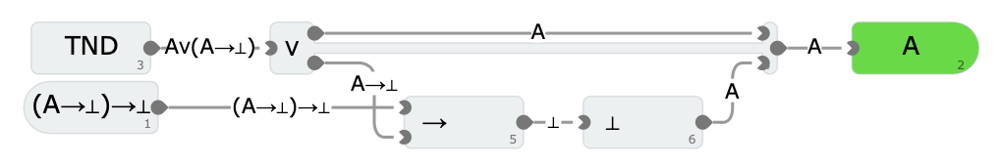
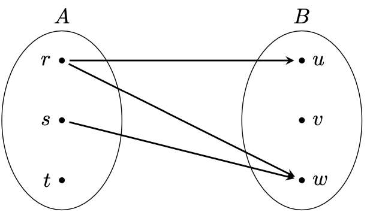

# Logik und Beweistechniken 1
Die Logik befasst sich mit eindeutigen Eigenschaften von Objekten und deren Zusammenhängen. Damit ist sie eine universelle Wissenschaft, die sowohl auf natürliche Zusammenhänge als auch für rein theoretische Überlegungen angewendet werden kann.
- Technischen Informatik: Schaltungen und zentralen Ausführungseinheiten
- Softwareentwicklung beschreibt Programmausführung durch logische Ausdrücke
- Abstrakte Aussagen können ebenso nur mit korrekter Logik bewiesen werden
- Theoretische Algorithmen werden durch logische Ausdrücke erst
Wichtig: Übersetzung von menschlicher Sprache in die Logik und umgekehrt, sowohl um Informationen verarbeiten zu können, als sie auch verständlich machen zu können.

## Definitionen
**Aussage**: Ein feststellender Satz, mit der Eigenschaft, eindeutig wahr oder falsch zu sein, unabhängig davon, ob die Einstufung in dem Moment erfolgen kann.
**Junktor**: Logischer Operator, der eine oder mehrere Aussagen miteinander verknüpft, um komplexere Aussagen zu bilden (z. B. $⊤$, $⊥$, $¬A$, $∧$, $∨$, $↔$...).
**Zusammengesetzte Aussagen**: Können äquivalent in zwei mit einem Junktor verbundene Aussagen zerlegt werden.
**Elementare Aussagen**: Können nicht sinnvoll weiter zerlegt werden.
**Logische Negation**: Die Negation einer Aussage wird als die Verneinung dieser Aussage definiert.
**Dualität der Aussagenlogik**: Eine Aussagenäquivalenz der Aussagenlogik bleibt korrekt, wenn alle Konjunktionen und Disjunktionen sowie Tautologie und Kontradiktion zur dualen Äquivalenz vertauscht werden.
**Beweis**: Eine formale Argumentationskette, die von angenommenen wahren Prämissen ausgeht und durch logische Ableitungsregeln zu einer Konklusionen führt, die die Wahrheit einer Aussage demonstriert.
**Kalkül (Rechnung)**: In einem Kalkül oder logischem System werden logische Axiome, das sind grundlegende und nicht bewiesene Aussagen, vorausgesetzt.
**Präpositionen (Verhältnis)**: Präpositionen sind eine Menge von Aussagen, die Voraussetzungen, die zusammen mit den Aussagen des Kalküls nachvollziehbar verwendet werden können (⇒ gegeben).
**Konklusionen (Schlussfolgerung)**: Logische Schlüsse bestehen aus Präpositionen, um die gewünschte Konklusion zu belegen (⇒ gesucht).
**Prädikate**: Ein Prädikat P ist eine Funktion einer logischen Aussage $P(x)$ oder $P(x_1, ..., x_n)$, dessen Subjekt x oder Subjekte $x_1, ..., x_n$ variabel sind.
**Quantoren**: Quantoren sind Operatoren für Prädikate, die den Umfang einer Aussage über die Elemente eines bestimmten Bereichs spezifizieren (z. B. $∀$, $∃$...).

## Symbole
**Tautologie (wahr)**: $⊤$
**Kontradiktion (falsch)**: $⊥$
**Negation (Verneinung)**: $¬A$ oder $Ā$
**Konjunktion (logische Und)**: $∧$
**Disjunktion (logische Oder)**: $∨$
**Äquivalenz (Gleichwertigkeit)**:
	**$↔$ (Logische Äquivalenz)**: Zwei logische Ausdrücke haben denselben Wahrheitswert (für Wahrheitstabellen und Aussagenlogik)
	**$⇔$ (Logische oder metalogische Äquivalenz)**: Logik: $⇔$ und $↔$ sind austauschbar. Metalogik: $⇔$ zeigt die Herleitung einer Äquivalenz oder die Gleichwertigkeit von logischen Systemen oder Theorien (hauptsächlich für Beweise)
	**$=$ (Mathematische oder logische Gleichheit)**: Mathematik: Drückt aus, dass zwei Objekte (Zahlen, Variablen, Mengen etc.) identisch oder gleichwertig sind; Logik: Kann gleiche Wahrheitswerte darstellen, verwende aber lieber $↔$ oder $⇔$
	**$:=$ ("wird definiert als" oder "ist gleich per Definition")**
	$≡$ **(Kongruenz, Identität, **logische Äquivalenz**)**: Kongruenz heißt, zwei Zahlen sind bei modulo $n$ gleich (gleicher Rest bei Division). Identität bedeutet "exakt gleich"
(also sie sind „modulo $n$“ gleich)

**Implikation (Zusammenhang)**:
	**$→$ (Logische Implikation)**: Eine Aussage folgt aus einer anderen (Teil des Objektbereichs, also formalen Struktur einer Aussage oder eines logischen Systems) Bsp.: $P(x) → Q(x)$
	**$⇒$ (Metalogische Implikation)**: Beschreibt eine Beziehung zwischen Aussagen durch Aussagen (für Beweistheorie oder formalen Argumenten) Bsp.: $∃x : ∀y : P(x, y) ⇒ ∀y : ∃x : P(x, y)$
**Allquantor / Universeller Quantor($B(x)$ gilt für alle Parameter $x$ bzw. $A(x)$)**: $∀x: B(x)$ oder $∀A(x) : B(x)$
**Existenzquantor (Es gibt mindestens ein Parameter $x$ bzw. $A(x)$, sodass $B(x)$ gilt)**: $∃x : B(x)$ oder $∃A(x) : B(x)$
**Element von (Objekt ist Mitglied einer Menge)**: $∈$
**Kein Element von (Objekt ist nicht in einer Menge enthalten)**: $∉$

## Bedeutung von Wörtern
| Mögliche Sätze                                                                                      | Bedeutung |
|-----------------------------------------------------------------------------------------------------|-----------|
| A und B                                                                                             | A ∧ B     |
| A oder B                                                                                            | A ∨ B     |
| Nicht A; Die Aussage A ist falsch                                                                   | ¬A        |
| A genau dann, wenn B; A ist äquivalent B; A gilt dann, und nur dann, wenn B gilt                    | A ↔/⇔ B   |
| Aus A folgt B; A impliziert B; Wenn A wahr ist, dann ist auch B wahr; Wenn A gilt, dann gilt auch B | A →/⇒ B   |
| Alle; jeder, jede, jeden                                                                            | ∀         |
| Nicht alle (Es gibt mindestens ein Element, das die gegebene Eigenschaft nicht erfüllt)             | ¬∀        |
| Es existiert; es gibt; (mindestens) ein, einer, eine, jemand                                        | ∃         |
| Es existiert nicht; niemand; keine (Es existiert kein Element, das die gegebene Eigenschaft erfüllt | ¬∃        |

### Unterschied zwischen $∃$ und $¬∀$
- $∃$ bedeutet, dass von 1 bis alle Ergebnisse gültig sind
- $¬∀$ bedeutet, dass von 1 bis alle Ergebnisse ungültig sind

### Negation an einem Beispiel


## Aussagenlogik 1.2
### Wahrheitstabelle
| A | B | A ∧ B | A ∨ B | A ↔ B | A → B |
|---|---|-------|-------|--|--|
| ⊥ | ⊥ | ⊥     | ⊤     | ⊤ | ⊤ |
| ⊥ | ⊤ | ⊥     | ⊤     | ⊥ | ⊤ |
| ⊤ | ⊥ | ⊥     | ⊤     | ⊥ | ⊥ |
| ⊤ | ⊤ | ⊤     | ⊥     | ⊤ | ⊤ |

### Axiomensystem
- Im Axiomensystem nach **Huntington** sind Kommutativität, Distributivität, Neutralität und Komplement definiert
- Daraus lässt sich das Axiomensystem nach **Peano** ableiten:


### Beispiel 1
Gegeben sei dieser Ausdruck: $(C ∨¬(¬B ∨¬A)) ∧(C ∨A)$

Wahrheitstabelle des Ausdrucks:
| $A$ | $B$ | $C$ | $((A ∨C) →B) ∨(C ∨¬A)$ |
| -- | -- | -- | -- |
| $⊥$ | $⊥$ | $⊥$ | $⊥$ |
| $⊥$ | $⊥$ | $⊤$ | $⊤$ |
| $⊥$ | $⊤$ | $⊥$ | $⊥$ |
| $⊥$ | $⊤$ | $⊤$ | $⊤$ |
| $⊤$ | $⊥$ | $⊥$ | $⊥$ |
| $⊤$ | $⊥$ | $⊤$ | $⊤$ |
| $⊤$ | $⊤$ | $⊥$ | $⊤$ |
| $⊤$ | $⊤$ | $⊤$ | $⊤$ |

Vereinfachen des Ausdrucks mit den Axiomen von Peano:
$(C ∨¬(¬B ∨¬A)) ∧(C ∨A)$
$⇔ C ∨(¬(¬B ∨¬A) ∧A)$		Distributivität
$⇔ C ∨(¬¬(B ∧A) ∧A)$			De Morgan
$⇔ C ∨((B ∧A) ∧A)$				Involution
$⇔ C ∨(B ∧(A ∧A))$				Assoziativität
$⇔ C ∨(B ∧A)$							Idempotenz

### Beispiel 2
Die Personen Anton, Bekka, Carsten, Doris und Emil sind auf Reisen. Jeder kann entweder mit Bahn oder mit Auto fahren, muss sich aber komplett entscheiden. Es gelten dabei diese 4 Bedingungen:

1. Wenn Carsten Auto fährt und Doris mit der Bahn, dann fährt Anton auch mit der Bahn.
2. Wenn Bekka im Auto fährt, so ist Emil auch im Auto und Anton in der Bahn.
3. Wenn Bekka Bahn fährt, so fährt Carsten fährt im Auto und Doris in der Bahn.
4. Wenn Carsten im Auto reist, so reist Anton auch im Auto und Emil mit der Bahn.

Beschreiben das Problem formal mit Variablen für jede Person, ob sie mit dem Auto fährt:

**Notiz**: Anton = $A$, Bekka = $B$, Carsten = $C$, Doris = $D$, Emil = $E$; Aussage wahr = Person fährt Auto

(1) $C ∧¬D ⇒¬A$
(2) $B ⇒E ∧¬A$
(3) $¬B ⇒C ∧¬D$
(4) $C ⇒A ∧¬E$

**Tipp**: Aussagen lassen sich umformen, bleiben aber äquivalent, wenn man die Seiten vertauscht und alles negiert.

Daraus kann man zusätzlich folgende Aussagen schließen:

(a) $A ⇒ ¬C \lor D$
(b) $¬E \lor A ⇒ ¬B$
(c) $¬C \lor D ⇒ B$
(d) $¬A \lor E ⇒ ¬C$

Kann man eindeutig bestimmen, ob Emil mit dem Auto fährt?

Emil fährt Auto: $E \overset{(d)}{⇒} ¬C \overset{(c)}{⇒} B \overset{(2)}{⇒} E ∧¬A\ \checkmark$

Emil fährt nicht Auto: $¬E \overset{(b)}{⇒} ¬B \overset{(3)}{⇒} C ∧ ¬D \overset{(1)}{⇒} ¬A$
	→ Widerspruch, weil: $C \overset{(4)}{⇒} A ∧¬E$

→ Ja, Emil fährt mit dem Auto.

Kann man eindeutig bestimmen, ob Doris mit dem Auto fährt?

Doris fährt Auto: $D \overset{(c)}{⇒} B \overset{(2)}{⇒} E ∧¬A \overset{(d)}{⇒} ¬C$

Doris fährt nicht Auto: Dazu muss man überprüfen, ob Carsten Auto fährt (1)
	Carsten fährt Auto: $¬D ∧C \overset{(1)}{⇒} ¬A$
		→ Widerspruch, weil: $C \overset{(4)}{⇒} A ∧¬E$
	Carsten fährt nicht Auto: $¬D ∧¬C \overset{(c)}{⇒} B \overset{(2)}{⇒} E ∧¬A\ \checkmark$

→ Nein, Doris kann sowohl Auto, als auch Bahn fahren.

## Logisches Schließen 1.3
Tool zum Visualisieren: [The Incredible Proof Maschine](https://incredible.pm)


Mit der gegebenen **Prämisse** (oben) lässt sich auf die gesuchte **Konklusion** (unten) schließen.
**Tipp**: Eine Prämisse lässt sich mehrmals verwenden, falls man es braucht.

### Regeln
#### Konjunktion


**Konjunktion ist kommutativ**:


#### Implikation / Modus Ponens


**Wichtig**: Hier (bei $II$) befindet sich in der Prämisse ein weiteres Kalkül. D. h. *innerhalb* von diesem Kalkül hat man $A$ gegeben und muss auf $B$ kommen, um zur Konklusion $A→B$ zu kommen.

**Implikation ist transitiv**:


#### Disjunktion


#### Allquantor


#### Existenzquantor


### Schlussprinzipien
#### Ex falso quodlibet
Alles kann aus einer falschen Aussage gefolgert werden.


#### Modus Tollens
Durch Aufheben aufhebende Schlussweise.

[Es gibt auch einen Modus ponens]

#### Tertium Non Datur
Diese Regel ist immer wahr und besitzt daher keine Prämissen. Somit kann man beliebige Aussagen "erzeugen", wodurch die konstruktive Logik verlassen wird.


#### Indirekter Beweis
Aus $¬B→¬A$ folgt $A→B$, es gilt also:


### Schritte darstellen
*Beispiel anhand Konjuktion*

**Tabelle**:


**Baumdarstellung**:


### Schriftlicher Beweis
- Was ist Gegeben (Prämisse) und Gesucht bzw. zu zeigen (Konklusion)
- Angeben, mit welchen Regeln man zu welchen Ergebnissen kommt
- Bei Schritten, in denen neue Prämissen (Annahmen) entstehen, wie $II$ und $D$, müssen zuerst deren Konklusionen in Unterschritten bewiesen werden
- Zuletzt bestimmen, ob die Konklusion erfüllt ist

#### Beispiel


Gegeben ist: $¬(¬A)$
Zu zeigen ist: $A$

1. Gemäß $TND$ muss entweder $A$ oder $¬A$ gelten.
2. Mit Regel $D$ kann aus $A \lor ¬A$ die Aussage $A$ gezeigt werden:
	a. Gilt $A$, so ist die Konklusion erfüllt.
	b. Es gelte $¬A$,
		i. Nun gilt $¬A$ laut Prämisse gilt gleichzeitig mit dessen Negation $¬(¬A)$.
		ii. Dies ist ein Widerspruch, bzw. falsche Aussage.
		iii. Daraus kann laut Regel $F$ alles gefolgert werden, insbesondere auch $A$
3. Damit ist die Konklusion $A$ für beide Fälle gezeigt.

### Tabellarischer Beweis
- Die ersten Schritte sind die *einzelnen* Schritte (pro Prämisse einer)
- Begründungen sind: Regel + Zeilen der Prämissen
- Bei Schritten, in denen neue Prämissen (Annahmen) entstehen, wie $II$ und $D$, müssen zuerst deren Konklusionen in Unterschritten bewiesen werden
- Der letzte Schritt ist die Konklusion

#### Beispiel


**Erklärung**:
1. Prämisse (1) ist gegeben
2. Nach $KL$ und $KR$ lässt sich (1) in (2) und (3) aufteilen
3. Um (3) aufzuteilen muss man $D$ verwenden
	a. (3) wird in (4.2) und (4.3) aufgeteilt mit dem Ziel, die Konklusion zu bestimmen
	b. Aus (4.1) und (4.2) lassen sich mit (2) (4.1.1) und (4.2.1) bilden
	c. Damit die Ergebnisse auch identisch sind werden durch $DL$ und $DR$ der Rest "dazugedacht"

## Prädikatenlogik 1.4
Hier zunächst nur vorausgesetzt, dass der logische Ausdruck für jeden Parameter $x$ oder Parameterliste $x_1, ..., x_n$ eindeutig ausgewertet werden
kann. Wenn im Folgenden nur von einstelligen Prädikaten $P(x)$ geschrieben wird, so sind damit immer auch mehrstellige Prädikate wie $P(x, y)$, $P(x, y, z)$ oder $P(x_1, ..., x_n)$ gemeint.

| Aussagen | Prädikat | Prädikatenaussage |
|--|--|--|
| Die Zahl 5 ist gerade. | G(x): Die Zahl x ist gerade. | G(5) |
| Deutschland liegt nicht in Europa. | E(x): x liegt in Europa. | ¬E(Deutschland) |
| 11 ist ungerade und eine Primzahl. | G wie oben, P(x): x ist eine Primzahl | ¬G(x) ∧P(x) |
| Alle Enten sind blau. | B(x): x ist Blau, D(x): ist eine Ente | ∀D(x) : B(x) |

### Allquantor und Existenzquantor
[Einstieg?]
Die vereinfachenden Schreibweisen der Ausdrücke $∀A(x) : B(x)$ und $∃A(x) : B(x)$, die oft mithilfe von später eingeführten Mengen mit $A(x) : x ∈ M$ als $∀x ∈ M : B(x)$ oder $∃x ∈ M : B(x)$ verwendet werden, können so in die elementare Form umgeschrieben werden:

$∀A(x) : B(x) ⇔ ∀x: ¬A(x) ∨ B(x)$
$∃A(x) : B(x) ⇔ ∃x: A(x) ∧ B(x)$

Bei einer begrenzten Anzahl von möglichen Parametern können die Quantoren durch Konjunktion und Disjunktion beschrieben werden:

$∀x : A(x) ⇔ A(1) ∧ A(2) ∧ A(3)$
$∃x : A(x) ⇔ A(1) ∨ A(2) ∨ A(3)$

### Prädikate
Für **symmetrische oder austauschbare** Prädikate $P$ mit Parameter $x$ und $y$ ergeben sich folgende Äquivalenzen:
$∀x : ∀y : P(x, y) ⇔ ∀y : ∀x : P(x, y)$
$∃x : ∃y : P(x, y) ⇔ ∃y : ∃x : P(x, y)$

**Bsp.**: $P(x, y)$: "$x$ ist mit $y$ befreundet."
Freundschaft ist symmetrisch ($P(x, y) ⇔ P(y, x)$), daher sind sie logisch gleichwertig.

Weißt das Prädikat **asymmetrischen Eigenschaften** auf, kann man nur eine Richtung zeigen bzw. implizieren:
$∀x : ∀y : P(x, y) ⇒ ∀y : ∀x : P(x, y)$
$∃x : ∃y : P(x, y) ⇒ ∃y : ∃x : P(x, y)$

**Bsp.**: $P(x, y)$: "$x$ ist der Vater von $y$."
"Vater von" ist keine symmetrische Beziehung (man kann nicht gegenseitig Vater sein), deswegen kann nur impliziert werden.

Unterschiedliche Quantoren sind immer nur in eine Richtung vertauschbar:
$∃x : ∀y : P(x, y) ⇒ ∀y : ∃x: P(x, y)$

Negationen wandeln den Typ des Quantors:
$¬∀x : P(x) ⇔ ∃x : ¬P(x)$
$¬∃x : P(x) ⇔ ∀x : ¬P(x)$

**Wichtig**: Daraus lassen sich vier Aussagen schließen:
1. $¬∀x: P(x) ⇒ ∃x: ¬P(x)$
2. $∃x: ¬P(x) ⇒ ¬∀x: P(x)$
3. $¬∃x: P(x) ⇒ ∀x: ¬P(x)$
4. $∀x: ¬P(x) ⇒¬∃x: P(x)$

**Wichtig**: Dadurch kann eine Aussage auf mehrere Weisen unterschiedlich formalisiert werden. Einen Quantor darf man aber nur umformen, wenn eine Negation vor ihm steht. Die Negation wird darauf einen Quantor (oder Prädikat) "weitergeschoben".

**Bsp.**:
$¬∀x : ∀y : P(x, y)$			| $¬∀ → ∃¬$
$≡ ∃x : ¬∀y : P(x, y)$		| $¬∀ → ∃¬$
$≡ ∃x : ∃y : ¬P(x, y)$

### Beispiel 1
$L(x, y) : x\text{ liebt }y$


- Aus Aussage (3) „Alle lieben eine(n)“ folgt Aussage (2) „Jede(r) liebt jemanden“, aber die Gegenrichtung wird nicht allgemein gelten.
- Existenzaussagen bedeuten nicht, dass es jeweils nur genau einen Fall gäbe: Alle Allquantoren können durch schwächere [?] Existenzquantoren ersetzt werden. Die Rückrichtung ist jedoch nicht allgemein gültig.

### Beispiel 2
Sei $A(x, y)$ das Prädikat, dass $x$ (jemals) in einer Klausur von $y$ abgeschrieben hat:
1. Dass alle von allen abschreiben, ist falsch.
2. Es gibt jemanden, der von nicht mal einem abschreibt.
3. Es gibt jemanden, der noch nicht von allen abgeschrieben hat.
4. Bei allen ist es so, dass nicht jeder von ihnen abschreibt.

Formuliere die Aussagen formal mit Hilfe der Prädikatenlogik:
1. $¬∀x : ∀y : A(x, y) ⇔ ∃x : ¬∀y : A(x, y) ⇔ ∃x : ∃y : ¬A(x, y)$
2. $∃x : ¬∃y : A(x, y) ⇔ ∃x : ∀y : ¬A(x, y)$
3. $∃x : ¬∀y : A(x, y) ⇔ ∃x : ∃y : ¬A(x, y)$
4. $∀y : ¬∀x : A(x, y) ⇔ ∀y : ∃x : ¬A(x, y)$

Stehen einige der Aussagen in Relation zueinander? Begründe etwaige Zusammenhänge, oder warum etwaig Aussagen nicht in Beziehung stehen:
Die Aussagen (3) und (1) sind logisch äquivalent. Die Aussagen folgen aus der Aussage (4), da die Existenzquantoren vertauscht werden können, und der Allquantor die Existenz erfüllt ($AE$, $EI$). Diese Aussage folgt wiederrum aus der Aussage (2), da der eine bei allen gleich sein kann. Ingesamt gilt also:
(2) $⇒$ (4) $⇒$ (1) und (1) $⇔$ (3)

## Beweistechniken 1.5
- Mit „Gegeben ist: *Prämissen*“ und „Zu zeigen ist: *Konklusion*“ beginnen
- Beim Gebrauch von Hilfsaussagen ($D$, $AI$, $EE$…) im Beweis einer Teilaussage ebenso die lokalen Prämissen und die gewünschte Konklusion definieren
- Kennzeichnen, wann die Konklusion erreicht und alle benötigten Zwischenaussagen bewiesen wurden
- Beweise wie $A ⇔ B$ in zwei Teile $A ⇒ B$ und $B ⇒ A$ aufzuteilen, ist sicherer und verständlicher
- Sind beiden Richtungen bewiesen, so ist die Äquivalenz bewiesen

### Beweise
Genauere Anweisungen: [[LA 1 Zusammenfassung#Übliche mathematische Beweisverfahren 2]]

#### Direkter Beweis
Ein direkter Beweis einer Implikation $A ⇒ B$ ist eine Abfolge von Implikationen zu Zwischenschritten, die am Ende zur Konklusion B führen ($A ⇒ A_1 ⇒ A_2 ⇒ … ⇒ A_n ⇒ B$).

#### Indirekter Beweis
Macht sich die Äquivalenz $(A ⇒ B) ⇔ (¬B ⇒ ¬A)$ zu Nutze. Um also $A ⇒ B$ zu zeigen, wird die äquivalente Aussage $¬B ⇒ ¬A$ gezeigt.

#### Beweis durch Widerspruch
Nutzt die Äquivalenz $(A ⇒B) ⇔ ¬(A ∧ ¬B)$ und startet mit den Prämissen $A$ und $¬B$, um damit auf einen Widerspruch als auf Falsch zu schließen.

#### Beweis durch Gegenbeispiel
Kommt bei der Widerlegung von Aussagen mit Allquantor zum Einsatz. Um eine Aussage mit Allquantor zu widerlegen, reicht ein einziges Gegenbeispiel, welches nachvollziehbar der Aussage widerspricht.

#### Vollständige Induktion
Vollständige Induktion über den natürlichen Zahlen. Sei $P$ ein Prädikat über den natürlichen Zahlen. Mit den folgenden zwei Schritten wird $P(x)$ für alle natürlichen Zahlen $x$ bewiesen:

Induktionsanfang $n = 1: P(1)$ ist wahr.
Induktionsschritt $n → n + 1$: Sei $n$ eine natürliche Zahl und $P(n)$ sei wahr. Dann folgt $P(n + 1)$.

Dann gilt $P(x)$ für alle natürlichen Zahlen $x$. Der Beweis basiert auf der Definition der natürlichen Zahlen.

### Beispiel
**Satz**: *Sei $n$ eine natürliche Zahl, also eine ganze positive Zahl. Dann ist $n^2$ genau dann eine gerade Zahl, wenn $n$ gerade ist.*

**Beweis vom Satz**:
Gegeben ist: $n$ ist eine ganze positive Zahl.
Zu zeigen ist: Genau dann, wenn $n^2$ gerade ist, ist $n$ gerade.

**Dafür werden im Folgenden zwei Aussagen gezeigt**:
⇒ Wenn $n^2$ eine gerade Zahl ist, so ist $n$ eine gerade Zahl.
⇐ Wenn $n$ eine gerade Zahl ist, so ist $n^2$ eine gerade Zahl.

- Eine Zahl $n$ ist genau dann gerade, wenn sie als das Doppelte einer anderen ganzen positiven Zahl $k$ geschrieben werden kann ($n = 2k$)
- D. h. positiven ganzen Zahlen sind ungerade wenn $n = 2k - 1$

**Direkter Beweis von n ist gerade $⇒ n^2$ ist gerade**:
Gegeben ist: $n$ ist gerade.
Zu zeigen ist: $n^2$ ist gerade.

1. Ist $n$ gerade, so gibt es ein ganzes $k$, sodass $n = 2k$ ist.
2. Damit ist $n^2 = n * n = 2k * 2k = 2 * 2k^2$.
3. Damit ist $m = 2k^2$ wieder eine ganze Zahl.
4. Somit ist $n^2 = 2 * m$ eine gerade Zahl.

**Indirekter Beweis von $n^2$ ist gerade $⇒ n$ ist gerade**:
Gegeben ist: $n$ ist nicht gerade, also ungerade.
Zu zeigen ist: $n^2$ ist nicht gerade, also ungerade.

1. Wenn $n$ ungerade ist, so gibt es ein ganzes positives $k$ mit $n = 2k - 1$.
2. Dann ist

$$
n^2 = n * n \\
= (2k - 1) * (2k - 1) \\
= 4k^2 - 4k + 1 \\
= 2 * (2k^2 - 2k) + 2 - 2 + 1 \\
= 2 * (2 * (k^2 - k) + 1) - 1 \\
$$

4. Da k positive ganze Zahl, ist $k^2 - k = k * (k - 1)$ eine ganze Zahl, und größer oder gleich $0$.
5. Damit ist $m = 2(k^2 - k) + 1$ eine ganze positive Zahl.
6. Somit ist $n^2 = 2m - 1$ eine ungerade Zahl.

# Relationen und Funktionen 2
- Es ist möglich n-stellige Relationen zwischen Mengen $A_1,...,A_n$ als Teilmenge von $A_1 ×...× A_n$ zu betrachten. Hier werden aber nur zweistellige Relationen innerhalb einer Menge behandelt.
- Viele der Konzepte können auf Relationen zwischen unterschiedlichen Mengen und auch mehrstellige Relationen erweitert werden.

## Definitionen
**Natürliche Zahlen ($\N$ / $\N_0$ bzw. $\N\cup\{0\}$ / $\N \backslash \{0\}$)**: Positive, ganze Zahlen, die entweder bei  $0$ oder $1$ beginnen und unendlich fortgesetzt werden. Um spezifisch zu sein wird deshalb auch  $\N_0$ oder $\N\cup\{0\}$ für inklusive $0$ und $\backslash \{0\}$ exklusive $0$ geschrieben:  $\N:\{0, 1, 2, 3, 4,...\}$.
**Ganze Zahlen ($\Z$)**: Erweitern die natürlichen Zahlen um die negativen ganzen Zahlen und die Null: $\Z:\{..., -2, -1, 0, 1, 2,...\}$.
**Rationale Zahlen ($\mathbb{Q}$)**: Alle Zahlen, die als Bruch dargestellt werden können, wobei der Zähler und der Nenner ganze Zahlen sind und der Nenner nicht null ist: $\mathbb{Q}: \frac{1}{2}, \frac{-3}{4}, 5$ (5 kann als $\frac{5}{1}$ geschrieben werden).
**Reelle Zahlen ($\R$)**: Alle rationalen und irrationalen Zahlen. Sie decken die gesamte Zahlenlinie ab: $\R: 2, -3.5, \sqrt{2}, \pi$.
**Komplexe Zahlen ($\mathbb{C}$)**: Erweitern die reellen Zahlen um eine zusätzliche Dimension, die auf der imaginäre Einheit $i$ ($i^2 = -1$) basiert, und umfassen Zahlen, die in der Form $a + bi$ geschrieben werden können: $\mathbb{C}: 3 + 4i, -2 - i, 0 + i$.
**Relation $R$**: Eine Relation $R$ zwischen zwei Mengen $A$ und $B$ ist eine Teilmenge ihres kartesischen Produkts $R ⊆ A × B$. Je zwei Elemente $a ∈ A$ und $b ∈ B$ stehen genau dann in Relation zueinander, geschrieben $aRb$, wenn $(a, b) ∈ R$..
**Menge $M$**: Eine Zusammenfassung von wohlbestimmten (eindeutig festgelegt, ob Teil der Menge) und wohl unterschiedenen (klar verschieden von den anderen) Objekten unseres Denkens zu einem Ganzen: $M=\{...\}$.
**Tupel / Paare, Tripel**: Elemente $(a,b)$ werden als zweistellige Tupel bezeichnet. Die Elemente des kartesischen Produkts über $n$ Mengen ($A_1 ×...× A_n = \{(a_1,...,a_n) |a_1 ∈ A_1 , ... , a_n ∈A_n \}$) werden als $n$-stellige Tupel bezeichnet. Dreistellige Tupel werden auch als Tripel bezeichnet.
**Intervall**: Eine zusammenhängende Menge von Zahlen auf einer Zahlengeraden, die durch zwei Endpunkte $[a,b]$ definiert ist und alle Zahlen dazwischen (inklusive Endpunkte) umfasst. Offene $(a,b)$ und halboffene $[a,b)$, $(a,b]$ Intervalle schließen die Endpunkte der offenen Seiten nicht mit ein.
**Äquivalenzrelation**: Relation, die reflexiv, symmetrisch und transitiv ist. Teilt Mengen in disjunkte Äquivalenzklassen ein.
**Ordnungsrelation $R\subseteq M\times M$**: Eine zweistellige Relation ("kleiner-gleich"-Beziehung), die Elemente einer Menge $M$ miteinander vergleicht.
**Quasiordnung / Präordnung**: Ordnungsrelation, wenn $R$ reflexiv und transitiv ist.
**Halbordnung / teilweise Ordnung**: Ordnungsrelation, wenn $R$ reflexiv, transitiv und antisymmetrisch ist.
**Vollordnung / lineare Ordnung / totale Ordnung**: Ordnungsrelation, wenn $R$ reflexiv, transitiv, antisymmetrisch und linear ist.
**Operation**: Vorgang, bei dem ein oder mehrere Werte (Operanden) durch einen Operator verarbeitet werden.
**Operator**: Ein Symbol oder eine Funktion, das die Art der Operation angibt.
**Operand**: Die Eingabewerte, auf die der Operator angewendet wird.
**Infixsymbole**: Symbole, die *zwischen* den Operanden in einem Ausdruck stehen und normalerweise die Operation darstellen. Siehe [Infix-Notation](#Infix-Notation).
**Präfixsymbole**: Symbole, die *vor* den Operanden in einem Ausdruck stehen und normalerweise die Operation darstellen. Siehe [Präfix-Notation](#Präfix-Notation).
**Unäre, binäre, … Operatoren**: Anzahl an Operanden. Unär = 1 (`x++`), binär = 2 ($1+1$), trinär .= 3 (`x ? 0 : 1`). $n$-ärer oder $n$-stellige Operatoren haben eine beliebige Anzahl an Operanden (`sum(a,b,c,...`)
**Abbildung / Funktion $f$**: Eine Regel, die jedem Element einer Ausgangsmenge (Elemente der .Definitionsmenge $A$) genau ein Element der Zielmenge $B$ zuordnet $f: A \rightarrow B$
**Definitionsmenge oder -bereich $A$**: Die Menge aller möglichen Ausgangswerte, auf die die .Abbildung angewendet wird
**Zielmenge oder -bereich $B$ / Kodomain**: Die Menge, in der alle potenziellen Ausgabewerte .einer Abbildung liegen (unterschiedliche Eingabewerte können zum gleichen Ausgabewert führen)
**Ausgangs- oder Eingabewerte**: Die Werte, die in die Abbildung eingegeben werden.
**Ausgabewerte**: Diese beziehen sich auf die konkreten Werte, die eine Abbildung liefert, wenn .sie auf ein bestimmtes Element der Definitionsmenge angewendet wird
**Wertemenge / Bildmenge**: Die Menge aller Ausgabewerte, die eine Abbildung tatsächlich .annimmt, wenn sie auf jedes Element der Definitionsmenge angewendet wird. Sie ist also eine Teilmenge der Zielmenge
**Identische Funktion / Identität $id$**: Spezielle Art von Funktion, die jedes Element der Definitionsmenge auf sich selbst abbildet.
**Bild** $Bild(f)$: Die Menge aller Ausgabewerte (Elemente der Zielmenge $B$), welche durch die Anwendung der Abbildung auf Elemente der Ausgangsmenge (Elementen der Definitionsmenge $A$) entstehen
**Urbild**: Bezieht sich auf eine Teilmenge der Zielmenge $B$, und ist die Menge aller Elemente .aus der Definitionsmenge $A$, welche von der Abbildung auf die gegebene Teilmenge abgebildet werden
**Permutationen**: Anordnungen oder Umordnungen einer gegebenen Menge von Objekten in .einer spezifischen Reihenfolge
**Graph $G$ / Netzwerk $N$**: Eine strukturierte Menge von verbundenen Knoten (oder Punkten), .oft dargestellt durch ein Graphenmodell, das die Beziehungen zwischen den Knoten beschreibt. Graphen sind entweder gerichtet (unidirektional = in eine Richtung) oder ungerichtet (bidirektional = keine Richtung)
**Knoten & Kanten**: Ein grundlegendes Element eines Netzwerks oder Graphen, das andere .Knoten (z.B. Zustände oder Entitäten) durch Kanten (Verbindungen) miteinander verbindet
**Kardinalität / Mächtigkeit**: Anzahl der Elemente in dieser Menge (Endliche Mengen ($|M|$) .oder unendliche Mengen). Sind $A$ und $B$ endliche Mengen mit $|A| = n$ und $|B| = m$ Elementen, so ist das kartesische Produkt ebenso endlich und hat $|A×B| = n·m$ Elemente. Unendliche Mengen können entweder abzählbar (Eins-zu-eins-Korrespondenz mit den natürlichen Zahlen) oder unabzählbar sein
**Mengensystem $Z$**: Ein Mengensystem ist eine Menge, deren Elemente selbst Mengen sind: $M=\{\{a,b\},\{c,d,e\}\}$.
**Potenzmenge $P$**: Die Potenzmenge einer Menge $A$ ist die Menge aller möglichen Teilmengen von $A$, einschließlich der leeren Menge und $A$ selbst. Wenn $A$ eine endliche Menge ist, enthält die Potenzmenge $2^{|A|}$ Elemente, wo $|A|$ die Mächtigkeit der Menge $A$ ist..
**Disjunkt**: Jedes Element der Menge ist in genau einer Teilmenge enthalten und kann nicht zwischen den Teilmengen geteilt werden.
**Äquivalenzklasse $[a]$**: Eine disjunkte Restklassen (Teilmengen einer Äquivalenzrelation), die durch eine Äquivalenzrelation innerhalb einer Menge definiert wird. Alle Elemente einer Äquivalenzklasse sind äquivalent zueinander, das heißt, sie stehen in der jeweils definierten Beziehung zueinander: $[a] = \{ x \in A \mid x \sim a \}$.
**Partitionierung einer Menge**: Die Aufteilung in eine Sammlung disjunkter, nicht-leerer Teilmengen $P$, deren Vereinigung die ursprüngliche Menge $A$ ergibt: $P_i \subseteq A$.
**Quotientenmenge / Faktormenge (von $M/R$)**: Enthält alle, bei der Partitionierung entstandenen, Äquivalenzklassen: $A\sim = \{ [a] \mid a \in A \}$.
**Zusammenhangskomponenten**: In einem ungerichteten Graphen eine maximal zusammenhängende Teilmenge von Knoten, in der zwischen jedem Knotenpaar ein Pfad existiert.

Projektive Raum: [?]
homogene Koordinaten: [?]
Diskrete und kontinuierliche Optimierung: [?]
Hasse-Diagramm: [!]
Fehlt viel aus Permutationen

## Symbole
**Leere Menge**: $∅$ oder $\{\}$
**Vereinigungsmenge / Vereinigung**: $\cup$ (Alle Elemente, die entweder in $A$ oder $B$ sind)
**Durchschnittsmenge / Schnitt**: $\cap$ (Alle Elemente, die sowie in $A$ als auch in $B$ sind)
**Einseitige Mengendifferenz**: $\setminus$ (Alle Elemente, die in $A$, aber nicht in $B$ enthalten sind)
**Symmetrische Mengendifferenz**: $\triangle$ (Alle Elemente, die entweder in $A$ oder in $B$ enthalten sind, aber nicht in beiden)
**Teilmenge / inklusiv gleich**: $\subseteq$ (Jedes Element von $A$ ist auch ein Element von $B$ ($A$ liegt in $B$))
**Echte Teilmenge**: $\subset$ (Es gibt mindestens ein Element in $B$, das nicht in $A$ ist ($A$ liegt in $B$))
**Obermenge / inklusiv gleich**: $\supseteq$ (Jedes Element von $B$ ist auch ein Element von $A$ ($B$ liegt in $A$))
**Echte Obermenge**: $\supset$ (Es gibt mindestens ein Element in $A$, das nicht in $B$ ist ($B$ liegt in $A$))
**Teiler von ([!])**: $|$
**Parallel zu ([!])**: $\parallel$
**Partition**: $\bigcup_{i=1}^n$ (Teilt eine Menge vollständige Stücke)
**Kartesisches Produkt**: $×$ (Menge aller einzigartigen, geordneten Paare)
**Äquivalenzrelation**: $∼$ oder $\sim_R$ (dieses Symbol ersetzt $R$ in Äquivalenzrelationen)
**Vorrangrelation / vorgeordnete Relation**: $\preceq$ (diese Symbole ersetzten $R$ in Ordnungsrelation und bedeutet je nach Kontext etwas anderes, z.B. Alter oder Größe)
**Mengenbeschreibungen**: $\{\ |\ \}$ (Beschreibt eine Eigenschaft in einer Menge)
**Wird abgebildet auf / maps to**: $↦$ (Jedem Element einer Menge wird eindeutig ein Element einer anderen Menge zugeordnet)
**Modulo**: $\text{mod}$ (Der Rest aus einer Division zweier Zahlen)
**Verkettung**: $\circ$ (Eine Funktion wird nach der anderen anwendet)

## Mengen 2.1
[[LA 1 Zusammenfassung#Mengen und Mengenoperationen]]

## Relationen 2.2
- Das $R$ wird durch Vergleichsperatoren ersetzt (z.B. $=$, $>$, $≥$, $"\text{ist älter als}"$, …)
- Eine Relation kann symmetrisch und antisymmetrisch sein, wenn nur ein Element enthalten ist
- $(a,b)R(c,d) ⇔ a/b = c/d ⇔ a * d = b * c$

### Beispiel
Es seien $A = \{r, s, t\}$ und $B = \{u, v, w\}$. Dann ist
$R = \{(r, u),(r, w),(s, w)\} ⊆ A × B$



### Eigenschaften von Relationen
*Sei $M$ eine Menge und $R⊆ M × M$ eine Relation.*

Die Relation $R$ ist...
- **symmetrisch**, wenn für alle $(x, y) ∈ R$ auch $(y, x) ∈ R$ folgt
- **antisymmetrisch**, wenn aus $(x, y) ∈ R$ und $(y, x) ∈ R$ folgt, dass $x = y$
- **reflexiv**, wenn für alle $x ∈ M$ gilt, dass $(x, x) ∈ R$
- **transitiv**, wenn aus $(x, y) ∈ R$ und $(y, z) ∈ R$ folgt, dass $(x, z) ∈ R$.
- **linear**, wenn für jedes $x, y ∈ M$ gilt: $(x,y ) ∈ R$ oder $(y, x) ∈ R$.

#### Beispiele der Eigenschaften
**Symmetrie**: Beide Paarkombinationen müssen funktionieren, die Elemente sind aber nicht gleich (z.B. $xRy ⟺ x ist verwandt mit y$. Verwandtschaft ist gegenseitig, aber man kann nicht mit sich selbst verwandt sein)
**Antisymmetrie**: Elemente sind "identisch" (z.B. $xRy⟺ x\text{ ist älter oder gleich alt zu }y$. Da nicht beide gleichzeitig älter als der andere sein können, müssen sie gleich alt sein)
**Reflexivität**: Heißt alle Paare sind vorhanden (z.B. $xRx ⟺ x\text{ ist so groß wie }x$)
**Transitivität**: Suche nach bestimmten Paaren (z.B. $xRy⟺ x\text{ ist ein Geschwister von }y$. Sind Theo und Thilo Geschwister, sowie Thilo und ein Bananenbrot, müssen Theo und das Bananenbrot Geschwister sein)
**Linearität**: Jedes Paar ist vergleichbar (z.B. $xRy ⟺ x\text{ ist größer oder gleich groß zu }y$. Es muss irgendeine Aussage stimmen)

#### Beispiel
Für die Menge $M = \{a,b,c,d\}$ ist die Relationen $R = \{(a,a),(a,b),(a,c),(a,d),(b,b),(b,c),(b,d),(c,c),(c,d),(d,d)\}$ definiert

Die Relation $R$ ist…
• nicht symmetrisch, denn aus $(a,b) ∈ R$ folgt nicht $(b,a) ∈ R$,
• antisymmetrisch, denn aus $(x,y) ∈ R$ und $(y,x) ∈ R$, folgt, dass $x = y$,
• reflexiv, da $\{(a,a),(b,b),(c,c),(d,d)\}⊆R$,
• transitiv, da z.B. mit $(a,b) ∈ R$, $(b,c) ∈ R$ auch $(a,c) ∈ R$ folgt,
• linear, da für alle $x ∈ M$ und $y ∈ M$ entweder $(x,y) ∈ R$ oder $(y,x) ∈ R$ gilt.


### Graphen
| Merkmal                              | Gerichtete Graphen                                                            | Ungerichtete Graphen                                         |
|--------------------------------------|-------------------------------------------------------------------------------|--------------------------------------------------------------|
| **Definition**                       | Kanten haben eine Richtung von einem Knoten zu einem anderen (unidirektional) | Kanten haben keine Richtung, Verbindungen sind bidirektional |
| **Darstellung der Kante**            | Geordnetes Paar $(u, v)$                                                      | Ungeordnetes Paar ${u, v}$                                   |
| **Grad (Anzahl verbundener Kanten)** | Knoten haben Eingangs- und Ausgangsgrade                                      | Jede verbunde Kante ist ein Grad                             |
| **Pfad**                             | Pfade folgen den Richtungen der Kanten                                        | Pfade sind in beide Richtungen möglich                       |


### Äquivalenzrelationen
- Eine Äquivalenzrelation ist reflexiv, symmetrisch und transitiv
- Alle Elemente, die in der Relation zusammenhängen, sind gleichwertig bzw. äquivalent
- Alle Elemente, die äquivalent zu einem anderen Element sind, gehören in dieselbe Äquivalenzklasse, also $[a]=\{x∈M∣x∼a\}$
- Die Quotientenmenge fässt alle **verschiedenen** Äquivalenzklassen zusammen

#### Beispiel 1
Auf der Menge $M = \{1, 2, 3, 4\}$ sei die Relation $R = \{ (1, 1), (1, 3), (2, 2), (3, 1), (3, 3), (4, 4) \}$.

**Reflexivität**: Es ist ${ (1, 1), (2, 2), (3, 3), (4, 4) } \subseteq R$, also erfüllt.
**Symmetrie**: Sei $x ≠ y$ (sonst siehe Reflexivität), dann bleibt nur $(1, 3) \in R$ und tatsächlich ist $(3, 1) \in R$ und umgekehrt, also erfüllt.
**Transitivität**: Für $x ≠ y$, $y ≠ z$, $x ≠ z$ gibt es in $R$ keine weitere Fälle, also erfüllt.

→ Damit ist $R$ eine Äquivalenzrelation. 

**Äquivalenzklassen**:
$[1]_R = \{1,3\}$
$[2]_R = \{2\}$
$[3]_R = \{3,1\}$
$[4]_R = \{4\}$

**Quotientenmenge**:
$M/R= \{ [1]_R, [2]_R, [4]_R \}= \{ \{1,3\}, \{2\}, \{4\} \}$

*$[3]_R$ ist nicht vorhanden, weil $[1]_R$ schon in der Menge ist.*

#### Beispiel 2
Sei $N$ ein ungerichteter Graph und sei darin $M$ eine Menge von Knoten und $K$ die Relation der Kanten zwischen den Punkten in einem Netzwerk, also mit $x K y$ gilt immer auch $y K x$.


*Graph zu Beispiel (Reflexive Kanten werden oft nicht eingezeichnet)*

Dann ist die Relation $K$ im Allgemeinen keine Äquivalenzrelation, aber die abgeleitete Relation $xRy$ für $x$ ist mit $y$ über Kanten verbunden, ist eine Äquivalenzrelation:

**Reflexivität**: Es gilt $xRx$, da jeder Punkt mit sich verbunden ist.
**Symmetrie**: Ist $xRy$, so existiert eine Folge von Kanten $x\ K\ a_1\ K\ ...\ K\ a_n\ Ky$, die umgekehrt $y$ mit $x$ verbindet, also $yRx$ gilt.
**Transitivität**: Ist $xRy$ und $yRz$, so existieren jeweils von $x$ nach $y$ nach $z$ eine Folge von Kanten, die zusammengehängt $x$ mit $z$ verbinden, also gilt $xRz$.

*Die neun Äquivalenzklassen überspringe ich einfach mal.*

### Ordnungsrelationen
**Kurze Erklärung**:
| Kontext | Bedeutung von a ⪯ b |
|-------------|---------------------|
| Zahlen | a ≤ b |
| Teilmengen | A ⊆ B |
| Aufgaben nach Schwierigkeit | A ist nicht schwerer als B |
| Personen nach Alter | Person A ist höchstens so alt wie B |

Ist $R$ über Menge $M$
- **reflexiv**, $∀x∈M : x⪯x$,
- **transitiv**, $∀x,y,z∈M : ( (x⪯y ∧y⪯z) ⇒ x⪯z )$
so ist die Relation **Quasiordnung**.

Ist die Relation zusätzlich
- **antisymmetrisch**, $∀x,y∈M : ( (x⪯y ∧y⪯x) ⇒ x= y )$,
so ist die Relation **Halbordnung**.

Ist die Relation zusätzlich
- **linear**, $∀x,y∈M : (x⪯y) ∨(y⪯x)$
so ist die Relation **Vollordnung**.

1. Die Ordnung $≤$ ist auf den ganzen Zahlen $\Z$ eine **Vollordnung**:
- Reflexivität: Für alle $x∈\Z$ gilt $x≤x$
- Transitivität: Für alle $x,y,z∈\Z$ mit $x≤y$ und $y≤z$ ist auch $x≤z$
- Antisymmetrie: Für alle $x,y∈\Z$ mit $x≤y$ und $y≤x$ ist $x = y$
- Linearität: Für alle $x,y∈\Z$ ist $(x≤y) ∨ (y≤x)$

2. Die Ordnung $⊆$ ist auf Mengen wie z.B. $P(\Z)$ eine **Halbordnung**:
- Reflexivität: Für alle Mengen $A$ gilt $A⊆A$
- Transitivität: Für alle Mengen $A,B,C$ mit $A⊆B$ und $B⊆C$ ist auch $A⊆C$
- Antisymmetrie: Gilt für zwei Mengen $A,B$, dass $A⊆B$ und $B⊆A$, so ist $A=B$
Die Ordnung ist nicht linear, da nicht alle Mengen vergleichbar sind.

3. Die Ordnung $⪯$ nach Größe von Preisen von Produkten im Supermarkt ist eine **Quasiordnung**:
- Reflexivität: Für alle Artikel $x$ gilt $x⪯x$
- Transitivität: Für Artikel $x,y,z$ mit $x⪯y$ und $y⪯z$ ist natürlich auch $x⪯z$
- Die Ordnung ist nicht antisymmetrisch, da gleicher Preis nicht auf das gleiche Produkt führt

Sei $⪯$ eine Halbordnung auf einer Menge $M$.
1. Ein Element $x∈M$ ist **minimal** bezüglich $⪯$, wenn es kein weiteres Element $y∈M$ mit $x ≠ y$ gibt mit $y⪯x$
2. Ein Element $x∈M$ ist **maximal** bezüglich ⪯, wenn es kein weiteres Element $y∈M$ mit $x ≠ y$ gibt mit $x⪯y$
3. Das Element $x∈M$ ist **kleinstes** Element bezüglich $⪯$, wenn $∀y:x⪯y$
4. Das Element $x∈M$ ist **größtes** Element bezüglich $⪯$, wenn $∀y:y⪯x$

*Für Halb- und Vollordnung: Existiert ein kleinstes Element, so ist es das einzige minimale Element (und umgekehrt). Das gleiche gilt für maximale und größte Elemente.*

#### Beispiel


1. Die Relation $R$ auf dem Graphen $G_1$:
	- Reflexiv, transitiv und antisymmetrisch (Halbordnung)
	- Nicht linear, da bspw. $d$ und $i$ nicht gegenseitig erreichbar und damit nicht vergleichbar sind
	- Elemente $a$ und $g$ sind minimal, Elemente $i$, $d$, $b$ und $c$ sind maximal
	- Der Graph hat kein größtes oder kleinstes Element

2. Die Relation $R$ auf dem Graphen $G_2$
	- Reflexiv, transitiv und antisymmetrisch (Halbordnung)
	- Nicht linear, da $d$ und $e$ nicht vergleichbar sind
	- $a$ ist minimal und kleinstes Element, $c$ ist maximal und größtes Element

3. Die Relation $R$ auf dem Graphen $G_3$
	- Reflexiv und transitiv (Quasiordnung)
	- Nicht antisymmetrisch, da es zwischen $a$, $d$, $g$, $h$, $e$, $b$ einen Zyklus gibt
	- Kein minimales oder kleinstes Element
	- $c$ ist maximales und größtes Element.

## Abbildungen 2.3
- Eine Abbildung oder Funktion mit Notation $f : A→B$ ist eine Relation auf $A×B$ ($A,B≠∅$)
- Jedes Element $x∈A$ steht mit genau nur einem Element $f(x) = y ∈ B$ in Relation
- Die Menge $A$ ist die Definitionsmenge der Abbildung und $B$ ist die Wertemenge
- Teilmenge von $A×B$, die die Relation bestimmt, wird als Graph der Abbildung bezeichnet: $graph(f) = {(x,f(x)) |x∈A }⊆A×B$

$$
f: A→B \\
x↦f(x)=y
$$

### Bild und Urbild
#### Bild
**Definition**: Die Menge aller Ausgabewerte (Elemente der Zielmenge $B$), welche durch die Anwendung der Abbildung auf Elemente der Ausgangsmenge (Elementen der Definitionsmenge $A$) entstehen.

**Erklärung**: Wenn man sich eine Abbildung als Maschine vorstellen, die Eingabewerte verarbeitet, dann ist das Bild die Sammlung all der Ausgabewerte, die die Maschine tatsächlich produzieren kann.

**Mathematische Darstellung**: Für eine Abbildung $f: A \rightarrow B$ ist das Bild von $f$ die Menge: $\operatorname{Im}(f) = \{ f(x) \mid x \in A \}$ (Alternativ zu $Im(f)$ auch $Bild(f)$ oder $f(A)$)

#### Urbild
**Definition**: Bezieht sich auf eine Teilmenge der Zielmenge $B$, und ist die Menge aller Elemente aus der Definitionsmenge $A$, welche von der Abbildung auf die gegebene Teilmenge abgebildet werden.

**Erklärung**: Das Urbild sagt uns, welche Eingabewerte in die Maschine gesteckt werden müssen, um bestimmte Ausgabewerte zu erhalten.

**Mathematische Darstellung**: Für eine Abbildung $f: A \rightarrow B$ und eine Teilmenge $T \subseteq B$ ist das Urbild von $T$ die Menge: $f^{-1}(T) = \{ x \in A \mid f(x) \in T \}$

Falls $T$ ein einzelnes Element $b$ in $B$ ist, dann ist das Urbild von $b$ die Menge aller Elemente in $A$, die auf $b$ abgebildet werden:$f^{-1}(\{b\}) = \{ a \in A \mid f(a) = b \}$

*Das Urbild ist keine Inversfunktion, es sei denn, die Abbildung $f$ ist bijektiv. Dann existiert für $f : A → B$ die Funktion $f^{−1} : B → A$*

#### Beispiel
Quadratische Funktion $f(x) = x^2$:
- Das Bild der Funktion $f$ ist die Menge aller möglichen Werte, die die Funktion annehmen kann
- Da $f$ niemals einen negativen Wert annimmt, ist das Bild $[0, \infty)$
- Im Graphen entspricht dies der y-Achse
- Das Urbild eines Wertes $y$ der Funktion $f$ ist die Menge aller $x$
- Z.B. das Urbild $y=4$ ist die Menge der $x$-Werte, für die $x^2 = 4$ ($x=\sqrt4 = \pm2$)
- Im Graphen sind dies die $x$-Werte, die $y = 4$ schneiden

### Eigenschaften von Abbildungen
**Eindeutige Abbildungen heißen**:
|Name |Menge A| Menge B|
|-|-|-|
|Funktion| Körper| Körper|
|Funktional| Vektor| Körper|
|Operator| Vektor| Vektor|

Eine Abbildung $f : A→B$ ist...
- …**injektiv** (Eindeutigkeit der Zuordnung), wenn verschiedene Elemente in $A$ auf verschiedene Elemente in $B$ abgebildet werden: $x,y∈A$ mit $x≠y$ folgt $f(x)≠f(y)$
- …**surjektiv** (Vollständigkeit der Abbildung), wenn jedes Element in der Zielmenge $B$ zumindest einmal von einem Element in der Definitionsmenge $A$ getroffen wird.
- …**bijektiv** (Eindeutigkeit und Vollständigkeit), wenn sie sowohl injektiv als auch surjektiv ist.

**Injektivität**: Eine injektive Funktion vermeidet also, dass zwei verschiedene Elemente der Definitionsmenge denselben Wert in der Zielmenge annehmen.

**Surjektivität**: Eine surjektive Funktion ist "überdeckend", da sie jeden Punkt in der Zielmenge erreicht.

**Bijektivität**: Es gibt eine perfekte Eins-zu-eins-Korrespondenz zwischen den Elementen der Definitionsmenge $A$ und der Zielmenge $B$. Jede Abbildung von $A$ auf $B$ ist eindeutig und deckt die gesamte Zielmenge ab. Eine bijektive Funktion hat auch eine Umkehrfunktion $f^{-1}: B \to A$, die ebenfalls eine Funktion ist.

### Beispiel 1


- Die Abbildung $f$ in ist weder injektiv noch surjektiv
- Die Abbildung $g$ ist surjektiv, aber nicht injektiv
- Die Abbildung $h$ ist injektiv aber nicht surjektiv
- Die Abbildung $i$, ist sowohl injektiv als auch surjektiv, und damit eine bijektive Abbildung

### Beispiel 2


Für die Quadratfunktion $f : R → R, x → f(x) = x^2$ ist das Bild vom Intervall $[1,2]$ gerade $f([1,2]) = [1,4]$ und das Urbild des Intervalls $[1,4]$ ist $f^{−1}([1,4]) = [−2,−1]∪[1,2]$.

- Die Quadratfunktion ist als Funktion $\R → \R$ weder injektiv noch surjektiv
- Als Funktion $[0,∞) → ∞$ ist sie injektiv und als Funktion $[0,∞) → [0,∞)$ ist sie injektiv und surjektiv und damit bijektiv

### Beispiel 3
[Kein Plan was hier abgeht...]
$f : \R → \R$
$x↦f(x) = (x−1)^2−1$


Gilt $f(x_0) = y_0$, so heißt $y_0$ das Bild von $x_0$ und $x_0$ heißt das Urbild von $y_0$, $G_f := \{(x,f(x))|x∈A\}$ heißt Graph von $f$

Sei $f : A→B$ eine Abbildung und $A_1 ⊂A$ und $B_1 ⊂ B$

1. $f(A_1) := \{f(x)|x∈A_1\}$ Bildmenge von $A_1$
	$f^{−1}(B_1) := \{x|x∈A∧f(x) ∈B_1\}$ Urbildmenge von $B_1$
2. $f : A→B$ heißt surjektiv, falls $f(A) = B$. Kurzum $∀y∈B∃x∈A: f(x) = y$
3. $f : A→B$ heißt injektiv (linkseindeutig), falls zu jedem $y$ höchstens ein $x$ gehört $∀y∈B: (∃!x∈A: f(x) = y∧¬(∃x∈A: f(x) = y))$
	äquivalent:
	$∀x_1,x_2 ∈ A: f(x_1) = f(x_2) ⇒ x_1 = x_2$ (gleiche $y$ bedingen das gleiche $x$)
	$∀x_1,x_2 ∈A: x_1 ≠ x_2 ⇒ f(x_1) ≠ f(x_2)$ (ungleiche $x$ bilden auf ungleiche $y$ ab)
4. $f : A→B$ heißt bijektiv (umkehrbar eindeutig, eineindeutig), falls $f$ surjektiv und injektiv ist. Kurzum $∀y∈B∃!x∈A: f(x) = y$.
[Kurz Liste verstehen. Z.B. was ist "!"?]

### Permutationen
- Sei $M$ eine **endliche** Menge, dann heißen **bijektive** Abbildungen $p : M → M$ Permutationen
- Die Menge aller Permutationen über $M$ ist definiert als: $S_M = \{p: M→M|p\text{ ist bijektiv}\}$
- Für die Menge $M=\{1,2,...,n\}$ der Zahlen von $1$ bis $n$ ist $S_n$ die Menge deren Permutationen
- Da Elemente endlicher Mengen immer durchgezählt werden können, können wir generell $S_n$ stellvertretend für die Permutationen $S_M$ von Mengen mit $n$ Elementen, also $|M|= n$, betrachten
- Die Anzahl der möglichen Permutationen, die aus einer Menge von $n$ unterschiedlichen Objekten gebildet werden können, ist $n!$
[Umkehrpermutation]

Die Menge $S$ hat 6 Elemente, die in ausführlicher Schreibweise von Urbild (meist $1,2,3,4...$) in der ersten Zeile und Abbild (von oben nach unten) in der zweiten Zeile geschrieben werden können:


- Beispielsweise ist $σ_3(1) = 2$ und $σ_4(3) = 1$.
- Es gibt $6! = 6 \times 5 \times 4 \times 3 \times 2 \times 1 = 720$ verschiedene Permutationen.

Permutationen können alternativ auch kürzer dargestellt werden mit der **Zykelschreibweise** bzw. -darstellung (oder Kurzschreibweise).

$$
σ_4 =
\begin{pmatrix}
1 & 2 & 3 \\
2 & 3 & 1
\end{pmatrix}
: 1 \overset{σ_4}{↦} 2 \overset{σ_4}{↦} 3 \overset{σ_4}{↦} 1 \overset{σ_4}{↦}...
$$

Die Zahlen durchlaufen immer einen Zyklus $1, 2, 3$, weshablb man es auch als $σ_4 = (1\ 2\ 3)$ darstellen kann (Reihenfolge der Zahlen eigentlich egal).

**Einfacher gesagt**: Wenn $1$ (oben) sich auf $2$ (darunter) bildet bzw. zeigt, und $2$ (oben) auf $3$ (darunter) zeigt und $3$ (oben) wiederum auf $1$ (darunter), dann entsteht ein Zyklus, weil sich die Reihenfolge wiederholt.

**Merke**: Man fängt normalerweise oben links, bei $1$, an. Ziegt eine Zahl auf sich selbst, schreibt man sie nicht mit auf. Bsp.:

$$
σ_2 =
\begin{pmatrix}
1 & 2 & 3 \\
1 & 3 & 2
\end{pmatrix}
= (2\ 3)
$$

Wenn jedes Element auf sich selbst abbildet, spricht man von einer Identität $id$. Da es keinen Zyklus gibt, den man aufschreiben könnte, schreibt man einfach nur  $id$. Bsp.:

$$
σ_1 =
\begin{pmatrix}
1 & 2 & 3 \\
1 & 2 & 3
\end{pmatrix}
= id
$$

Zyklusschreibweise zu $S$: $σ_1 = id, σ_2 = (2\ 3), σ_3 = (1\ 2), σ_4 = (1\ 2\ 3), σ_5 = (1\ 3\ 2), σ_6 = (1\ 3)$

Permutationen können auch mehrere Zyklen haben, die hintereinander geschrieben werden [Was das für ein Zeichen?]:

$$
ϱ =
\begin{pmatrix}
1 & 2 & 3 & 4 \\
3 & 4 & 1 & 2
\end{pmatrix}
= (1\ 3)(2\ 4)
$$

$1$ und $3$ bilden sich gegenseitig ab, sowie $2$ und $4$. Es besteht keine Verbindung zwischen den beiden Zyklen, weshalb sie mit Klammern getrennt aufgeschrieben werden.

Sind $f : A → B$ und $g : B → C$ Abbildungen so ist deren Verkettung $g \circ f$ definiert als Abbildung:

$$
g \circ f : A→C \\
x↦g(f(x))
$$

$(σ_3 \circ σ_4)(1) = σ_3(σ_4(1)) = σ_3(2) = 1$
$(σ_3 \circ σ_4)(2) = σ_3(σ_4(2)) = σ_3(3) = 3$
$(σ_3 \circ σ_4)(3) = σ_3(σ_4(3)) = σ_3(1) = 2$

*Sieht vielleicht kompliziert aus, deswegen Beispiel anschauen.*

Und damit ist $σ_3 \circ σ_4 = σ_2$. Da bei der Verkettung von Permutationen wieder neue Permutationen entstehen, ergibt sich durch Verkettung immer wieder ein Element aus $S$.

$σ_1 = id$, und es gilt $σ_1 \circ σ_k = σ_k = σ_k \circ σ_1$ für alle $k = 1,...,6$.

Da alle Funktionen in $S$ bijektiv sind, haben alle eine Inverse, die ebenfalls als Permutation in $S$ ist: $σ_1^{−1} = σ_1, σ_2^{−1} = σ_2, σ_3^{−1} = σ_3, σ_4^{−1} = σ_5, σ_5^{−1} = σ_4, σ_6^{−1} = σ_6$

[Urbild bestimmen fehlt glaube ich. Einfach in der oberen Zeile immer ablesen bei o^{-1}]

#### Beispiel 1
Gegebe die folgenden Permutationen $(146)(23)$ und $(17)(23)(45)$ in Zyklusschreibweise an und bestimme die Verkettung $(\ (146)(23)\ )\ \circ \ (\ (17)(23)(45)\ )$.

1. Schreibe einfach die Zyklen ab. Wenn $1 ↦ 4$, dann $\begin{matrix}1 \\ 4\end{matrix}$, und $4 ↦ 6$, dann $\begin{matrix}4 \\ 6\end{matrix}$. Da in der Zyklusschreibweise keine $5$ und $7$ vorhanden sind, bilden sie sich selbst ab.

$$
(146)(23) =
\begin{matrix}
1 & 2 & 3 & 4 & 5 & 6 & 7 \\
4 & 3 & 2 & 6 & 5 & 1 & 7
\end{matrix}
$$

2. Das gleiche für $(17)(23)(45)$ machen:

$$
(17)(23)(45) =
\begin{matrix}
1 & 2 & 3 & 4 & 5 & 6 & 7 \\
7 & 3 & 2 & 5 & 4 & 6 & 1
\end{matrix}
$$

3. Bei dem Verketten ist wichtig darauf zu achten, dass man auf der **rechten Seite** beginnt. Zuerst sucht man $\begin{matrix}1 \\ ?\end{matrix}$. Man erkennt, dass $\begin{matrix}1 \\ 7\end{matrix}$ (rechts) zu $\begin{matrix}7 \\ 7\end{matrix}$ (links) führt, wodurch das Ergebnis $\begin{matrix}1 \\ 7\end{matrix}$ ist.

$$
\begin{matrix}
1 & 2 & 3 & 4 & 5 & 6 & 7 \\
4 & 3 & 2 & 6 & 5 & 1 & 7
\end{matrix}\; \circ \;
\begin{matrix}
1 & 2 & 3 & 4 & 5 & 6 & 7 \\
7 & 3 & 2 & 5 & 4 & 6 & 1
\end{matrix}\;=\;
\begin{matrix}
1 & 2 & 3 & 4 & 5 & 6 & 7 \\
7 & 2 & 3 & 5 & 6 & 1 & 4
\end{matrix}
$$

4. Nachdem alle Elemente verkettet sind, muss man in die Zyklusschreibweise zurückrechnen. $1$ bildet auf $7$ ab, $7$ auf $4$, $4$ auf $5$, $5$ auf $6$, und weil $6$ wieder auf $1$ abbildet ist der Zyklus vollendet. $2$ und $3$ bilden auf sich selbst ab und werden daher nicht aufgeschrieben.

$$
\begin{matrix}
1 & 2 & 3 & 4 & 5 & 6 & 7 \\
7 & 2 & 3 & 5 & 6 & 1 & 4
\end{matrix}
= (17456)
$$

**Wichtig**: $(\ (146)(23)\ )\ \circ \ (\ (17)(23)(45)\ )$ und $(\ (17)(23)(45)\ )\ \circ \ (\ (146)(23)\ )$ sind nicht gleich!

#### Beispiel 2
Bestimmen die Umkehrpermutation von $(146)(23)$.

Dazu muss man eigentlich nur die "Pfeile umdrehen". Die kleinste Zahl wird immer noch am Anfang geschrieben. Zweier Paare verändern sich daher nicht.

$$
(146)(23) = (1↦4↦6↦...)(2↦3↦...) \\
$$
$$
(\ (146)(23)\ )^{-1} = (...↤1↤4↤6)(...↤2↤3) = (1↦6↦4↦...)(2↦3↦...) = (164)(23)
$$

# Algorithmentheorie
## Definitionen
**Formale Sprachen**: Mengen von Zeichenfolgen, die basierend auf bestimmten Regeln gebildet werden.
**Alphabet $Σ$**: Ein endliche Menge von Zeichen oder Symbolen, aus dem die Zeichenfolgen gebildet werden: $Σ = \{α_1,α_2,...,α_n\}$.
**Wort $ω$**: Ein endliches oder leeres Tupel $(w_1,w_2,...,w_n) ∈ Σ^n$ von Zeichen $w_k ∈ Σ$ eines Alphabets mit Länge $|ω|=n$ der Anzahl der Zeichen. Meist werden keine Klammern oder Kommata geschrieben: $w_1w_2$.
**Wortmengen**: Gibt die Menge der Worte an (Siehe Symbole).
**Grammatik**: Regelsystem oder Vorschrift, das die Struktur einer formalen Sprache definiert.
**Abschluss**: Auf einer Menge mit einer Verknüpfung, jede Anwendung der Operation mit Elementen aus einer Kleene-Abschluss-Menge wieder ein Element aus der Menge ergibt[Überarbeiten].
**Rechnermodell**: Eine theoretische Darstellung eines Computers, die dazu dient, die Prinzipien der Informationsverarbeitung zu verstehen und zu analysieren. Dazu gehören die Turing-Maschine, das Lambda-Kalkül oder endliche Automaten.
**Deterministisch**: Ein System oder Prozess, bei dem der Ausgangszustand eindeutig durch .den Eingabe- oder Anfangszustand bestimmt wird. Bei gleicher Eingabe wird immer exakt dieselbe Abfolge von Schritten und Ergebnissen erzeugt
**Nicht-deterministisch**: Ein System oder Prozess, bei dem mehrere mögliche Ergebnisse von .einem bestimmten Eingabe- oder Anfangszustand ausgehen können. Prozesse können viele mögliche Pfade zum Ergebnis haben
**Terminieren**: Der Abschluss eines Berechnungsprozesses oder Algorithmus. Ein Programm .terminiert, wenn es nach einer endlichen Anzahl von Schritten stoppt und ein Ergebnis liefert
**Automaten**: Theoretische Maschinen, die zur Erkennung formaler Sprachen verwendet werden (z.B. endliche Automaten, Kellerautomaten)[Mehr].
**Turing-Maschine**: Ein theoretisches, standardmäßig deterministisches Rechenmodell, das .aus einem unendlichen Band und einem Lesekopf besteht. Es führt Berechnungen durch, indem es Symbole auf dem Band gemäß festgelegten Regeln liest, schreibt und den Kopf bewegt. Dies dient zur Untersuchung der Grenzen dessen, was mit algorithmischen Prozessen berechenbar ist
**Orakelmaschinen**: Eine nichtdeterministische Turing-Maschine mit Zugriff auf ein Orakel, das .an jeder Verzweigungsmöglichkeit den zuerst erfolgreich terminierenden Pfad vorhersagen kann. Das Orakel ist rein hypothetisch und dient lediglich als theoretisches Hilfsmittel, um die Grenzen von Berechenbarkeit und Komplexität zu untersuchen
**Parallele Turing-Maschine**: Eine nichtdeterministische Turing-Maschine, welche jede Verzweigungsmöglichkeit bzw. Alternative gleichzeitig parallel ausführen kann und terminiert, sobald eine parallele Ausführung erfolgreich endet.
**Brute-force**: Methode zur Problemlösung, bei der alle möglichen Lösungen oder Kombinationen iterativ ausprobiert werden, bis die richtige oder optimale Lösung gefunden wird.
**Algorithmus**: Eine eindeutige Vorschrift aus durchführbaren Anweisungen oder Schritten zur .Lösung eines Problems oder zur Durchführung einer Aufgabe. In der Regel werden gegebene Eingabedaten oder Parameter verarbeiten und erzeugen eine Ausgabe, die das Problem löst
**Vorschrift**: Eine Beschreibung in Form einer Programmiersprache, sprachlichen Beschreibungen oder als Ablaufdiagramme usw., welche die Problemlösung eindeutig, durchführbar und verständlich beschreibt.
**Programmablaufpläne / Flussdiagramme**: Grafische Darstellung eines Algorithmus oder .Prozesses, die verschiedene Schritte in einer bestimmten Reihenfolge mit Knoten, Kanten usw. veranschaulicht
**Knotentyp**: Eine Art Knoten in einem Diagramm oder Netzwerk, der unterschiedliche Funktionen erfüllt.
**Terminator**: Markiert den Start oder das Ende eines Prozesses.
**Operation**: Stellt eine Berechnung oder Aktion dar.
**Ein-/Ausgabe**: Zeigt, wo Daten eingegeben oder ausgegeben werden.
**Entscheidung**: Repräsentiert einen Punkt, an dem sich der Prozess verzweigt.
**Einstiegspunkt**: Zeigt den Beginn eines Prozesses an.
**Pseudocode**: Eine vereinfachte, leicht verständliche Darstellung eines Algorithmus, die natürliche Sprache mit Programmierelementen kombiniert, um die Logik eines Programms unabhängig von einer Programmiersprache zu beschreiben.
[Literale]

[Es fehlen Definitionen aus 3.1 und 3.2]

## Symbole
**Leeres Wort**: $ε$ oder ()
**Wortemenge ohne Zeichen**: $Σ^0:=\{ε\}$
**Wortemenge mit beliebig vielen Zeichen**: $Σ^*:=\bigcup_{n\geq0}Σ^n$
**Wortemenge mit mindestens einem Zeichen**: $Σ^+:=\bigcup_{n>0}Σ^n$
[Kleene Abschluss Menge]

## Formale Sprachen 3.1
### Alphabete und Wortmengen
**Alphabete, die es gibt**:
Alphabet (Form): $Σ = \{α_1,α_2,...,α_n\}$
Lateinische Alphabet: $Σ_{lat} = \{a,b,c,...,z\}$
Dezimal Zahlen: $Σ_{10} = \{0,1,2,3,4,5,6,7,8,9\}$
Unicode: $Σ_{Unicode} = \{x|x\text{ ist ein Zeichen im Unicode}\}$

**Beispiel mit Wortmengen**:
$M_0 = \{ε\}$
$M_1 = \{01,2\}$
$M_2 = \{0101,012,201,22\}$

$M^+ = M^1 ∪ M^2 = \{01,2,0101,012,201,22\}$
$M^∗ = M^0 ∪ M^+ = \{ε,01,2,0101,012,201,22\}$

**Kartesisches Produkt**: $A×B$ oder $A^n$ für $n∈N$ von Mengen oder Alphabeten bezeichnet die Menge der Tupel $(a,b)$ oder $(a_1,...,a_n)$ von Elementen der Mengen:

$$
A×B := \{(a,b) |a∈A, b∈B\} \\
A^n := A×...×A = \{(a_1,...,a_n) |a_1,...,a_n ∈A\}
$$

- Für zwei Wörter $u = (u_1,...,u_n)$ und $w = (w_1,...,w_m)$ ist das Produkt oder Konkatenation $u·w = uw = (u_1,...u_n,w_1,...,w_m) = u_1 ...u_nw_1 ...w_m$
- Die $n$-te Potenz eines Wortes $w$ ist $w^n=w·...·w$ für n>0, oder das leere Wort $w_0 = ε$ für $n = 0$.

**Jede Teilmenge $L⊆Σ^∗$ ist eine formale Sprache über dem Alphabet $Σ$**:
$L_{Prim} = \{n∈Σ_{Zahl}^∗|n\text{ ist eine Primzahl}\}$
$L_{Java} = \{p∈Σ_{Unicode}^∗ |p\text{ ist ein syntaktisch korrektes Java-Programm}\}$
$L_{JQuine} = \{p∈L_{Java} | \text{Die Ausgabe bei Ausführung von }p\text{ ist }p\}$

### Beispiel
- Die **Collatz-Funktion** ist per Definition auch eine formale Sprache
- Sie stammt aus dem Collatz-Problem, dass die Frage stellt, ob es für ein gegebenes $n \in \N$ eine Konstante $k \in \N_0$ gibt, so dass die $k$-malig wiederholte Ausführung der Collatz-Funktion $f$ erstmals die Zahl $1$ ergibt
- **Einfacher gesagt**: Wie oft muss die Funktion ausgefürt werden, bis die gegebene Zahl zum ersten Mal $1$ ergibt (danach wiederholt sich die Funktion endlos)
- Bisher konnte man noch nicht beweisen, dass es ein Wort (natürliche Zahl) gibt, welches nicht in dieser Sprache vorhanden ist

$$
f(n) = 
\begin{cases}
\frac{n}{2} & \text{wenn } n \text{ gerade ist} \\
3n + 1      & \text{wenn } n \text{ ungerade ist}
\end{cases}
$$

**Formale Sprache**: $L_{Collatz} = \{n \in N | ∃ k \in \N_0 : f^k (n) = 1\}$

**Beispiel anhand $n=6$**: 
$6 \overset{f}{↦} 3 \overset{f}{↦} 10 \overset{f}{↦} 5 \overset{f}{↦} 16 \overset{f}{↦} 8 \overset{f}{↦} 4 \overset{f}{↦} 2 \overset{f}{↦} 1 \overset{f}{↦} 4 \overset{f}{↦} 2 \overset{f}{↦} 1 \overset{f}{↦}...$

Also gilt $\{1, 2, 3, 4, 5, 6, 8, 10, 16\} \subseteq L_{Collatz}$

## Komplexitätsklassen 3.2
- Frage der Berechenbarkeit handelt davon, ob algorithmisch bestimmt werden kann, ob ein Wort Teil einer Sprache ist oder nicht
- Frage nach der Komplexität handelt davon, welcher Aufwand zur Beantwortung der Frage erforderlich ist
- Komplexitätsklassen werden verwendet, um Probleme basierend auf den Ressourcen zu kategorisieren, die zu ihrer Lösung benötigt werden, insbesondere Zeit und Speicherplatz
- Die Länge einer Zeichenkette wird als $n = |w|$ notiert
- Die Klassenhierarchie für Komplexitätsklassen: $P ⊆ NP ⊆ PSPACE = NPSPACE$

Sei $L$ eine formale Sprache, mit $M$ ein deterministisches Rechnermodell, mit $N$ ein nichtdeterministisches Rechnermodell, die $L$ erkennen. Dann ist…
$L∈time(f)$, wenn es $M$ gibt, die für $w∈L$ nach max. $f(|w|)$ Schritten terminieren,
$L∈ntime(f)$, wenn es $N$ gibt, die für $w∈L$ nach max. $f(|w|)$ Schritten terminieren kann,
$L∈space(f)$, wenn es $M$ gibt, die für $w∈L$ maximal $f(|w|)$ Speicherpositionen nutzt,
$L∈nspace(f)$, wenn es $N$ gibt, die für $w∈L$ optimal maximal $f(|w|)$ Speicherpositionen nutzt.

*Diese Einteilungen sind sehr grob, weil weder einem Schritt eine Zeiteinheit zugeordnet werden kann, noch eine Speicherposition eine bezifferbare Speichermenge beschreibt. Außerdem wird keine Zeit oder kein Raum für die Initialisierung oder Finalisierung berücksichtigt.*

### $P$ (Polynomialzeit)
- Umfasst alle Entscheidungsprobleme, die von einer deterministischen Turing-Maschine in polynomieller Zeit gelöst werden können
- D.h., dass es einen Algorithmus gibt, der das Problem in einer Anzahl von Schritten löst, die durch ein Polynom in der Länge der Eingabe $n$ beschränkt ist
- Probleme in $P$ gelten als effizient lösbar

$$
P:=\bigcup_{k \in N} time(n^k)
$$

**Beispiel**:
- Algorithmen wie Merge-Sort oder Quick-Sort können eine Liste mit $n$ Zahlen in $O(n \log(n))$ Zeit sortieren, was polynomiell ist
- Da diese Algorithmen deterministisch sind und innerhalb einer Zeit, die durch ein Polynom in Bezug auf die Eingabelänge begrenzt ist, arbeiten, gehört das Problem zur Klasse $P$

### $NP$ (Nichtdeterministische Polynomialzeit)
- Umfasst alle Entscheidungsprobleme, für die eine Lösung, wenn sie einmal gefunden ist, in polynomieller Zeit von einer deterministischen Turing-Maschine verifiziert werden kann
- Alternativ kann man sich $NP$ auch als die Klasse von Problemen vorstellen, die von einer nichtdeterministischen Turing-Maschine in polynomieller Zeit gelöst werden können
- Ein bekanntes offenes Problem in der Informatik ist die Frage, ob $\text{P} = \text{NP}$ oder $NP = PSPACE$

$$
NP:=\bigcup_{k \in N} ntime(n^k)
$$

**Beispiel**:
- SAT ist das Problem, die Erfüllbarkeit einer booleschen Formel zu bestimmen, d.h., ob es eine Zuweisung von Wahr/Falsch-Werten gibt, die die Formel wahr macht[?]
- Eine mögliche Lösung kann in polynomieller Zeit verifiziert werden, indem man die Zuweisung in die Formel einsetzt; jedoch ist es im Allgemeinen nicht bekannt, ob die Lösung deterministisch in polynomieller Zeit gefunden werden kann, weshalb das Problem in $NP$ ist

### $PSPACE$ (Polynomialer Speicherplatz)
- Die Klasse aller Entscheidungsprobleme, die von einer deterministischen Turing-Maschine mit einer Speicherplatzbeschränkung gelöst werden können, die durch ein Polynom in der Länge der Eingabe $n$ begrenzt ist
- $PSPACE$-Probleme könnten theoretisch mehr als polynomielle Zeit benötigen, sind aber durch den Speicherplatz beschränkt

$$
PSPACE:=\bigcup_{k \in N} space(n^k)
$$

**Beispiel**:
- Das Generalisierte Schieben von Spielen beschäftigt sich damit, ob ein Spieler eine Gewinnstrategie hat, basierend auf einer gegebenen Startkonfiguration[?]
- Der benötigte Speicher, um alle möglichen Züge und Spielkonfigurationen zu berücksichtigen, kann durch ein Polynom in der Größe des Spielfeldes begrenzt werden
- Das Problem gehört daher zu $PSPACE$ aufgrund des speicherbedingten Erfordernisses, alle möglichen Zustände zu verfolgen.

### $NPSPACE$ (Nichtdeterministischer polynomieller Speicherplatz)
- $NPSPACE$ ist die Klasse aller Entscheidungsprobleme, die von einer nichtdeterministischen Turing-Maschine mit einer Speicherplatzbeschränkung gelöst werden können, die durch ein Polynom in der Länge der Eingabe $n$ begrenzt ist
- Nach dem Savitch-Theorem ist bekannt, dass $\text{NPSPACE} = \text{PSPACE}$, was bedeutet, dass nichtdeterministische polynomiale Speicherplatzkomplexität mit deterministischer polynomieller Speicherplatzkomplexität übereinstimmt

$$
NPSPACE:=\bigcup_{k \in N} nspace(n^k)
$$

**Beispiel**:
- Gegeben ist ein gerichteter Graph, bei dem man prüfen soll, ob es Pfade zwischen bestimmten Knoten gibt
- In einem nichtdeterministischen Berechnungsmodell lässt sich der Pfad mit polynomiellem Speicherplatz verfolgen
- Da die Beziehung zwischen $NPSPACE$ und $PSPACE$ durch Savitch’s Theorem demonstriert, dass sie äquivalent sind, gehört es auch zur $PSPACE$.

### Polynomielle Reduzierbarkeit
- Ein Problem, in diesem Fall eine Sprache $L ⊆Σ^∗$ ist polynomiell reduzierbar auf eine Sprache $N ⊆ Γ^∗$ ($N ≤_{poly} L$), falls es eine Funktion $f : Γ^∗→Σ^∗$ gibt, die Instanzen von $L$ in Instanzen von $N$ umwandelt, wobei $f$ in polynomialer Zeit berechenbar ist: $∀w∈Γ^∗: w∈N ⇔f(w) ∈L$
- Polynomiell bedeutet, dass etwas in polynomieller Zeit lösbar ist
- D.h., wenn man einen polynomiellen Algorithmus hat, der $N$ entscheidet, und man $L$ auf $N$ reduzieren kann, dann hat man auch einen polynomialen Algorithmus, um $L$ zu entscheiden, indem man die Reduktion benutzt und den Algorithmus für $N$ ausführt

**Beispiel**: $N$ sei ein Entscheidungsproblem (entweder "ja" oder "nein"), das durch einen polynomiellen Algorithmus lösbar ist. $L$ sei ein Entscheidungsproblem, das auf $N$ polynomial reduzierbar ist. Das bedeutet, es gibt eine polynomielle Reduktionsfunktion $f$, die Instanzen von $L$ in Instanzen von $N$ umwandelt, sodass das Ergebnis für $L$ auch nur dann "ja" ist, wenn das Ergebnis für die durch $f$ transformierte Instanz für $N$ auch "ja" ist.

- Da jedes Problem auf $L$ in ein Problem in $N$ äquivalent umgeformt werden kann, so muss $N$ mindestens so schwer sein wie $L$
- Eine Sprache $L$ ist
	- $NP$-schwer, wenn für alle $N∈NP$ gilt, dass $N ≤_{poly} L$
	- $NP$-vollständig oder $L∈NPC$ (NP-complete), wenn $L$ $NP$-schwer und $L∈NP$ ist
- $NP$-schwer ist schwer nachweisbar, wenn überhaupt nicht alle NP-Probleme bekannt sind
- Ein Anwendungsbeispiel von Polynomielle Reduzierbarkeit ist, dass 3SAT auf SAT polynomial reduzierbar ist, was bedeutet, dass wir jede Instanz von 3SAT in eine Instanz von SAT umwandeln können, sodass die Lösung beider Probleme übereinstimmt

### SAT-Problem
- SAT steht für satisfiability und wird oft auch Erfüllbarkeitsproblem der Aussagenlogik genannt
- Es bezeichnet die Frage, ob es für einen gegebenen geklammerten logischen Ausdruck aus booleschen Variablen mit den logischen Operationen von Konjunktion, Disjunktion und Negation in konjunktiver Normalform wie $X_1 ∧ (X_1 ∨ X_2)$ eine Belegung der Variablen gibt, so dass der gesamte Term wahr wird
- **Einfacher gesagt**: Welche Variablen müssen wahr oder falsch sein, damit der Term wahr wird
- $SAT = \{F|F\text{ ist boolescher Ausdruck und erfüllbar}\}$
- Jedes Problem, für das ein polynomialer Algorithmus für eine nichtdeterministische Turing-Maschine angegeben werden kann, ist unmittelbar darstellbar als ein SAT-Problem, weshalb das SAT-Problem **$NP$-schwer** ist
- Weil es in polynomialer Zeit auf einer nichtdeterministischen Turing-Maschine gelöst werden kann, einfach durch Ausprobieren einer korrekten Lösung, ist es **$NP$-vollständig**

#### Beispiel
$f(x_1,x_2,x_3,x_4) = \overline{x_3} ∧ (x_1 ∨x_2) ∧ (\overline{x_2} ∨ x_3 ∨\overline{x_2} ∨ x_3) ∧ (x_4 ∨ \overline{x_1})$

**Betrachte die Klauseln einzeln**:
- **Klausel 1:** $\overline{x_3}$ bedeutet, dass $x_3$ falsch sein muss
- **Klausel 2:** $(x_1 \lor x_2)$ mindestens eine der Variablen $x_1$ oder $x_2$ muss wahr sein
- **Klausel 3:** $(\overline{x_2} \lor x_3 \lor \overline{x_2} \lor x_3)$ vereinfacht sich zu $(\overline{x_2} \lor x_3)$. Diese Klausel ist wahr, wenn $x_2$ falsch ist oder $x_3$ wahr ist. Da wir bereits $x_3$ auf falsch setzen müssen, muss hier $\overline{x_2}$ wahr sein, also $x_2$ falsch
- **Klausel 4:** $(x_4 \lor \overline{x_1})$ mindestens eine der Variablen $x_4$ oder $\overline{x_1}$ muss wahr sein, d.h. $x_4$ muss wahr sein oder $x_1$ muss falsch sein

**Erfüllung der Bedingungen**:
- Aus Klausel 1 wissen wir, dass $x_3 = 0$
- Aus Klausel 3 folgt, dass $x_2 = 0$
- Aus Klausel 2 folgt, dass $x_1$ wahr sein muss, da $x_2$ falsch ist
- Aus Klausel 4 folgt, dass $x_4$ wahr sein muss, weil $x_1$ nicht falsch sein kann (schon wahr gesetzt wird in Klausel 2)


Der Term ist wahr, wenn $x= (1,0,0,1)$.

### 3SAT-Problem
- Das 3SAT-Problem bezeichnet die Frage, ob logische Terme in konjunktiver Normalform mit maximal (oder genau) drei Literalen erfüllbar sind
- Das Problem ist $NP$-schwer, da das SAT-Problem polynomiell auf das 3SAT-Problem zurückgeführt werden kann: $SAT ≤_{poly} 3SAT$
- Um das zu Beweisen muss man SAT-Problem in ein äquivalentes 3SAT-Problem überführen:
	- Besteht ein Term aus genau drei Termen, so kann er übernommen werden
	- Besteht ein Term aus weniger als drei Termen, so können Literale neutral vervielfältigt werden (z.B. $x_4$ zu $x_4 ∨ x4$)
	- Besteht ein Term aus mehr als drei Termen, können diese mit Hilfsvariablen aufgespalten werden (z.B. $(x_1 ∨ x_2 ∨ x_3 ∨ x_4)$ zu $(x_1 ∨ x_2 ∨ y)\land(\overline{y} ∨ x_3 ∨ x_4)$)
- Damit ist das 3SAT-Problem mit dem SAT-Problem auch $NP$-schwer und somit $NP$-vollständig

#### Beispiel
$f(x_1,x_2,x_3,x_4) = \overline{x_3} ∧ (x_1 ∨x_2) ∧ (\overline{x_2} ∨ x_3 ∨\overline{x_2} ∨ x_3) ∧ (x_4 ∨ \overline{x_1})$

**Anwendung der oben genannten Regeln**:
- $\overline{x_3}$ muss auf $(\overline{x_3} ∨\overline{x_3} ∨\overline{x_3})$ verlängert werden
- $(x_1 ∨x_2)$ wird mit $(x_1 ∨x_2 ∨x_2)$ verlängert
- $(\overline{x_2} ∨ x_3 ∨\overline{x_2} ∨ x_3)$ wird in $(\overline{x_2} ∨x_3 ∨y_1)$ und $(\overline{y_1} ∨\overline{x_2} ∨x_3)$ aufgeteilt
- $(x_4 ∨ \overline{x_1})$ wird mit $(x_4 ∨\overline{x_1} ∨\overline{x_1})$ verlängert

$f(x_1,x_2,x_3,x_4,y_1) = (\overline{x_3} ∨\overline{x_3} ∨\overline{x_3}) ∧(x_1 ∨x_2 ∨x_2) ∧(\overline{x_2} ∨x_3 ∨y_1) ∧(\overline{y_1} ∨\overline{x_2} ∨x_3) ∧(x_4 ∨\overline{x_1} ∨\overline{x_1})$

### Teilsummenproblem
- Das Teilsummenproblem oder SSP-Problem (subset sum problem) bezeichnet die Frage, ob es eine nicht-leere Teilmenge $N ⊆ M$ von Zahlen gibt, aus einer Menge von natürlichen Zahlen $M= \{m_1,...,m_n\}$, deren Summe genau einem vorgegebenen Wert $S$ entspricht
- **Einfacher gesagt**: Man hat eine Menge $M$ aus der man sich Zahlen aussucht, die zusammenaddiert bestimmte Zahlen aus einer anderen Menge (Teilsummen $T$) ergeben. Die zusammenaddierten Zahlen sine eine Teilmenge $N$ von $M$
- Das Problem liegt in $NP$, da eine Summe direkt geprüft werden kann

#### Beispiel
Mit einer gegebenen Menge $M = \{2,4,5,11,20\}$ können welche Teilsummen $T∈\{25,34,37\}$ erreicht werden?

- Offensichtlich ist: $20 + 5 = 25$
- Da $34$ gerade ist dürfen entweder nur gerade Zahlen vorkommen, oder beide ungerade Zahlen müssen verwendet werden:
	- Die größte Summe mit nur geraden Zahlen ist $2 + 4 + 20 = 26$
	- Mit ungeraden Zahlen erreicht man entweder $20 + 11 + 5 = 36$, was zu hoch ist, oder $2 + 4 + 11 + 5 = 22$, was zu niedrig ist
	⇒ $34$ ist somit nicht erreichbar
- $37$ ist ungerade und muss somit entweder $5$ oder $11$ enthalten:
	- Mit $5$ erreicht man nur: $20 + 5 + 4 + 2 = 31$
	- Aber mit $11$ erreicht man $20 + 11 + 4 + 2 = 37$
	⇒ $37$ ist also erreichbar

### 3SAT-Problem zu Teilsummenproblem
- Da es sich bei dem Teilsummenproblem um ein $NP$-vollständiges Problem handelt, gibt es keine bekannte Lösung, die in polynomieller Zeit für alle Fälle funktioniert
- Der Grund ist, dass das 3SAT-Problem polynomiell auf das SSP-Problem zurückgeführt werden kann, also $3SAT ≤_{poly} SSP$
- Ein Term eines 3SAT-Problems kann in ein äquivalentes SSP-Problem überführt werden

**Anleitung**:
- Die Anzahl an $x$ gibt die Variablen $n$ an
- Die Anzahl an Klammern die Terme $m$
- Ist ein $x$ in einem 3SAT-Term vorhanden, wird es zu einer $1$, ist es negiert oder nicht vorhanden, wird es zu einer $0$
- Danach werden alle Terme $m$ negiert, wobei die nicht vorhandenen $x$ bei $0$ bleiben
- Man versucht eine Kombination von allen $x$ und $\overline{x}$ zu finden, bei denen die Summen der einzelnen Ziffern zwischen $1$ und $4$ sind (**$0$ geht nicht auf**)
- Am Ende sollte Zielsumme $T = 111\ 44444$ entstehen
- Weil es trotzdem meist nicht genug $1$er für jede $4$ gibt kann man Füllzahlen bzw. -terme verwenden
- Eine Füllzahl kann jede Ziffer um $1$ oder $2$ erhöhen, darf aber pro Ziffer nur einmal verwendet werden (deswegen keine $0$)
- $1$: Jedes $x$ ($3$ Stück) einmal
- $4$: In jeder Klammer ($5$ Stück) muss mindestens ein $x$ wahr sein (wegen $\lor$)
- Es sind $4$ und nicht $3$, weil Minimum $1$ plus Füllzahlen $1,2=4$
- Wäre es $3$, dann würden Füllzahlen ausreichen, was nicht funktioniert
- Die Kombination an $x$ und $\overline{x}$ die funktioniert ist die Lösung, wobei $x=1$ und $\overline{x} = 0$

*Das Skript formuliert diese Regeln formeller, läuft aber auf das gleiche hinaus.*

#### Beispiel
$(x_3 ∨ \overline{x_2} ∨ \overline{x_1}) ∧ (x_3 ∨ x_2 ∨ x_3) ∧ (x_1 ∨ \overline{x_3} ∨ \overline{x_2}) ∧ (x_1 ∨ \overline{x_2} ∨ x_3) ∧ (\overline{x_1} ∨ \overline{x_3} ∨ \overline{x_1})$

Für das 3SAT-Problem ergeben sich diese Zahlen (Summanden für die $n=3$) für jede Variable:


Außerdem gibt es die **optionalen** Füllzahlen (Summanden zum Auffüllen für die $m = 5$) für jeden Terme:


Die hier eindeutige Lösung des Teilsummenproblems lautet:


Damit lautet die eindeutige Lösung $x_1 = x_2 = 0$ und $x_3 = 1$.

### Faktorisierung
- Das Problem der Faktorisierung (FACTORIZE) einer ganzen Zahl $n = pq \in \Z$ in zwei ganzzahlige Primfaktoren $p, q \in \Z$ liegt in $NP$
- **Einfach gesagt**: Es bezieht sich auf die Zerlegung einer ganzen Zahl in ein Produkt von kleineren Primzahlen, die als Faktoren bezeichnet werden
- Die Multiplikation von zwei Primfaktoren ist in polynomialer Zeit, bezogen auf die Länge des Produkts durchführbar
- In einem nichtdeterministisches Rechnermodell können alle in Frage kommenden Faktoren parallel in polynomialer Zeit bestimmt werden
- Es ist bisher nicht gelungen für die Faktorisierung $NP$-schwer oder $NP$-vollständig nachzuweisen

### Vereinfachtes Teilsummenproblem
- Ein vereinfachte Teilsummenproblem schränkt das Teilsummenproblem ein, wodurch es aus bestimmten Gründen leichter handhabbar ist
- Einige Eigenschaften sind z.B.:
	- Wenn alle Elemente der Menge positiv sind, kann man sofort schließen, dass keine Teilmenge eine negative oder null Summe haben kann
	- Bei einer geringeren Anzahl von Elementen, lässt sich das Problem oft durch "brute force" lösen
	- Wenn die Summanden $M = \{m_1, . . . , m_n\}$ streng stark anwachsend sind, also größer als die Summe der vorangehenden Summanden sind ("super-increasing knapsack"): $m_k > \sum_{i=1}^{k-1} m_i$

#### Beispiel
Beispiele für ein vereinfachtes Teilsummenprobleme sind die Fragen bei der gegebenen Menge $M = \{1, 2, 6, 10, 20\}$, welche Teilsummen $T \in \{22, 24, 27\}$ aus dieser Menge erreicht werden können. Es kann nun jeweils der Größe nach probiert werden, ob die Zahlen abgezogen werden können.

**So funktionierts**:
1. $22$ durch $20$ teilbar: ja
2. Rest davon durch $10$ oder $6$ teilbar: nein
3. Kommt $0$ raus ist man erfolgreich


- Damit sind $22 = 20 + 2$ und $27 = 20 + 6 + 1$ und $24$ ist nicht darstellbar
- Es ist auch unmittelbar ersichtlich, wie die Binärzahl $01001_2$ in der Zahl $22$ und die Binärzahl $10101_2$ in der Zahl $27$ eindeutig kodiert wird.

### Merkle-Hellman-Kryptosystem
- In 1978 von Ralph Merkle und Martin Hellman entwickeltes asymmetrisches Verschlüsselungsverfahren, das auf dem super-increasing knapsack basiert
- Adi Shamir veröffentlichte eine Arbeit, die nachwies, dass aus dem öffentlichen Schlüssel effzient passende Zahlen gefunden werden können, die das nur scheinbar sichere Teilsummenproblem wieder in ein vereinfachtes Teilsummenproblem wandeln
- Daher wird das Merkle-Hellman-Kryptosystem nicht mehr verwendet

#### **Schlüsselerzeugung**
- Eine Menge $M=\{m_1​,...,m_n​\}$, die eine superincreasing Sequenz bildet (jede Zahl​ ist größer als die Summe aller vorherigen)
- Zwei zufällige natürliche Zahlen $C,e∈\N$, wobei:
- $C>m_k$​ für alle $m_k$​ in $M$, also $C$ größer als jedes Element der Sequenz ist
- $ggT(C,e)=1$, $e$ ist teilerfremd zu $C$, sodass ein multiplikatives Inverses existiert
- Das multiplikative Inverse von $e$ modulo $C$ ist eine Zahl $d$, sodass gilt: $e×d≡1\ mod\ C$
- Das bedeutet, wenn $e$ und $d$ miteinander multipliziert und dann durch $C$ geteilt werden, der Rest $1$ ist
- Mit $d$ kann man $e$ "rückgängig" machen, wenn man modulo $C$ rechnet
- $d$ wird mit dem erweiterten euklidischen Algorithmus bestimmt

2. **Erstellung der Schlüsselsequenzen**
	- Jedes Element von $M$ wird mit $e$ multipliziert und modulo $C$ reduziert: $w_k​≡ e×m_k\ ​mod\ C$
	- Die resultierende Sequenz $K_{pub}​=(w_1​,...,w_n​)$ ist der öffentliche Schlüssel
	- Der private Schlüssel besteht aus $K_{priv}​=(m_1​,...,m_n​,d,C)$, also der ursprünglichen superincreasing Sequenz und den geheimen Zahlen $d$ und $C$

#### **Verschlüsselung**
- Die zu verschlüsselnde Nachricht wird in eine binäre Zeichenkette der Länge $n$ umgewandelt: $b=(b_1​,b_2​,...,b_n​),b_k​∈\{0,1\}$
- Die Chiffre $u$ ist die gewichtete Summe der Bits mit den öffentlichen Schlüsseln: $u = E(b) = \sum_{k=1}^n b_k w_k$
- Jedes Bit $b_k$​ der Nachricht bestimmt, ob $w_k$​ in die Summe aufgenommen wird

#### **Entschlüsselung**
1. **Rücktransformation in die superincreasing Sequenz**
	- Multipliziere die Chiffre $u$ mit $d$ modulo $C$: $v≡d×u\ mod\ C$
	- Dies stellt sicher, dass die ursprüngliche Summenstruktur aus $M$ zurückgewonnen wird, weil: $v≡d×∑b_k ​w_k\ ​mod\ C$ und $v≡∑b_k​(d×w_k​)\ mod\ C$
	- Da $d×w_k​≡m_k\ ​mod\ C$ gilt, reduziert sich die Summe auf die ursprüngliche superincreasing Sequenz: $v=∑b_k ​m_k​$

2. **Lösen des Teilsummenproblems**
	- Da $M$ superincreasing ist, kann $v$ eindeutig durch die Summe von Teilmengen aus $M$ dargestellt werden
	- Verwende das "Greedy Algorithmus"-Verfahren, um die binären Werte $m_k$​ zurückzuholen:
		- Beginne mit dem größten Wert in der superincreasing Sequenz und subtrahiere ihn von $v$, falls möglich
		- Setze das zugehörige $m_k$​ auf $1$, andernfalls auf $0$

#### Beispiel
- Die Menge $M = \{1, 2, 6, 10, 20\}$ ist die Menge eines vereinfachten Teilsummenproblems mit der Gesamtsumme $39$
- Sei $C = 41$ und $e = 17$, dann ist $ggT(41, 17) = 1$ und $17 \times d ≡ 1\ mod\ 41$

1. $41=2×17+7$
2. $7=2×3+1\ \checkmark$

3. $17=2×7+3$
4. $3=3×1+0$

Den letzten nicht-null Rest (2) rückwärts aufschreiben:
$1=7−2×3$

Setze $3=17−2×7$ (3) ein:
$1=7−2×(17−2×7)$
$1=5×7−2×17$

Setze $7=41−2×17$ (1) ein:
$1=5×(41−2×17)−2×17$
$1=5×41−12×17$

Gleichung umschreiben:
$17×−12≡1\ mod\ 41$

Da $d$ nicht negativ sein darf wird $41$ addiert:
$d=−12+41=29$

Öffentlicher Schlüssel: $K_{pub} = (17, 34, 20, 6, 12)$
Private Schlüssel ist: $K_{priv} = (1, 2, 6, 10, 20, 29, 41)$

Soll nun die Nachricht $21 = 10101_2$ verschlüsselt werden, so ergibt sich
$u = E(21) = 1 \times 17 + 0 \times 34 + 1 \times 20 + 0 \times 6 + 1 \times 12 = 49$

Die Nachricht kann dann mit Hilfe des privaten Schlüssels mit $v = 49 \times 29 ≡ 27\ mod\ 41$ und dann wie im Beispiel zuvor
$27 - 1 \times 20 = 7$
$7 - 0 \times 10 = 7$
$7 - 1 \times 6 = 1$
$1 - 0 \times 2 = 1$
$1 - 1 \times 1 = 0$
zu $10101_2 = 21$ dechiffriert werden.

## Beschreibung von Algorithmen 3.3
- Bei der Frage, ob ein allgemeiner Boole'scher Ausdruck lösbar ist, liegt der Fokus auf der Problemstellung
- Bei der Frage, wie das Problem gelöst werden kann, liegt der Fokus auf der Lösungsmethode
- Ist eine Lösungsmethode allgemein anwendbar und eindeutig beschreibbar, so geht es um Algorithmen

### Programmablaufplan (PAP)
- Stellt den Ablauf eines Programms mit Hilfe eines gerichteten Graphen mit unterschiedlichen Knotentypen dar


#### Beispiel
Algorithmus für den größten gemeinsamen Teiler $ggT(a, b)$ (größte natürliche Zahl, die $a$ und $b$ teilt)


Eingabe: Natürliche Zahlen $p$, $q$
Ausgabe: Ganzzahl $ggT\ g$
1. Ermittele Minimum $m$ von $p$, $q$
2. Zähle $z$ absteigend von $m$ bis $1$
3. Prüfe, ob $p$ und $q$ sich ohne Rest durch $z$ teilen lassen
4. Wenn ja, so ist $g=z$ und Ende, sonst mit nächstem $z$ mit Schritt 3
```Python [Kein Python Code]
Algorithmus ggT-Naiv(p, q)
	z = min(p, q)
	while p mod z ≠ 0 or q mod z ≠ 0 do
		z = z - 1
	return z
```
*Es gibt auch den Euklidischen Algorithmus, dazu mehr im Skript.*

### Eigenschaften von Algorithmen
**Allgemeinheit**: Algorithmen sollten eine Problemklasse und nicht nur ein spezifisches Problem lösen. Das bedeutet, er sollte in der Lage sein, mit verschiedenen Eingabedaten umzugehen und trotzdem das korrekte Ergebnis zu liefern.
**Ausführbarkeit**: Jeder Schritt eines Algorithmus muss (in endlicher Zeit) ausführbar sein. Z.B. durch ein theoretisches Rechnermodell wie die Turingmaschine.
**Determinismus**: Die Ausführung jedes Schrittes ist eindeutig und festgelegt, also nicht zufällig oder von Ein-/Ausgabe abhängig. Jede Eingabe liefert immer die gleiche Ausgabe.
**Determiniertheit**: Gleiche Eingangswerte durchlaufen die gleichen Schritten, was bei erneuter Ausführung den gleichen Ausgangswert liefert. Trifft nicht zu oder führt zu Problemen bei: Absichtlichem Zufall, probabilistische Verfahren, paraller Ausführung (Synchronisation), Quantencomputer oder kosmischer Strahlung
**Finitheit**: Die Beschreibung bzw. Anzahl von Anweisungen ist endlich. Selbstverständlich bei endlich dargestellten Algorithmen, jedoch nicht für algorithmisch beschriebene Algorithmen oder selbst modifizierendem Algorithmen.
**Terminierung**: Die Ausführung stoppt bei endlicher Eingabe nach einer endlichen Anzahl von Schritten (keine Endlosschleife). Wenn die Wahrscheinlichkeit, dass ein Algorithmus nicht terminiert gegen null läuft, ist er terminiert, weil $0,\overline{0}1 = 0$ ist.
**Dynamische Finitheit**: Die Ausführung hat beschränkten bzw. endlichen Ressourcenbedarf (Speicher oder Rechenzeit) bei endlicher Eingabe. Besteht die Chance, dass unendlich viele Ressourcen verbraucht werden, ist ein Algorithmus dynamisch finit.
**Komplexität**: Die Laufzeit oder der Ressourcenbedarf ist in Abhängigkeit von der Eingabe funktional abschätzbar. Wird häufig in Bezug auf Zeitkomplexität (wie lange dauert die Ausführung?) und Raumkomplexität (wieviel Speicherplatz wird benötigt?) betrachtet.

#### Zusammengefasst
1. **Allgemeinheit**: Anwendbar auf verschiedene Problemfälle
2. **Ausführbarkeit**: Jeder Schritt ist in endlicher Zeit machbar
3. **Determinismus**: Jeder Schritt ist eindeutig und festgelegt
4. **Determiniertheit**: Gleiche Eingangswerte liefern gleiche Ausgangswert
5. **Finitheit**: Die Beschreibung ist endlich
6. **Terminierung**: Stoppt nach einer endlichen Anzahl von Schritten
7. **Dynamische Finitheit**: Ausführung braucht endlich Ressourcen
8. **Komplexität**: Ressourcenbedarf ist abschätzbar

#### Beispiel
1. Auf einem quadratischen Gitter der Größe $n×n$ Knoten soll startend von ganz links unten die Weglänge in Kanten nach ganz rechts oben gemessen werden. In jedem Schritt wird zufällig nach rechts oder oben gegangen, wenn dort eine Kante existiert, und der Schritt gezählt. Die Ausgabe ist die Anzahl erforderlicher Schritte, wenn der obere rechte Knoten des zu messenden Gitters erreicht wird.

- Algorithmus kann ausgehend von $x = (1,1)$ zufällig Schritte auswählen und erste oder zweite Komponente erhöhen, falls die Kante vorhanden ist, bis $(n, n)$ erreicht ist
- Algorithmus ist **ausführbar**, wegen der Zufallskomponente **nicht deterministisch**
- Ergebnis ist **determiniert** auf $2n$
- Beschreibung ist **finit**, wird **terminieren** und ist auch **dynamisch finit**

2. Das zu messende Gitter ist Teil eines unendlichen in alle Richtungen ausgedehnten Gitters, Schritte nach oben und rechts sind also immer möglich. Das Vorgehen zum Messen startend von links unten nach rechts oben ist wie zuvor.

- Algorithmus kann wie zuvor gestaltet werden, doch die Abfrage, ob eine Kante vorhanden ist, fällt weg
- Algorithmus ist weiterhin **ausführbar** und **nicht deterministisch** und Beschreibung ist **finit**
- Algorithmus **terminiert** nur dann, wenn der Zielknoten erreicht wird
- Nur dann **determiniert** auf $2n$, wenn es terminiert
- Nicht **dynamische finit**, weil der Zähler für die Kanten über alle Grenzen wachsen kann

3. Das zu messende Gitter ist Teil eines $2n× 2n$ Knoten großen Gitters, dessen Enden rechts mit den linken Knoten und oben mit den unteren Knoten verbunden sind, das auf diese Weise einen Torus bildet. Das Vorgehen zum Messen startend von links unten nach rechts oben ist wie zuvor.

- Wie zuvor kann der Algorithmus gestaltet werden, jedoch nach $2n$ in einer Komponente wird im nächsten Schritt bei Erhöhung die Komponente auf $0$ gesetzt
- Algorithmus ist weiterhin **ausführbar** und **nicht deterministisch** und Beschreibung ist **finit**
- Ergebnis ist **nicht determiniert**, da Vielfache $2n$ erreicht werden können
- Die Wahrscheinlichkeit, dass der Algorithmus nicht **terminiert** läuft gegen $0$, aber es gibt keine obere Schranke auf die Laufzeit
- **Dynamisch finit** ist das Verfahren nicht, da die Laufzeit beliebig lang sein kann

## Rekursion und Iteration 3.4
- Zur Lösung vieler Problemstellungen werden Wiederholungen benötigt
- Es gibt verschiedene Umsetzungsmöglichkeiten, wie Rekursion, Turing-Vollständigkeit oder iterativen und imperativen for, while, do-while oder repeat-until-Schleifen
- Eine Schleife ist eine Kontrollstruktur in Algorithmen, die eine bedingte wiederholte Ausführung von einzelnen Ausführungsschritten darstellt
- Eine einzelne Durchführung wird als Iteration bezeichnet
- Kopfgesteuerte Schleife oder while-Schleife: Bedingung wird zu Beginn und vor erster Iteration geprüft
- Fußgesteuerten Schleife oder do-while-Schleife (auch repeat-until-Schleife): Bedingung nach einer Iteration geprüft, ob eine weitere Durchführung erfolgen kann
- Die verschiedenen Schleifenarten können in die andere umgewandelt werden, indem z.B. die erste Iteration vor der Schleife passiert (Fuß. → Kopf.)
- Ein Algorithmus ist rekursiv, wenn in der Beschreibung des Algorithmus der Algorithmus selbst als ein Ausführungsschritt aufgerufen wird

**Iterative Schleife**:
```Python [Kein Python Code]
Algorithmus IterativeWhile(state)
	while condition(state) do
		state = iterate(state)
	return state
```
**Rekursive Schleife**:
```Python [Kein Python Code]
Algorithmus RecursiveWhile(state)
	if condition(state) then
		return RecursiveWhile(iterate(state))
	return state
```
### Beispiel
Die Fibonacci-Zahlen $1, 1, 2, 3, 5, 13,...$ sind definiert durch

$$
a\_k = \begin{cases} 1, & \text{für } k \leq 2 \\ a\_{k-1} + a\_{k-2}, & \text{sonst} \end{cases}
$$

**Rekursiver Algorithmus zur Berechnung der Fibonacci-Zahlen**:
```Python [Kein Python Code]
Algorithmus fib(k)
	if k < 3 then
		return 1
	else
		return fib(k - 1) + fib(k - 2)
```
$fib(3) = fib(2) + fib(1) = 1 + 1 = 2$
$fib(4) = fib(3) + fib(2) = fib(2) + fib(1) + fib(2) = 1 + 1 + 1 = 3$
$fib(5) = fib(4) + fib(3) = fib(3) + fib(2) + fib(2) + fib(1) = ...$

*In diesem imperativem Ausführungsmodell steigt die Anzahl der durchgeführten Auswertungen exponentiell, da frühere Berechnungen wieder neu ausgeführt werden.*

**Linear rekursiver Algorithmus zur Berechnung der Fibonacci-Zahlen**:
```Python [Kein Python Code]
Algorithmus fib2(k, i = 2, ai = 1, ai1 = 1)
	if k > i then
		return fib2(k, i + 1, ai + ai1, ai)
	else if k= i then
		return ai
	else
		return ai1
```
$fib2(5) = fib2(5, 2, 1, 1)$
$= fib2(5, 3, 2, 1)$
$= fib2(5, 4, 3, 2)$
$= fib2(5, 5, 5, 3) = 5$

*Indem der doppelte Aufruf durch einen einzelnen Aufruf ersetzt wird, müssen Berechnungen kein zweites mal ausgeführt werden, was Ressourcen schont.*

## Algorithmische Korrektheit 3.5
- Der Beweis der Korrektheit ist Eine Methode um zu prüfen, ob Algorithmen die Lösung auch bestimmen können
- Grundsätzlich gibt es mehrere Möglichkeiten die Korrektheit eines Algorithmus zu beweisen
- Das Hoare-Kalkül ist dabei eine systematische Vorgehensweise, um auf Ebene der einzelnen Algorithmenschritte die Korrektheit nachzuweisen

**Hoare-Tripel bestehen aus**:
- Präposition oder Vorbedingung $P$
- Zustände, einer Anweisung $S$
- Konklusion oder Nachbedingung $K$

$$
P\ \{\ S\ \}\ K
$$

*$K$ wird nach Ausführung aus $S$ mit $P$ gefolgert*

**Partielle Korrektheit**: Falls Programm terminiert (nicht garantiert) und $K$ korrekt ist
**Totale Korrektheit**: Ein Programm wird terminieren (garantiert) und $K$ ist korrekt

*Totale Korrektheit setzt immer partielle Korrektheit voraus.*

### Komposition
- Kombination mehrerer aufeinanderfolgender Anweisungen
- Komposition zweier Hoare-Tripel $P_1\ \{\ S_1 \}\ K_1$ und $P_2\ \{\ S_2 \}\ K_2$ ergibt ein Hoare-Tripel $P_1\ \{\ S_1;S_2 \}\ K_2$
- Wenn $P_2$ aus $K_1$ folgt oder gleich sind und $S_2$ nach $S_1$ ausgeführt wird, sind $K_1$ und $P_2$ Zwischenbedingungen


### Iteration
- Das Hoare-Tripel einer Iteration wird mit einer Schleifenbedingung $B$ und einer Invariante $I$ bewiesen
- $B$ ist eine logische Aussage, die bei jedem Durchlauf einer Schleife überprüft wird und $S$ so lange ausführt, bis $B$ nicht mehr erfüllt ist (kann auch endlos laufen → Partielle Korrektheit)
- $I$ ist eine Aussage, die dauerhaft wahr ist, um Korrektheit der Schleife zu beweisen
- Bei $I\ \land\ B\ \{\ S\ \}\ I$ folgt das Hoare-Tripel der Schleife über $S$ solange $B$ gilt
- Um eine geeigneten Invariante zu bestimmen, hilft es, eine Schleifen auszuführen und die Eigenschaften zu beschreiben, die immer vor und damit auch nach einer Iteration vorliegen


### Fallunterscheidung
- Je nachdem ob $B$ wahr ist, wird $S_1$ oder $S_2$ ausgeführt
- $K$ der Fallunterscheidung ist eine Hoare-Tripel, weil es in beiden Fällen $P \land B$ oder $P \land ¬B$ durch Ausführen von $S_1$ oder $S_2$ K erfüllt wird


### Beispiel
Bestimmen zu diesem Algorithmus für $n \in \N$ zur Berechnung der Summe der Zahlen von $1$ bis $n$ die Schleifeninvariante und beweisen Sie die Korrektheit des Algorithmus nach Hoare-Kalkül.
```Python [Kein Python Code]
1. Algorithmus summe(n)
2.	s = 0
3.	i = n
4.	while i > 0 do
5.		s = s + i
6.		i = i−1
7.	return s
```
Eine mögliche Schleifeninvariante lautet:
$n \in \N \land s = \frac{n^2}{2}+\frac{n}{2}-\frac{i^2}{2}-\frac{i}{2} = \sum_{k=1}^n k - \sum_{k=1}^i k$

`1. Algorithmus summe(n)`
Vorbedingung: $n∈\N$
`2.	s = 0`
Zwischenbedingung: $n∈\N ∧ s = 0$
`3.	i = n`
Zwischenbedingung: $n∈\N ∧ s = 0 ∧ i = n$
Invariante: $n∈\N ∧ s = \frac{n^2}{2}+\frac{n}{2}-\frac{i^2}{2}-\frac{i}{2}$
`4.	while i > 0 do`
Vorbedingung: $n∈\N ∧ s = \frac{n^2}{2}+\frac{n}{2}-\frac{i^2}{2}-\frac{i}{2} ∧ i > 0$
`5.		s = s + i`
Zwischenbedingung: $n∈\N ∧ s = \frac{n^2}{2}+\frac{n}{2}-\frac{(i-1)^2}{2}-\frac{i-1}{2} ∧ i > 0$
`6.		i = i−1`
Nachbedingung: $n∈\N ∧ s = \frac{n^2}{2}+\frac{n}{2}-\frac{i^2}{2}-\frac{i}{2} ∧ i \geq 0$ (`while` Ende)
Nachbedingung: $n∈\N ∧ s = \frac{n^2}{2}+\frac{n}{2} ∧ i = 0$
`7.	reurn s`

[Bestimmen der Invariante genauer erklären?]

Hoare-Tripel bewiesen und (partiell) korrekt. Ist nach einer Iteration B wahr, so ist das Hoare-Tripel bewiesen und (total) korrekt.

# Deklarative Programmierung

$$
\fbox{\textbf{Bei Prolog und Haskell sind teilweise nur Haupteigenschaften,}} \\
\fbox{\textbf{Code-Beispiel und Internetlinks vorhanden.}}
$$

**Nützliche Links**:
[https://prolog.readthedocs.io/en/latest/overview.html](https://prolog.readthedocs.io/en/latest/overview.html)
[https://www.tutorialspoint.com/prolog/prolog_basics.htm](https://www.tutorialspoint.com/prolog/prolog_basics.htm)

## Paradigmen 4.1
### Deklarative Programmiermodell
- Stellt die Beschreibung von Zusammenhängen, Fragestellungen oder erwartete Lösung in den Vordergrund
- Die Bestimmung der Lösung ergibt sich aus den Beschreibungen, wobei die tatsächliche Auswahl und Reihenfolge der Lösungsschritte dem Ausführungsmodell überlassen werden
- Es werden viele domänenspezifische Sprachen eher dem deklarativen Modell zugeordnet (z.B. SQL oder Make)
	- **Logische Programmiermodelle**: Basiert auf formaler Logik und verwendet Regeln und Fakten, um Schlussfolgerungen zu ziehen. Programme bestehen aus einer Reihe logischer Aussagen, und die Lösung eines Problems wird durch logisches Schließen ermittelt (z.B. Prolog)
	- **Funktionale Programmiermodell**: Eine (ideal) nebenwirkungsfreie Auswertungen von mathematischen Funktionen, wodurch Zusammenhänge durch ihre funktionalen Abhängigkeiten beschrieben werden, deren Auswertungsreihenfolge und Auswertungszeitpunkt aber nicht festgelegt wird. Liegt eine Nebenwirkungsfreiheit vor, so sind einmal getätigte Funktionsauswertungen allgemein gültig und können jederzeit wieder eingesetzt werden (z.B. LISP oder Haskell)

### Imperative Programmiermodell
- Stellt die genaue Beschreibung der Lösungsschritte in den Vordergrund
- Im deklarativen Programmiermodell werden besonders logische und funktionale Modelle unterschieden
	- **Prozeduale Programmiermodell**: Abfolge klar definierter Schritte oder Verfahren. Es verwendet strukturelle Programmierungstechniken, bei denen der Fokus auf Prozeduren liegt, die die Hauptprogramme steuern (z.B. BCPL oder C)
	- **Objekt Orientierte Programmiermodell**: Zusammenstellen von Objekten, die sowohl Daten als auch Methoden kapseln. Diese Objekte interagieren miteinander und sind gemäß ihrer Klassenstruktur organisiert, wobei Konzepte wie Vererbung und Polymorphismus benutzt werden (z.B. Java, Simula oder Smalltalk).

### Zusammenfassung
**Logische Programmierung**: Programmieren mit Regeln und Fakten. Basierend auf logischem Schließen (Prolog)

**Funktionale Programmierung**: Nutzt Funktionen und vermeidet änderbare Daten. Fokussiert auf funktionale Transformationen (Haskell)

**Prozedurale Programmierung**: Schreibt Programme als Abfolge von Schritten (Prozeduren). Strukturierte Ansätze, um Probleme zu lösen (C)

**Objektorientierte Programmierung (OOP)**: Organisiert Code in Objekten mit Daten und Funktionen. Nutzt Klassen, Vererbung und Polymorphismus (Java)


## Logische Programmierung mit Prolog 4.2
Tatsächlich ziemlich hilfreich: [de.wikipedia.org/wiki/Prolog_(Programmiersprache)](https://de.wikipedia.org/wiki/Prolog_(Programmiersprache))

### Infix-Notation
→ Operator zwischen den Operanden

**Beispiel**: Die Addition von $1$ und $2$ wird als $1+2$ geschrieben

**Vorteil**: Für die meisten Menschen leicht verständlich und intuitiv. Man braucht meist weniger Klammern als bei der Präfix-Notation (siehe Haskell)

### Präfix-Notation
→ Operator vor den Operanden (auch "Polnische Notation")

**Beispiel**: Die Addition von $3$ und $4$ wird als $+\ 3\ 4$ geschrieben

**Vorteile**: Konsistent mit anderen Operatoren/Funktionen die allgemein in Präfix-Notation geschrieben werden (wie Summe, Wurzel… im Programmieren). Trinäre Operatoren (und generell $n$-äre Operatoren) sind einfacher zu schreiben. Einige Eigenschaften von Haskell funktionieren besser mit Präfix-Notation

#### Ausdrucksbäume


### Ausdrücke
**Konstanten**: Klein geschriebene Atome (z.B. `rick`), Zahlen und Operanden wie `+` oder `:-`.

**Variablen**: Beginnen mit einem Großbuchstaben oder Unterstrich wie `X` oder `Parent`.

**Zusammengesetzte Begriffe**: Bestehen aus einem Atom als Funktor vor Klammern und mit Komma getrennte Argumente wie `parentOf(X, rick)` oder `f(g(X), +(3, q), Mu, eps)`.

### Prozeduren, Prädikate, Fakten, Regeln
- Ein Prolog Programm besteht aus einer Auflistung von Prozeduren, die jeweils ein Prädikat bestimmen, welche Zusammenhänge aus Argumenten herstellen
- Jede Prozedur besteht aus einem oder mehreren Sätzen, die jeweils mit einem Punkt abgeschlossen werden[zu kompliziert]
- Ein Satz kann ein Fakt (immer gültiger zusammengesetzter Begriff), oder eine Regel der Form `H:-B` sein (`H` = Kopf und `B` = Körper; `H` gilt, wenn `B` gilt)
- Besteht ein Körper aus mehreren Ausdrücken, so werden die Teilausdrücke Ziele genannt, sonst ist der Körper das Ziel
- Anstatt `true` und `false` werden `yes` und `no` verwendet [Stimmt nicht ganz]

#### Beispiel
```Prolog
male(rick). % rick is male
male(morty). % morty is male
parentOf(rick,beth). % rick is parent of beth
parentOf(beth,morty). % beth is parent of morty
parentOf(beth,summer). % beth is parent of summer

?- male(rick).
>> yes.

?- male(beth).
>> no.

?- male(X).
>> X=rick ; X=morty

?- parentOf(beth,morty).
>> yes.

?- parentOf(morty,beth).
>> no.

?- parentOf(X,morty).
>> X=beth

?- parentOf(beth,X).
>> X=morty ; X=summer

% "Child" is child of "Parent" when "Parent" is parent of "Child"
childOf(Kid,Parent) :- parentOf(Parent,Kid).

?- childOf(morty,beth).
>> yes.

?- childOf(beth,morty).
>> no.

?- childOf(X,beth).
>> X=morty ; X=summer

?- childOf(morty,X).
>> X=beth

siblingOf(Sibling1,Sibling2) :- siblingOf(Sibling2,Sibling1). % Symmetrische Relation
?- siblingOf(morty,summer).
>> yes.

?- siblingOf(summer,morty).
>> yes.

?- siblingOf(X,summer).
>> morty.

?- siblingOf(morty,X).
>> summer.
```
### Boolesche Algebra
- Logisches Oder ist ein Semikolon `;`
- Logisches Und ein Komma `,`
- Größer, kleiner als `>`, `<`
- Größer, kleiner gleich `>=`, `=<` (`=>`, `<=` verboten)
- Muster stimmen überein (nicht mathematisch) `==`, `\==` (negiert)
- Numerische vergleich (mathematisch) `=:=`, `=\=` (negiert)
- Prüft ob Unifikation möglich `\=`

#### Beispiel
```Prolog
?- true;true.
>> true.

?- true;false.
>> true.

?- false;true.
>> true.

?- false;false.
>> false.

?- 3 < 4.
>> true.

?- anton == anton.
>> true.

?- 3 == 1+2.
>> false.

?- 3 =:= 1+2.
>> true.

?- 3 =\= 3.
>> false.

?- 3 =< 4.
>> true.

?- 4 \= 2.
>> true.

?- X + 4 \= 2 + Y.
>> false.
```
### Unifikation
- Prozess des Vergleichens und Vereinheitlichens von Termen (z.B. Variablen, Atome, Strukturen)
- Zwei gleiche Konstanten (Atome oder Zahlen) unifizieren nur, wenn sie identisch sind (z.B. `rick=rick`)
- Eine Variable kann mit allem unifizieren und wird instanziiert (z.B. `X=morty`, `Y=X`)
- Zwei zusammengesetzte Terme unifizieren, wenn ihre Funktoren und Argumente rekursiv unifizieren (z.B. `p(X, a) = p(rick, a)` → `X=rick` und `p(X, Y) = p(a, b)` → `X = a`, `Y = b`)
- Zwei Variablen können unifizieren und bleiben bis zur weiteren Instanziierung gleich (`X=Y`)

#### Beispiel
```Prolog
?- 1+3=X+3
>> true.

?- 1+3\=X+3
>> false.

?- 1+3==X+3
>> false.

?- 1+3\==X+3
>> true.

?- X=3.
>> X=3.

?- parentOf(rick,X)=parentOf(rick,beth).
>> X=beth.

?- g(X,h(Y))=g(f(Z),h(a)).
>> X=f(Z), Y=a.
```
### Operationen
| Operator | Operation        | Operator    | Operation                |
|----------|------------------|-------------|--------------------------|
| X+Y      | Addition         | X-Y, -X     | Subtraktion, Negation    |
| X*Y      | Multiplikation   | X/Y         | Division                 |
| X//Y     | Ganzzahldivision | X mod Y     | Rest bei Division        |
| abs(X)   | Betragswert      | sign(X)     | Vorzeichen -1, 0, 1      |
| round(X) | Math. Rundung    | truncate(X) | Abschneid-Rundung (zu 0) |
| floor(X) | Abrundung        | ceiling(X)  | Aufrundung               |
| X**Y     | Potenzierung     | sqrt(X)     | Quadratwurzel            |
| exp(X)   | Exponation       | log(X)      | Natürlicher Logarithmus  |
| sin(X)   | Sinus            | cos(X)      | Cosinus                  |
| atan(X)  | Arcustangens     | \X          | Bit-Komplement           |
| X<<Y     | Bitshift links   | X>>Y        | Bitshift rechts          |
| X/\Y     | Bitweises Und    | X\/Y        | Bitweises Oder           |

### Listen
- Listen können durch **eckige Klammern**, durch den **Punkt-Operator** oder der **Bracket-Notation** mit senkrechtem Strich elementeweise oder mit mehren Elementen auf einmal aus einer leeren Liste [ ] erzeugt werden.
- Listen können weitere Listen enthalten
- `[a1,a2,...,an]=.(a1,.(a2,....(an,[])...))=[a1|[a2|...[an|[]]...]]=[a1,a2,...,an|[]]`
- Listen können mit der Bracket-Notation wieder zerlegt werden
- `H` = Kopf ist das erste Element und `T` = Tail die restliche Liste
- `[H|T]=[a1,a2,...,an]` → `H=a1 ; T=[a2,...,an]`

#### Beispiel
```Prolog
doubler([],[]).
doubler([A|As],[A,A|Bs]) :- doubler(As,Bs).

?- doubler([1,2,3],X).
>> X = [1,1,2,2,3,3]

len([],0).
len([_|As],L) :- len(As,L2), % Sowohl "A" und "_" funktionieren
	L is L2 + 1.

?- len([1,2,3,7],L).
>> L=4

reverse(X,Y) :- reverse(X,[],Y).
reverse([],R,Y) :- Y = R.
reverse([X|Xs],R,Y) :- reverse(Xs,[X|R],Y).

?- reverse([1,2,6,17],R).
>> R=[17,6,2,1]

list(X,[X|_]).
list(X,[_|Y]) :- list(X,Y).

?- list(X,[1,2,3]).
>> X=1; X=2; X=3

last(X,[X]).
last(X,[_|Y]) :- last(X,Y).

?- last(X,[1,2,3,a,7]).
>> X=7

nextto(X,Y,[Y,X|_]).
nextto(X,Y,[_|Xs]) :- nextto(X,Y,Xs).

?- nextto(X,5,[5,2,3,5,4,7,5]).
>> X=2 ; X=4

?- nextto(5,Y,[5,2,3,5,4,7,5]).
>> Y=3 ; Y=7

delete(_,[],[]).
delete(X,[X|Z],R) :-
    delete(X,Z,R).
delete(X,[Y|Z],[Y|R]) :-
    Y \= X,
    delete(X,Z,R).

?- delete(2,[5,2,4,5,2,7,5],R).
>> R=[5,4,5,7,5]
```
### Fortgeschrittene Beispiele
Auf dem Kontinent Prolo befinden sich die neun Länder Alu, Beka, Cera, Dola, Erito, Faku, Gela, Hora und Iona. Die Länder haben diese Nachbarn mit Grenzlinien:
Alu - Beka, Alu - Cera, Alu - Hora, Beka - Dola, Beka - Erito, Beka - Faku, Beka - Gela, Beka - Hora, Beka - Iona, Cera - Erito, Cera - Faku, Dola - Faku, Dola - Iona, Erito - Hora, Faku - Gela, Faku - Hora.

Dabei erklärt sich die gemeinsame Grenze von Faku und Hora durch eine Enklave von Hora in Faku. Jetzt soll die Karte mit möglichst wenigen Farben so eingefärbt werden, so dass Länder eine feste Farbe haben, aber Länder mit gemeinsamer Grenzlinie immer unterschiedliche Farben haben. Cera besteht aus Nationalstolz auf die Farbe rot und für Hora kommt nichts anderes als blau in Frage.
1. Iona möchte aus Freundschaft zu Cera ebenso rot gefärbt werden. Ist eine Färbung der Länder der Karte mit drei Farben rot, blau und grün möglich, und wenn ja, ist diese eindeutig?
2. Wie viele Möglichkeiten gibt es unter der Vorgabe von Iona, wenn zusätzlich ocker zum Einsatz kommt?
3. Wie viele Möglichkeiten mit 3 Farben rot, blau und grün gibt es, wenn Iona eine beliebige Farbe hat?


**Prolog-Programm, um Kombinationen zu finden**:
```Prolog
color(rot).
color(blau).
color(gruen).
color(ocker).

d(X,Y) :- color(X), color(Y), X \= Y.

farben(Alu, Beka, Cera, Dola, Erito, Faku, Gela, Hora, Iona) :-
	Cera=rot, Hora=blau, Iona=rot,
	d(Alu,Beka), d(Alu,Cera), d(Alu,Hora), d(Beka,Dola), d(Beka,Erito), d(Beka,Faku), d(Beka,Gela), d(Beka,Hora), d(Beka,Iona), d(Cera,Erito), d(Cera,Faku), d(Dola,Faku), d(Dola,Iona), d(Erito,Hora), d(Faku,Gela), d(Faku,Hora).

?- farben(Alu,Beka,Cera,Dola,Erito,Faku,Gela,Hora,Iona).
Alu=gruen, Beka=ocker, Cera=rot, Dola=blau, Erito=gruen, Faku=gruen, Gela=rot, Hora=blau, Iona=rot ; Alu=gruen, Beka=ocker, Cera=rot, Dola=blau, Erito=gruen, Faku=gruen, Gela=blau, Hora=blau, Iona=rot ; Alu=ocker, Beka=gruen, Cera=rot, Dola=blau, Erito=ocker, Faku=ocker, Gela=rot, Hora=blau, Iona=rot ; Alu=ocker, Beka=gruen, Cera=rot, Dola=blau, Erito=ocker, Faku=ocker, Gela=blau, Hora=blau, Iona=rot
```
## Funktionale Programmierung mit Haskell 4.3

**Nützliche Links**:
[https://en.wikibooks.org/wiki/Haskell](https://en.wikibooks.org/wiki/Haskell)
[https://hackage.haskell.org/package/base-4.21.0.0/docs/Prelude.html](https://hackage.haskell.org/package/base-4.21.0.0/docs/Prelude.html)
```haskell
module Main (main) where

import Lib

inv10p1 :: Double -> Double
inv10p1 = ((/) 10) . ((+) 1)

umge :: (a->b->c)->b->a->c
umge f a b = f b a

hainc :: Double -> Double
hainc = ((+) 1) . ((**) ((/) 1 2)) -- Weil x nur einmal drin vorkommt muss man nicht hainc x angeben
-- hainc x = 1 + ( ( 1 / 2) ** x ) -- Alternative variante mit Infixoperatoren

cave :: Double -> Double
cave 0 = 0
cave 1 = 1
cave x = (-) x ( (/) ( (-) ( (**) x 2) x) ( (-) ( (*) 2 x) 1) ) {- Funktioniert? -}

positive :: Double -> Bool
positive = ((<) 0)

less100 :: Double -> Bool
less100 = ((>) 100)

checkPoLe :: Double -> Bool
checkPoLe x = positive x && less100 x

never :: Double -> Bool
never x = positive x && never x

soil :: (Double, Double) -> Double
soil(0, m) = m + 1 -- Man kann mit Klammern schreiben, sollte es aber vermeiden
soil(n, 0) = soil(n - 1, 1)
soil(n, m) = soil(n - 1, soil(n, m - 1))

mid3 :: Int -> Int -> Int -> Int
mid3 a b c
    | (a >= b && a <= c) || (a >= c && a <= b) = a
    | (b >= a && b <= c) || (b >= c && b <= a) = b
    | otherwise                                = c

coll :: Integer -> Integer
coll x
    | even x = div x 2
    | otherwise = (+) ((*) 3 x) 1

collend :: Integer -> Integer
collend x
    | x == 1 = 1
    | otherwise = collend (coll x)

integrate :: (Double -> Double) -> Double -> Double -> Double
integrate f a b = inner f a b ((b - a) / 10000)
 where inner f x y s
        | x + s < y = (f x) * s + (inner f (x + s) y s)
        | otherwise = (f x) * (y - x)
-- main = print (integrate (\x -> x * x) 0 1)

derivative f x = let h = 1e-8
 in (/) ( f((+) x ((/) h 2)) - f((-) x ((/) h 2)) ) h
-- main = print (derivative (\x -> sin x) ((/) pi 2))

teilerfolgt :: [Integer] -> [Integer]
teilerfolgt [] = []
teilerfolgt [_] = []
teilerfolgt (x1:x2:xs)
    | (x1 `mod` x2) == 0 = x1:(teilerfolgt (x2:xs))
    | otherwise = teilerfolgt (x2:xs)

mittlere [] = []
mittlere [_] = []
mittlere [_,_] = []
mittlere (x1:x2:x3:xs)
    | (x1 < x2) && (x2 < x3) = x2:(mittlere (x2:x3:xs))
    | (x1 > x2) && (x2 > x3) = x2:(mittlere (x2:x3:xs))
    | otherwise = mittlere (x2:x3:xs)
-- main = print (mittlere [4,9,3,6,16,8,4,22,14,7,8])

-- main = print ([ (a,b,c) | a<-[1..100], b<-[1..a], c<-[a..100], a*a+b*b == c*c ])
-- main = print (sum [ x | x<-[1..1000], (mod) x 3 == 0, (mod) x 5 == 0 ])

remove x str = filter ((/=) x) str
-- main = print (remove 's' "Joshua")

without str rem = foldr (remove) str rem
-- main = print (without "ananas baumkuchen" "abc")

firstEvenProduct :: [Integer] -> Integer

firstEvenProduct [] = (1::Integer)
firstEvenProduct (x:xs)
    | even x = x * (second xs)
    | otherwise = firstEvenProduct xs
    where second [] = 1
          second (x:xs)
              | even x = x
              | otherwise = second (xs)

-- main = print (firstEvenProduct [5,10..])

-- main = print (take [5,10..])

oddOnly = filter odd
-- main = print (oddOnly [1,2,3,4,5])

firstOdd x = take (2) (oddOnly x)

firstOddSum x = foldr1 (+) (firstOdd x)

main :: IO ()
main = print (firstOddSum [1,2,7,4,5])
```